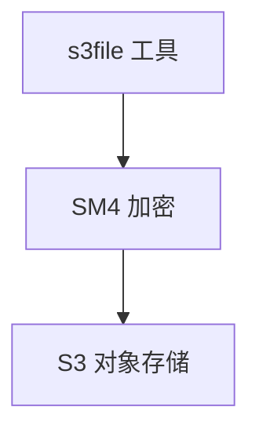

# SM4 S3 对象存储加密子模式

> 源：`sm4-storage-encryption` 的 `S3` 四场景之一

## 架构

Source: `file: F/139/备份传输存储国密SM4全流程加密方案.md:1`

## F/143 落改细节（T2107，2026-09-09）

> 来源 record：`records/T2107-0909-guomi-storage-research/`（行号级重验，零代码改动）

- 写端现状只分支 `gmssl==1`（`s3tools/s3file/main.cpp:923,954`），key/IV 硬编码（`:919-922`）；GCM 需每对象随机 12B nonce 并新增 `sm4-nonce` 元数据。
- 读端现状按卷开关解密（`s3mount/fuse-file.cpp:224,823,914`），需按对象 `gmssl` 自适应；`config.cpp:129-136` bool 口径需扩为三态。
