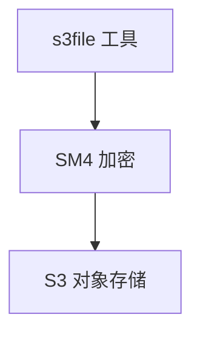

# SM4 S3 对象存储加密子模式

> 源：`sm4-storage-encryption` 的 `S3` 四场景之一

## 架构

Source: `file: F/139/备份传输存储国密SM4全流程加密方案.md:1`

## S3落改规则

> 来源 record：`records/T2107-0909-guomi-storage-research/`、`records/T2125-0910-guomi-storage-research2/`

- 落改规则：multiscale 下三态统一、读端按对象自适应、meta_data_count 2→3 新增 sm4-nonce。

## SM4库选型（T2151，2026-09-10）

> 来源 record：`records/T2151-0910-openssl-sm4-review/`（结论 `confirmed`，含初判纠错记录）

- 现状：s3file/s3mount 直调 GmSSL 底 API（`sm4_cbc_padding_*`等），链预编译 gmssl；openssl4（3.x线，libs静态链接）未被 s3 侧使用。
- 替换结论：可行但须重写调用层——CBC 走 `EVP_sm4_cbc`、GCM 走 provider 取数（legacy 无 `EVP_sm4_gcm`，provider 有 `cipher_sm4_gcm.c` 含硬加速）；xmake 由预编译 gmssl 切 openssl4 包。
- 前提：provider 运行时可用性验证 + 与 GmSSL 产出互通测试（本次只审查未验证）；纠错注：初判漏查 provider 路径误言不可替换，深查整树后反转。
