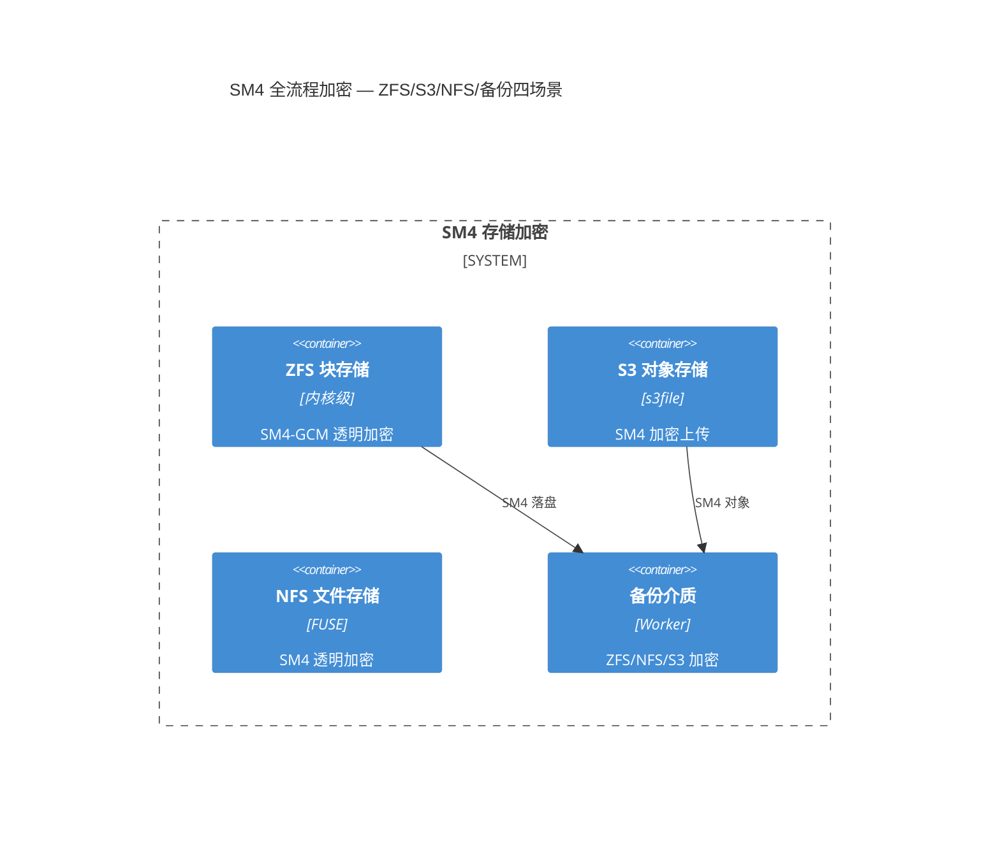
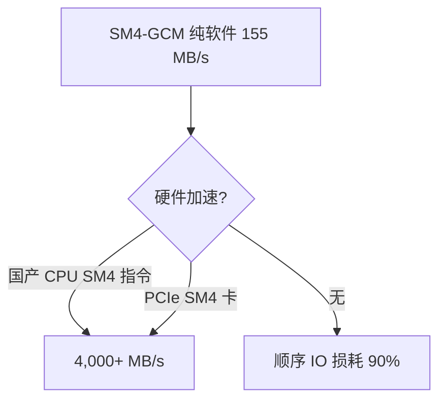
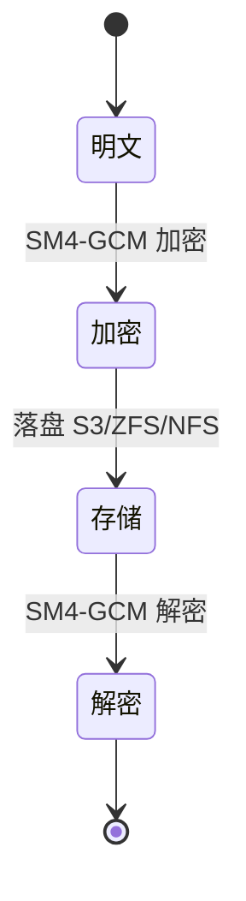

# 国密SM4全流程存储加密模式（SM4 Storage Encryption Pattern）

> 源：`T2044 d3b99ac8` 的 `SM4` 四场景方案（`155 MB/s` 纯软件基线，`国产 CPU/PCIe 卡` 硬件依赖） + `T2028` 的 `aio-tools-6200-release` 的 `rdbcomm` 契约，`F-139` 的 `d3b99ac8` 为 `4 合 1 squash`。

## 阈值表（`rdb-config.h:allowed_values` 可复用）

| 枚举 | 说明 | Source |
|------|------|--------|
| `TLS_SM4_GCM_SM3` | `国密SM4-GCM-SM3(TLS1.3)` | `file: libs/rdb-config.h:allowed_values` |
| `TLS_AES_256_GCM_SHA384` | `AES256-GCM-SHA384(国际/TLS1.3)` | `file: libs/rdb-config.h:allowed_values` |

*Source: `file: F/139/libs/rdb-config.h:allowed_values="TLS_SM4_GCM_SM3=..."` — T0458*

## 四场景架构（mermaid）


Source: `file: F/139/备份传输存储国密SM4全流程加密方案.md:1` — S1


Source: `file: F/139/备份传输存储国密SM4全流程加密方案.md:155 MB/s` — S1


Source: `file: F/139/备份传输存储国密SM4全流程加密方案.md:1` — S1

## 可重跑验证

```bash
grep -q "TLS_SM4_GCM_SM3" libs/rdb-config.h && grep -q "allowed_values" libs/rdb-config.h && echo "阈值表可检"
grep -q "155 MB/s" "备份传输存储国密SM4全流程加密方案.md" && echo "基线可检"
grep -c '```mermaid' ontology/pattern/sm4-storage-encryption.md  # ≥3
```

## 决策背景（原 T2044 的 records-only 晋级）

- 背景：`T2044 d3b99ac8` 为 `1716` 业务的 `4 合 1` 需求，虽含 `SM4` 阈值表但 `快照特化`，故 `records-only`；现按 `A` 本体晋级要求，将 `SM4` 的 `TLS_SM4_GCM_SM3` 四场景阈值表晋为 `pattern`，供 `ZFS/S3/NFS` 跨域复用。
- 决策：`records/T2044-0904-research-f139-sm4/` 的 `1716` 业务事实晋为 `ontology:pattern/sm4-storage-encryption`，`composed_of` 待拆为 `sm4-zfs/sm4-s3` 二叶。

*Diátaxis: reference* | *arc42: 5/6/12 节* | *C4 L2 可建模*
