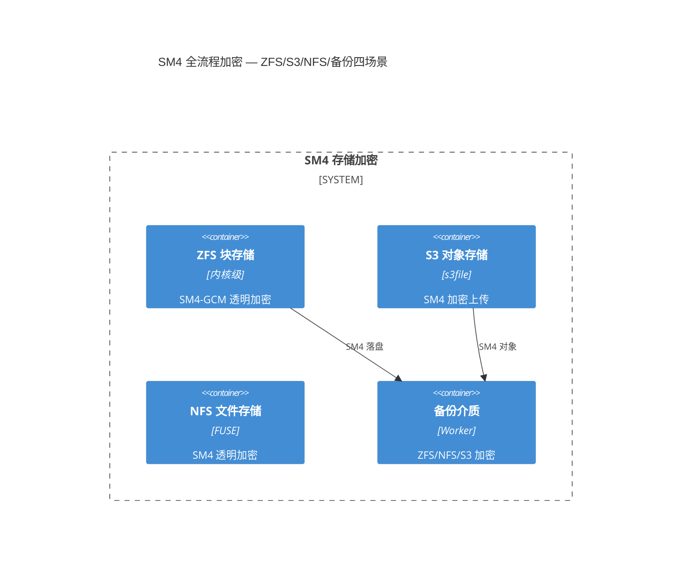
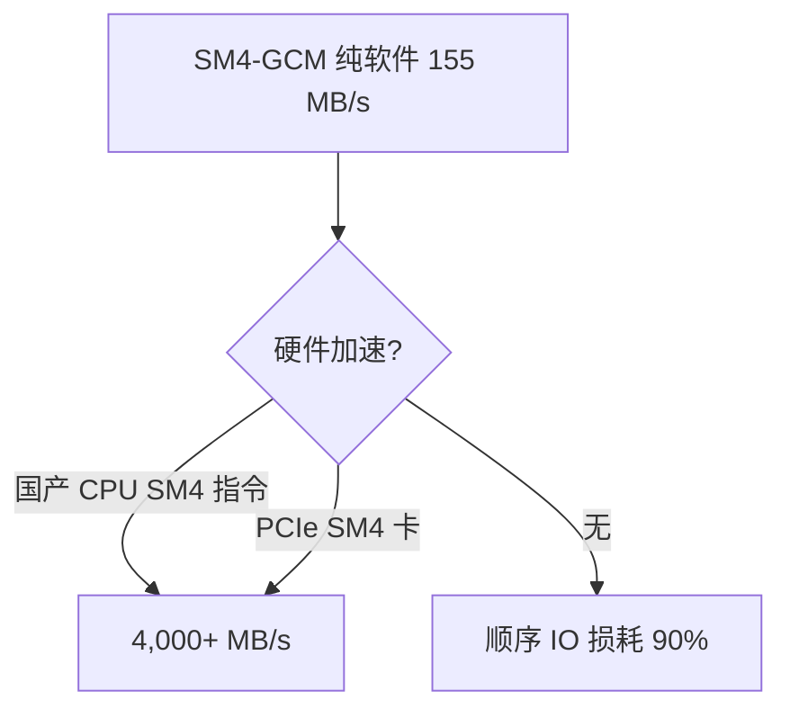
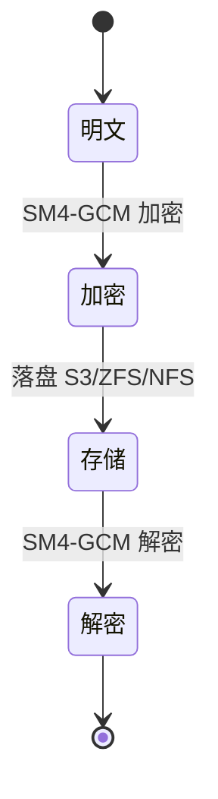

# 国密SM4全流程存储加密模式（SM4 Storage Encryption Pattern）

> 源：`T2044 d3b99ac8` 的 `SM4` 四场景方案（`155 MB/s` 纯软件基线，`国产 CPU/PCIe 卡` 硬件依赖） + `T2028` 的 `aio-tools-6200-release` 的 `rdbcomm` 契约，`F-139` 的 `d3b99ac8` 为 `4 合 1 squash`。

## 阈值表（`rdb-config.h:allowed_values` 可复用）

| 枚举 | 说明 | Source |
|------|------|--------|
| `TLS_SM4_GCM_SM3` | `国密SM4-GCM-SM3(TLS1.3)` | `file: libs/rdb-config.h:allowed_values` |
| `TLS_AES_256_GCM_SHA384` | `AES256-GCM-SHA384(国际/TLS1.3)` | `file: libs/rdb-config.h:allowed_values` |

*Source: `file: F/139/libs/rdb-config.h:allowed_values="TLS_SM4_GCM_SM3=..."` — T0458*

## 四场景架构（mermaid）


Source: `file: F/139/备份传输存储国密SM4全流程加密方案.md:1` — S1


Source: `file: F/139/备份传输存储国密SM4全流程加密方案.md:155 MB/s` — S1


Source: `file: F/139/备份传输存储国密SM4全流程加密方案.md:1` — S1

## 可重跑验证

```bash
grep -q "TLS_SM4_GCM_SM3" libs/rdb-config.h && grep -q "allowed_values" libs/rdb-config.h && echo "阈值表可检"
grep -q "155 MB/s" "备份传输存储国密SM4全流程加密方案.md" && echo "基线可检"
grep -c '```mermaid' ontology/pattern/sm4-storage-encryption.md  # ≥3
```

## 决策背景（原 T2044 的 records-only 晋级）

- 背景：`T2044 d3b99ac8` 为 `1716` 业务的 `4 合 1` 需求，虽含 `SM4` 阈值表但 `快照特化`，故 `records-only`；现按 `A` 本体晋级要求，将 `SM4` 的 `TLS_SM4_GCM_SM3` 四场景阈值表晋为 `pattern`，供 `ZFS/S3/NFS` 跨域复用。
- 决策：`records/T2044-0904-research-f139-sm4/` 的 `1716` 业务事实晋为 `ontology:pattern/sm4-storage-encryption`，`composed_of` 待拆为 `sm4-zfs/sm4-s3` 二叶。

*Diátaxis: reference* | *arc42: 5/6/12 节* | *C4 L2 可建模*

## 修订记录 R1（T2076 评审补齐，2026-09-09）

> 来源 record：`records/T2076-0909-storage-guomi-supplement/`（结论 `confirmed`，证据 `guomi-doc-v5`，复审 `存储国密加密技术方案评审.md ✅ 通过`）
> 理由：首轮评审 15 项非绿（P1×11+P2×4）经三轮 Check 返工全部落地，本模式同步吸收可复用经验：
>
> - **NBU 对照法**：参考产品以 NBU 逆向实测为核心对照（mangle AES-256-GCM 每调用随机 12B IV+16B Tag、备份像内嵌 `.EnCrYpTiOn` 标记随数据走、KMS 按组管钥、无国密必须外挂），源自 `NBU数据加密算法使用总结.md` 第 3–5 节；“存储侧承担国密、NBU 零改造”立场的直接依据。
> - **实现后形态表达法**：加密落地形态必须逐介质给出可审计表达——ZFS 属性三要素（`encryption/keystatus`/设备存在性）、S3 对象元数据表（`gmssl/sm4-nonce/file-size`）、NFS 文件布局（原文件名 + 管理侧清单），汇总为运维/审计统一清单（算法/随机数/密钥版本/状态/完整性五字段）。
> - **容量无关裁定**：加密机制正确性与容量无关经作者裁定列入显式 non-goals，容量事项由存储容量专项承担；评审维度 12 由此转绿，P1 清零。

## 修订记录 R2（T2088 五点修订，2026-09-09）

> 来源 record：`records/T2088-0909-guomi-rework2/`（结论 `confirmed`，证据 `guomi-r2-doc-17`）
> 理由：作者五点纠偏经十七轮 Check 返工落地，本模式同步吸收：
>
> - **容灾继承原则**：容灾端沿用复制的加密属性，不讨论两端加密不一致场景（删除非 raw 改算法设计）。
> - **配置驱动原则**：S3 写模式不设默认、只由 `--gmssl` 配置控制，未指定默认明文；NFS 命令用独立 `--enc-algo` 参数（不用 `gmssl`）。
> - **最小范围原则**：S3 防篡改、可观测性告警巡检不属本要求内容；灰度与回滚边界只在内部测试环境；密钥备份表述为与密文分离存放（非异地封存）。
> - **真实示例原则**：形态示例用联网核实的 OpenZFS 官方真实输出并加注，不用示意值。

## 修订记录 R3（T2107 落改清单，2026-09-09）

> 来源 record：`records/T2107-0909-guomi-storage-research/`（结论 `confirmed`，证据 `guomi-research-report`+`guomi-zero-ontology-proof`）
> 理由：S3 存储加密可复用规则模型如下：
>
> - **S3三态机**：`--gmssl` 取值域为 0/1/2；`0` 为明文，`1` 为 CBC 兼容，`2` 为 SM4-GCM 且每对象随机 12B nonce。
> - **读端自适应分支规则**：读路径按对象 `gmssl` 标记分支；缺 `sm4-nonce` 则 fail-closed，不跨模式重试。
> - **卷校验过渡规则**：读端先行具备三态解析能力，写端按配置取值落盘。
> - **XOR 非合规规则**：`--encrypt` 为静态 XOR，不计入国密；传输层 `--tls-algorithm TLS_SM4_GCM_SM3` 为既有能力。

## 修订记录 R4（T2125 补齐三缺口，2026-09-09）

> 来源 record：`records/T2125-0910-guomi-storage-research2/`（结论 `confirmed`，逐章AC-1~AC-7）
> 理由：NFS 与密钥管理可复用规则模型如下（NFS 细节见 `ontology:pattern/sm4-nfs-encryption`）：
>
> - **NFS清单模型**：`--enc-algo` 取值 `sm4-gcm/sm4-cbc`，缺省为明文；管理侧清单含算法/nonce/长度/校验和四字段；半写按清理后重传收敛。
> - **密钥四原则**：收发同钥；与密文分离存放；轮换另立项；丢钥即丢数据。
> - **门禁灰度规则**：读端先行具备 GCM 解析能力后允许写 GCM；旧挂载点清理后升级；灰度限内部测试环境。
