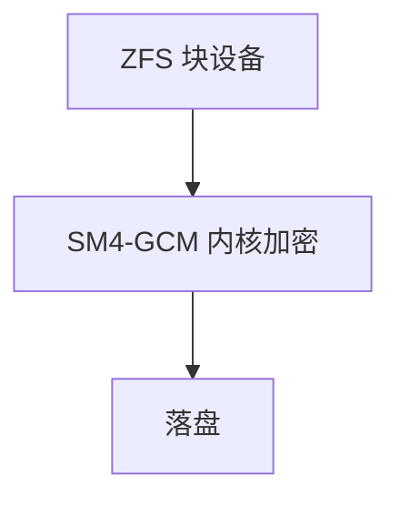

# SM4 ZFS 块存储加密子模式

> 源：`sm4-storage-encryption` 的 `ZFS` 四场景之一，`F/139` 的 `SM4` 方案

## 架构

```mermaid
flowchart TD
    A[ZFS 块设备] --> B[SM4-GCM 内核加密]
    B --> C[落盘]
```
Source: `file: F/139/备份传输存储国密SM4全流程加密方案.md:1`
