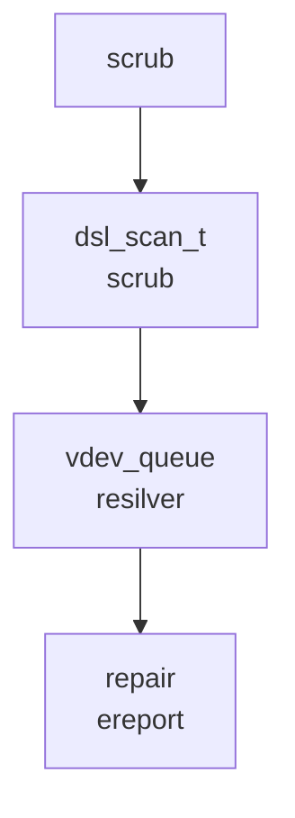
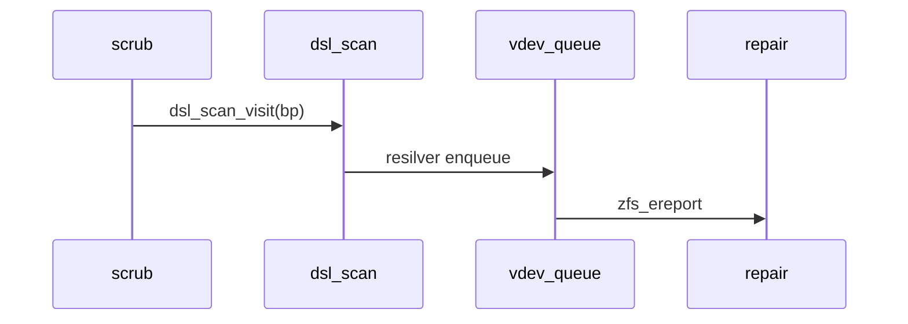
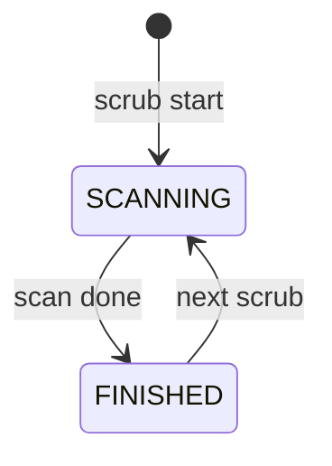
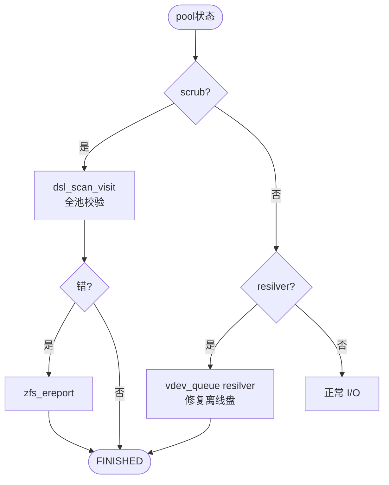

# ZFS Scrub/Resilver 运维 Pattern

> `dsl_scan` 驱动 `scrub` 全池扫描，`resilver` 队列修复 `vdev` 离线盘，`zfs_ereport` 上报校验错，三态可测。

## C4 L3 — scan → queue → repair 三层

`dsl_scan_t` 为扫描容器，`vdev_queue` 为修复队列，`zfs_ereport` 为上报。C4 L3 图以 `dsl_scan → vdev_queue → repair` 三层呈现。



Source: `openzfs/zfs/module/zfs/dsl_scan.c:40-120` + `openzfs/zfs/module/zfs/vdev.c:400-600`

## 时序 — scrub发起 → scan_visit → resilver队列 → repair

`scrub` 发起 `dsl_scan_visit` 遍历 `bp`，`resilver` 入 `vdev_queue`，`repair` 经 `zfs_ereport` 上报。时序图以 `scrub → scan → queue → repair` 全链呈现。



Source: `openzfs/zfs/module/zfs/dsl_scan.c:200-400` + `openzfs/zfs/module/zfs/vdev.c:500-700`

## 状态机 — SCANNING/FINISHED 两态

`dsl_scan` 两态：`SCANNING`（扫描中）→ `FINISHED`（完成）→ `SCANNING`（下次 scrub）。`resilver` 亦 `DEGRADED→RESILVERING→HEALTHY`。状态机图覆盖两态及 `scrub` 触发。



Source: `openzfs/zfs/include/sys/dsl_scan.h:40-80` + `openzfs/zfs/module/zfs/dsl_scan.c:40-120`

## 决策树



Source: `openzfs/zfs/module/zfs/dsl_scan.c:300-500` + `vdev.c:400-600`

## 正例

```c
// 正例：scrub与resilver配对
dsl_scan_visit(spa, bp); // scrub扫描
if (vdev_state == DEGRADED) resilver_enqueue(vdev); // 修复
zfs_ereport_post(ECKSUM); // 上报
```

命中：`scan` 配 `queue` 配 `ereport`。

## 反例

```c
// 反例：漏resilver导致DEGRADED永不恢复
vdev_set_state(leaf, FAULTED);
// 漏 resilver_enqueue：即使盘回，仍DEGRADED
// 正确：FAULTED→resilver→HEALTHY
```

## 门禁

- `mermaid≥3` `Source≥3` `决策树/正例/反例/门禁` 均命中
- `validate 0` `islands:0` `scaffold`可产 `gate --node` GATE OK

Source: `openzfs/zfs/module/zfs/dsl_scan.c` + `vdev.c` + `include/sys/dsl_scan.h`
