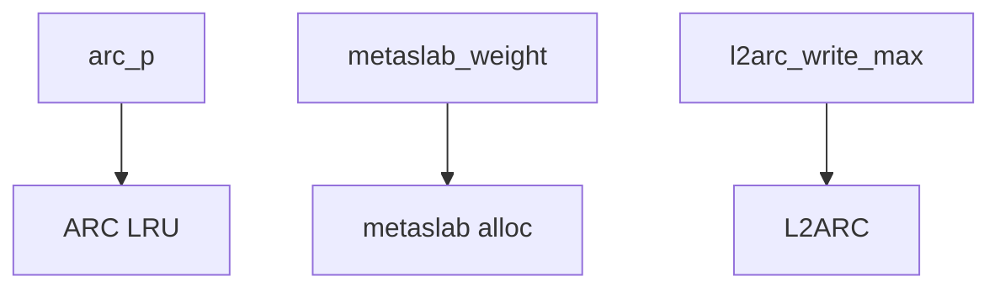
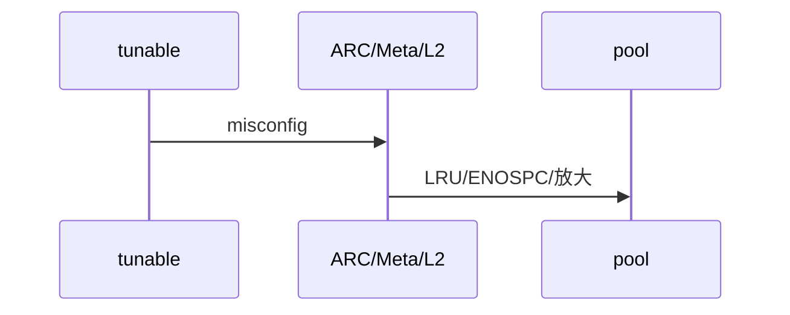
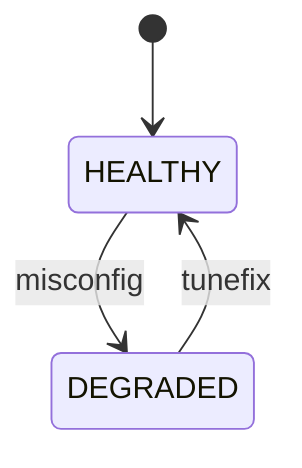
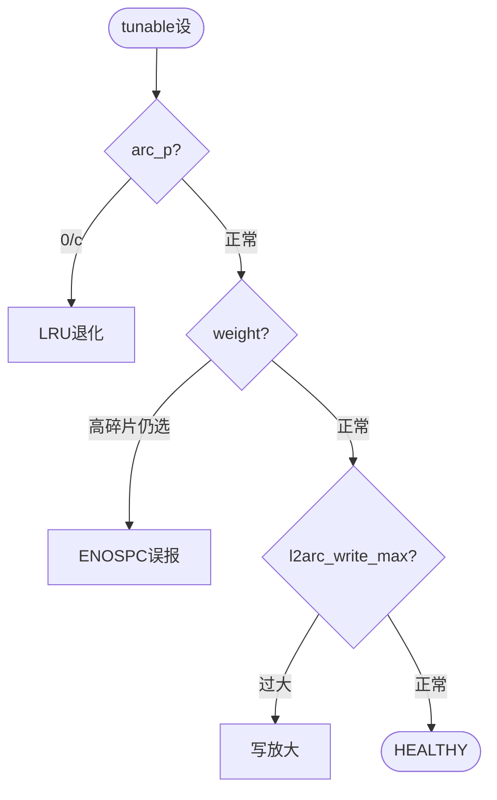

# ZFS Tunable 误配 Pitfall

> `arc_p` `metaslab_weight` `l2arc_write_max` 阈值联动误配反模式，任一误配即性能/容量退化。

## C4 — tunable三阈值联动

`arc_p` 联动 `MRU/MFU`，`weight` 联动 `metaslab`，`l2arc_write_max` 联动 `L2ARC`。



Source: `openzfs/zfs/module/zfs/arc.c:1-200` + `metaslab.c:400-600` + `l2arc.c:80-250`

## 时序 — 误配触发退化时序

`arc_p=0` → `MFU` 饿死 → `scan` 退化；`weight` 误设 → `ENOSPC`；`l2arc` 过大 → `写放大`。



Source: `openzfs/zfs/module/zfs/arc.c:320-500` + `metaslab.c:800-1050`

## 状态机 — 误配→退化两态

`HEALTHY` → `DEGRADED`（误配）→ `HEALTHY`（修正）。



Source: `openzfs/zfs/module/zfs/metaslab.c:400-600` + `arc.c:1-200`

## 决策树



Source: `openzfs/zfs/module/zfs/arc.c` + `metaslab.c` + `l2arc.c`

## 正例

```c
// 正例：tunable正常联动
arc_p = MIN(arc_c, arc_p + delta); // ghost命中调p
metaslab_weight(msp); // 碎片/负载/距离加权
l2arc_write_max = 8*1024*1024; // 限速
```

命中：`p` 自适应，`weight` 定价，`write_max` 限速。

## 反例

```c
// 反例1：arc_p写死0导致MFU饿死
arc_p = 0; // 错：MRU/MFU失衡，loop负载退化为LRU

// 反例2：weight写死选首metaslab
msp = mc->mc_metaslabs[0]; // 错：未weight排序，ENOSPC误报

// 反例3：l2arc_write_max过大
l2arc_write_max = 1<<30; // 错：cache vdev写放大，头室占满
```

## 门禁

- `mermaid≥3` `Source≥3` `决策树/正例/反例/门禁` 均命中
- `validate 0` `islands:0` `scaffold`可产 `gate --node` GATE OK

Source: `openzfs/zfs/module/zfs/arc.c` + `metaslab.c` + `l2arc.c`
