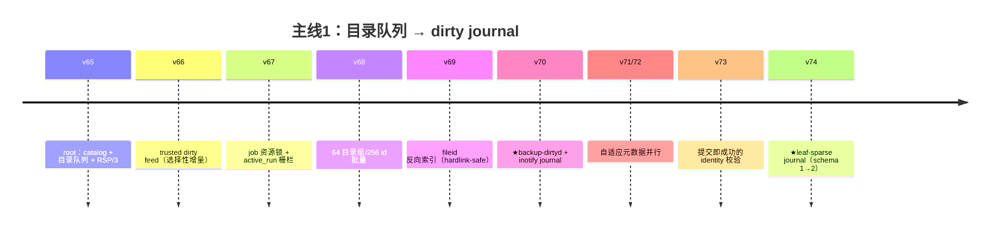
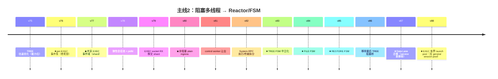
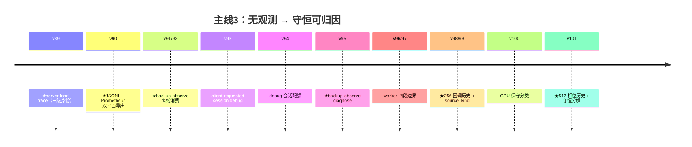
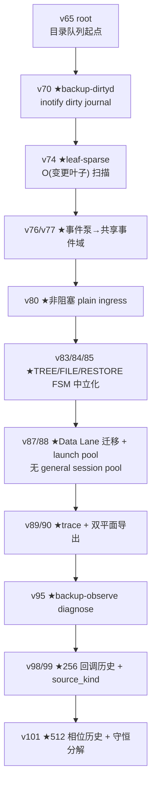
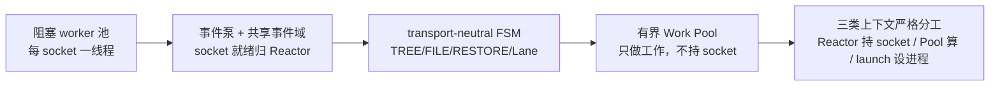
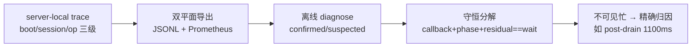
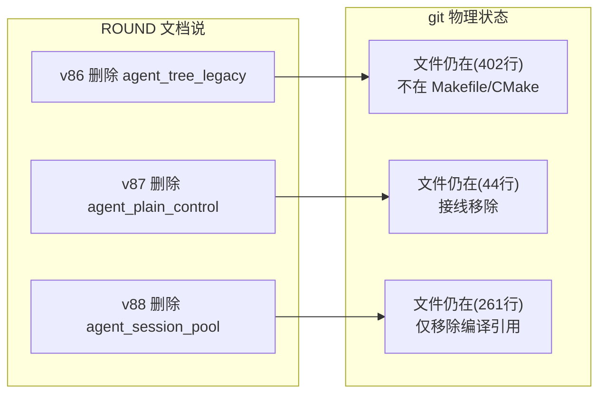
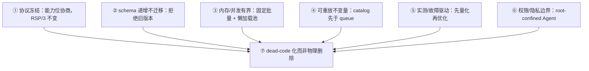

# backupstream v65→v101 演进学习图文版：36 个提交的架构之旅

任务: T0297 图形化改造
源报告: T0295 evidence `git-history-learning-final.md`
范围: main 分支 v65→v101 共 36 个提交（v91 无独立提交，设计并入 v92）

> 一句话：从「全量目录队列」到「inotify leaf-sparse dirty journal」，从
> 「阻塞多线程 Agent」到「Reactor/事件域 + 有界 Work Pool」，从「无观测」
> 到「守恒分解可归因的 observability」——四轮演进，主线清晰。

---

## 1. 演进时间线：四轮架构主线的完整旅程

**主线 1：客户端目录队列 / dirty journal（v65-v74）**

**主线 2：Agent 传输 Reactor/FSM 化（v75-v88）**

**主线 3：Observability 与离线诊断（v89-v101）**

> 图例：三条 `timeline` 各回答"一条主线怎么演进"一个问题，合计覆盖 v65-v101
> 全部 36 个提交（v91 无独立提交，并入 v92）；★ 为架构分水岭。

---

> 图例：`timeline` 三段并列展示三条主线；★ 为架构分水岭（引入新模块/新模式）。
> 36 提交全量覆盖，无遗漏。

---

## 2. 架构分水岭：哪 12 个节点定义了演进

> 图例：`flowchart TD` 自上而下；每个节点是架构分水岭（★），
> 箭头表示演进方向，非依赖关系。

---

## 3. 主线一图流：四轮演进各自解决什么问题

### 主线 1：目录队列 → dirty journal（v65-v74）

> 图例：自左向右为演进；最后为量化收益与正确性保证。

### 主线 2：阻塞多线程 → Reactor/事件域（v75-v88）

> 图例：演进路径；最后节点为最终线程模型——网络所有权恒驻 Reactor。

### 主线 3：无观测 → 守恒可归因（v89-v101）

> 图例：观测能力逐级增强；终点让"reactor 忙"变成可归因的具体相位。

---

## 4. 文档-代码漂移：一个必须记住的坑

ROUND 文档声称"删除"的模块，git 里**文件还在**——只是停止编译、成为死代码：

| 版本 | 文档声称 | git 实际 |
|------|---------|---------|
| v86 | 删除 `agent_tree_legacy.*` | 文件仍在（402 行），停止编译 |
| v87 | 删除 `agent_plain_control.*` | 文件仍在（44 行），接线移除 |
| v88 | 删除 `agent_session_pool.*` | 文件仍在（261 行），仅移除编译引用 |

> 图例：虚线为"文档语义 ↔ git 物理状态"对应；**阅读历史以编译产物为准，
> 而非源文件存在性**。这是 RSP/3「删除旧路径」在代码层的体现：
> dead-code 化而非物理删除。

---

## 5. 学习结论速记

> 图例：L1-L6 为六条设计纪律，汇入第 7 条（文档-代码漂移的根因）。

---

## 6. 适用范围与边界

- 结论限 v65-v101 当前版本；未来版本需重新核验。
- v91 无独立 git 提交（设计并入 v92 提交）。
- 个别模块行数（如 backup_agent.cpp -865）为 diff 统计，精确值以 git 为准。
- 「删除」表述为逻辑删除（停止编译接线），与 git 物理文件存在性不同。

---

## 参考资料

- 源报告（逐提交三要素事实源）: `records/T0295-0816-backupstream-git-history/evidence/git-history-learning-final.md`
- 知识沉淀: `knowledge/linux-epoll-eventloop/backupstream-v65-v101-arch-evolution.md`
- 仓库: `/home/black/Downloads/backupstream`（main 分支，v65-v101）