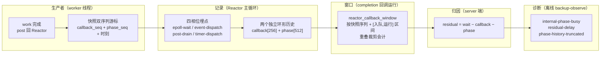
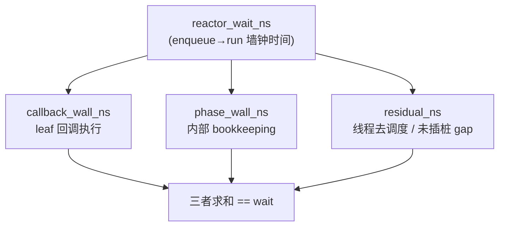
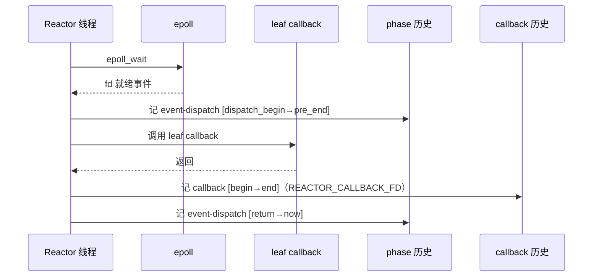
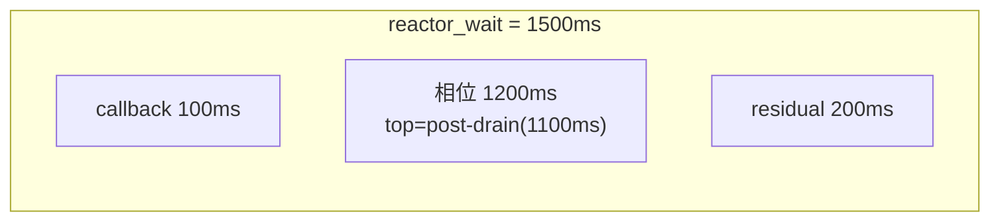
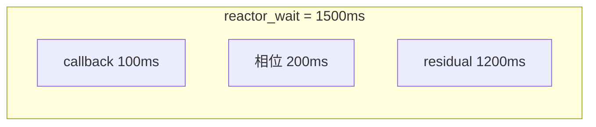
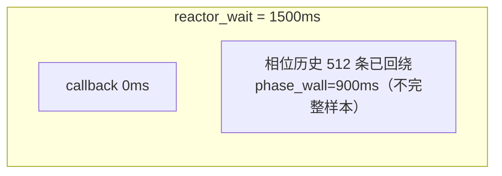
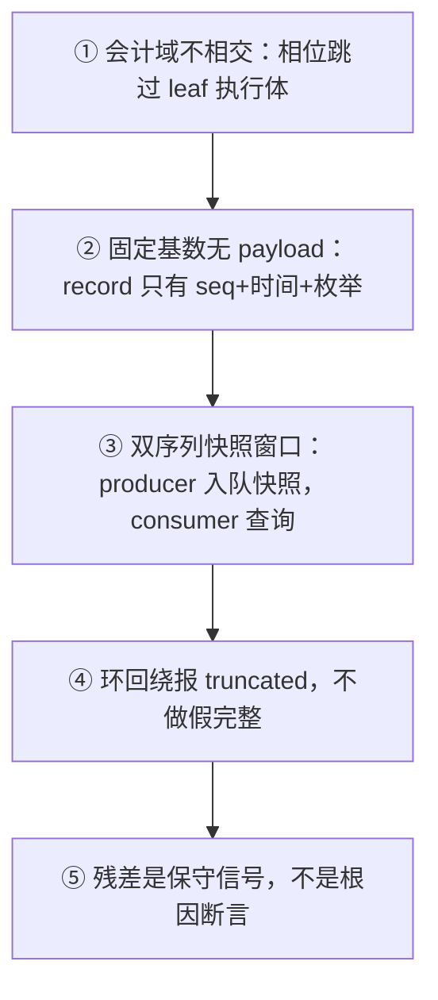

# Reactor 相位会计图文版：时间去哪了？（callback/phase/residual 守恒分解）

任务: T0297 图形化改造
源报告: T0296 evidence `reactor-phase-accounting-report-v3`
版本: v101 (commit 867da08)

> 一句话：事件循环线程的每一纳秒，都能归因到 callback（leaf 执行）、
> phase（内部 bookkeeping）或 residual（两者都解释不了）三个互不重叠的桶，
> 且三者之和恒等于一次完成的 enqueue→run 墙钟时间。

---

## 1. 链路全景：从 worker 完成到诊断归因

> 图例：`flowchart LR` 自左向右，菱形为快照/判定，矩形为处理节点；
> 五段链路即「producer → 记录 → 窗口 → 归因 → 诊断」，缺一段就无法守恒归因。

---

## 2. 守恒原理图：一个等式，三个互斥桶

> 图例：`--` 为分解方向，`==` 为守恒等式；三个桶互斥（会计域不相交），
> 所以求和才不重计、不遗漏。等式仅在 callback 与 phase 两套历史
> 均完整（coverage_complete）且减数非负时成立。

### 为什么会计域不相交？（EVENT_DISPATCH 埋点）

相位区间刻意**跳过** leaf callback 执行体，把它留给 callback 历史：

> 图例：`->>` 同步调用/记入，`-->>` 返回；红色为相位域区间，蓝色为 callback
> 域区间，两者在时间轴上不相交——这是守恒等式成立的基石。

---

## 3. 四个相位埋在哪？（reactor.cpp 行号佐证）

| 相位 | 埋点位置 | 覆盖区间 | 说明 |
|------|---------|---------|------|
| `epoll-wait` | reactor.cpp:1244-1245 | `epoll_wait` 前后 | 含线程去调度时间，勿当 epoll 问题 |
| `event-dispatch` | reactor.cpp:1253-1265, 1311 | 每个 fd 事件 dispatch 前 + 回调返回后 | **跳过** callback 执行体 |
| `post-drain` | reactor.cpp:635-724 | post 队列 dequeue/dispatch/requeue/finish | 批量 drain 全程 |
| `timer-dispatch` | reactor.cpp:1128-1215 | timer source 读 fd + 回调前后 + rearm | 含 rearm 后端写 |

---

## 4. 真实案例：三个诊断 finding 的守恒演算

数据取自 `tests/backup_observe_diagnose_integration.sh`（b-20/b-21/b-22 三事件）。
所有数值为纳秒（ns），阈值 `--stage-ms=1000`（1s）。

### 案例 A：b-20-1 → `reactor-internal-phase-busy`

**事件**：`reactor_wait_ns=1500000000`，callback 仅 1 个（100ms），相位 8 条。

| 域 | 值 | 分解 |
|----|----|------|
| callback_wall | 100ms | 1 个 post-normal cleanup 回调 |
| phase_wall | 1200ms | epoll-wait 50 + event-dispatch 30 + **post-drain 1100** + timer 20 |
| residual | 200ms | 1500 − 100 − 1200 |
| **守恒** | 100+1200+200 == 1500 | ✓ |

**结论**：post-drain 相位累计 1100ms ≥ 阈值 → `reactor-internal-phase-busy`
confidence=confirmed，top_phase=post-drain。**不可见忙找到了——在 post 批量
drain 的内部 bookkeeping 里，不在任何 leaf callback。**

### 案例 B：b-21-1 → `reactor-residual-delay`

**事件**：`reactor_wait_ns=1500000000`，callback 1 个（100ms），相位 4 条。

| 域 | 值 | 分解 |
|----|----|------|
| callback_wall | 100ms | 1 个 fd plain-control 回调 |
| phase_wall | 200ms | event-dispatch 120 + post-drain 30 + epoll 50 + timer 0 |
| residual | 1200ms | 1500 − 100 − 200 |
| **守恒** | 100+200+1200 == 1500 | ✓ |

**结论**：callback 与相位都解释不了 1200ms → `reactor-residual-delay`
confidence=confirmed。**候选根因：owner 线程去调度，或某段未插桩的 Reactor gap。
报告明确说这只是候选，不是断言。**

### 案例 C：b-22-1 → `reactor-phase-history-truncated`

**事件**：`reactor_wait_ns=1500000000`，callback 0 个，相位历史 512 条（环回绕）。

| 域 | 值 | 语义 |
|----|----|------|
| callback_wall | 0ms | 无 leaf callback 记录 |
| phase_wall | 900ms | **truncated**——512 条环形被写满，早期相位已被覆盖 |
| residual | **不输出** | 相位历史不完整，v101 显式拒绝残差归因 |

**结论**：`reactor-phase-history-truncated` confidence=confirmed。**宁可说
"证据不足"，也绝不假装分解完整——截断时不做残差根因归因。**

---

## 5. 方法论速记：事件循环时间守恒分解

> 图例：P1→P5 为方法论的五个先后原则；每一条都在本报告图 1-4 中有对应实现。

---

## 6. 关键结论与边界

**结论**：v101 把 v100 只能叫"unattributed"的时间拆成了相位域（可归因到四相位）
+ 残差域（保守归因到域外）。不可见忙从"笼统的 reactor 忙"变成
"post-drain 相位忙 1100ms"这样的精确归因。

**边界**：
- `reactor_wait_ns` 只覆盖 completion enqueue→run，不含 work 执行本身。
- 相位 512 固定容量，超高事件率会频繁 truncated（案例 C 即此情形）。
- 相位与 callback 共享一个使能开关，无法只开相位。
- 减法为负（会计域重叠 = bug）时 server 静默省略残差字段，需警惕。

**改进建议摘要**（5 条，详见源报告，不改码）：
1. `top_phase` 未命中时区分 "none" vs "unknown" 语义；
2. 减法为负时输出显式哨兵字段而非静默省略；
3. 为反复主导的相位补 `cpu_ns` 分离自旋/阻塞；
4. 相位/callback 历史独立使能开关；
5. 若 residual 反复显著，下一步加保守 scheduler/run-state 证据。

---

## 参考资料

- 源报告（事实与行号来源）: `records/T0296-0816-reactor-phase-accounting/evidence/reactor-phase-accounting-report-v3.md`
- 源码: reactor.cpp/reactor.hpp, work_pool.cpp/.hpp, agent_observability.cpp, backup_observe.cpp
- 测试: tests/backup_observe_diagnose_integration.sh:152-224, tests/unit.cpp:349-366
- 设计意图: docs/ROUND101_REVIEW.md

---

# 附录 A：方法论完整推导与边界（源报告文字保真）

> 本附录为源报告核心文字的保真摘录，补充图示无法承载的推导细节，
> 图例/术语与正文一致。

## A.1 守恒等式的推导步骤

1. **分域记账**：事件循环按「相位（内部 bookkeeping）/ callback（leaf 执行）」
   两域记账，每域独立固定容量环形历史，字段仅含时间与枚举——不携带任何
   FD/路径/负载，可观测性不随业务规模膨胀。
2. **会计域不相交**：相位区间刻意排除 callback 执行区间（callback 前/后分别埋点），
   使两域求和不重计、不遗漏——这是守恒等式成立的前提。
3. **双序列快照窗口**：producer 在事件入队时快照两个序列游标，consumer 在窗口查询
   时以「序列 > 快照值 且 ≤ 当前」过滤，天然处理并发与覆盖；环形回绕时显式报
   `truncated` 而非假装完整。
4. **守恒残差归因**：完整窗口内 `callback + phase + residual == wait`；残差是
   "两者都解释不了"的保守信号（线程去调度、未插桩 gap），**不是根因断言**——
   证据边界与根因猜测严格分离。
5. **诊断分级**：truncated（拒绝归因）/ phase-busy（归因到相位）/ residual
   （归因到域外）三级，均为 confirmed 置信度但语义逐级保守。

## A.2 v100 → v101 演进衔接

v100 引入 callback 历史与 `reactor-unattributed-delay`（callback 唯一归因域）；
v101 在其上叠加独立相位历史，把 unattributed 进一步拆成 `phase_wall_ns`
（四相位）与 `residual_ns`（仍不可归因）。v100 记录无相位字段仍有效，
诊断优先用更强的 phase/residual 证据。

## A.3 适用范围与限制

- 结论限于 v101（867da08）及当前 HEAD 状态；未来版本需重新核验。
- `reactor_wait_ns` 仅覆盖 completion enqueue→run 区间，不覆盖 work 执行本身。
- 相位历史 512 固定容量，在超高事件率下可能频繁 truncated（届时只产生
  `phase-history-truncated`，不产生相位/残差归因）。
- `epoll-wait` 相位含线程去调度时间，不能直接解读为 epoll 问题。

## A.4 五条改进建议（不改码，完整清单）

| # | 建议 | 位置 | 理由 |
|---|------|------|------|
| 1 | `reactor_internal_phase_name` 对 `REACTOR_PHASE_COUNT` 返回 "unknown"，建议窗口 zero 态与 truncate 态明确区分 "none" vs "unknown" | reactor.cpp:42, 79-84 | 避免 unknown 被误读为第四相位冲突 |
| 2 | 减法为负时 server 端输出显式哨兵字段而非静默省略 | agent_observability.cpp:539-542 | 负残差 = 会计域重叠（bug），静默丢失掩盖缺陷 |
| 3 | 为反复主导的相位加 `cpu_ns` 分离自旋/阻塞 | reactor.cpp:126-131 | post-drain 内自旋 vs 阻塞不可分 |
| 4 | 相位/callback 历史独立使能开关 | reactor.cpp:91, 108 | 共享单开关无法只采相位 |
| 5 | residual 反复显著时加保守 scheduler/run-state 证据 | 设计层 | 遵循文档分阶段演进纪律 |
