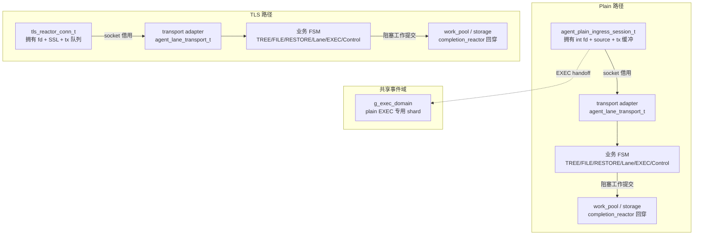
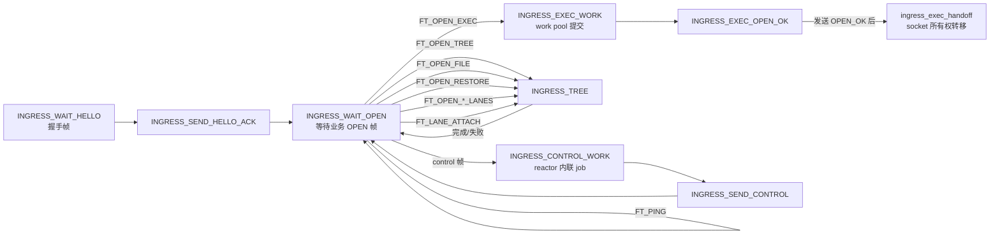
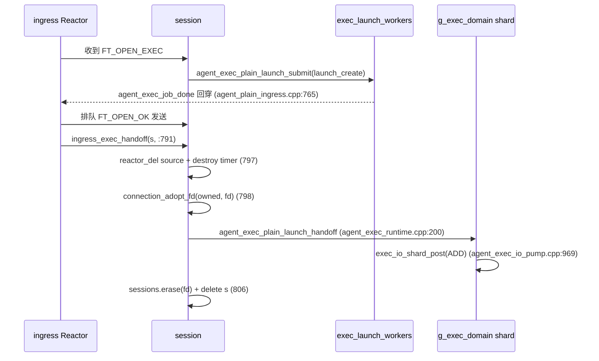
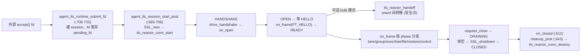
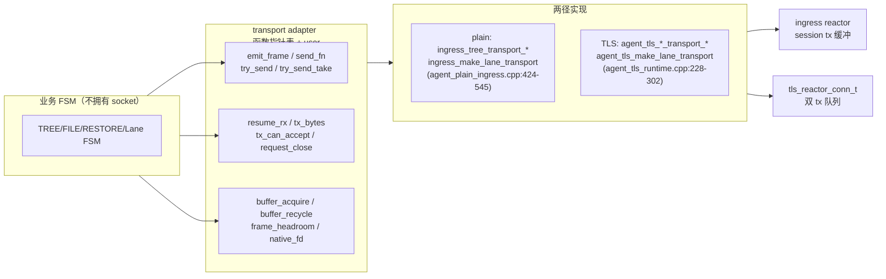
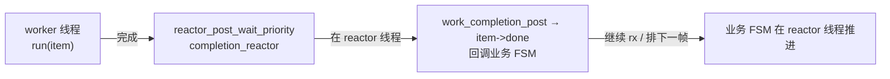
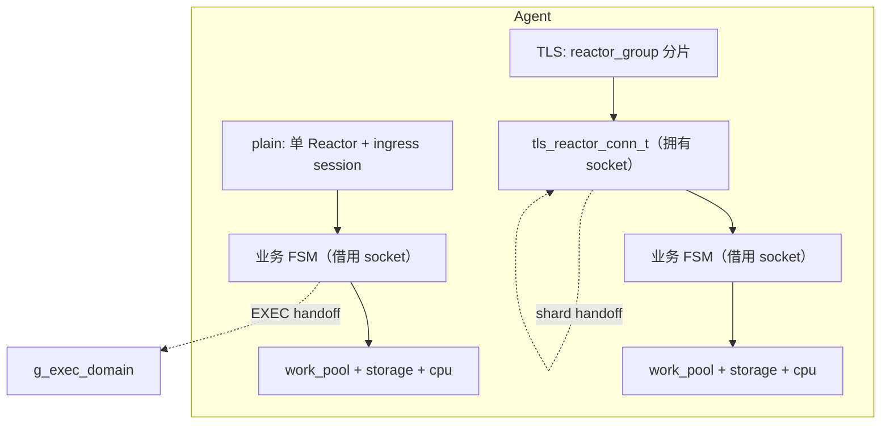

# backupstream 传输所有权设计分析：谁拥有这条连接

任务: T0299 (research)
版本: v101
日期: 2026-08-16

> 一句话：Agent 侧的每一条传输，从 accept 到 close，所有权只会落在**两种容器**上——plain 的 `agent_plain_ingress_session_t`（直接持有裸 fd）或 TLS 的 `tls_reactor_conn_t`（持有 fd+SSL）。业务 FSM（TREE/FILE/RESTORE/Lane/EXEC/Control）一律是**租借者**，通过统一 transport adapter 借用 socket，通过 work pool 借线程。整个系统的并发安全，建立在「每个时刻每个对象恰好属于一个执行上下文」这一不变量上。

---

## 1. 所有权模型总览：三类所有权，两种容器

### 1.1 三类所有权的定义

把「所有权」拆成三个互不重叠的维度，任何时刻一个传输对象在每个维度上恰有一个归属：

| 维度 | 含义 | 判定方法 |
|------|------|---------|
| **Socket 所有权** | 谁负责 `::close(fd)` / `SSL_free()`，谁把 fd 注册进事件循环 | 找 fd/SSL 的唯一释放点 |
| **协议状态所有权** | 谁拥有帧解析器、发送队列、FSM 状态机 | 找帧分发入口（`ingress_source_cb` / `agent_tls_on_frame`） |
| **阻塞工作所有权** | 谁执行会阻塞的磁盘/计算操作（pread/pwrite/scan/verify） | 找 `work_item_t.completion_reactor` 字段 |

> 图例：实线为常规借用/提交，虚线为 plain EXEC 的**唯一一次 socket 所有权转移**。两条路径共享同一套业务 FSM 与 work pool 回穿契约，区别只在 socket 容器。

### 1.2 两种 socket 容器

| 容器 | 持有物 | 释放点 | 线程归属 |
|------|--------|--------|---------|
| `agent_plain_ingress_session_t`（agent_plain_ingress.cpp:149-184） | `int fd`（:151）+ `reactor_source_t source`（:153）+ `tx` 发送缓冲 | `ingress_destroy_session`（:230-272）直接 `reactor_del` + `::close` | ingress 单 Reactor |
| `tls_reactor_conn_t`（tls_reactor.hpp:213-347） | `int fd`（:218）+ `SSL* ssl`（:219）+ 双 tx 队列（:259-260） | `tls_reactor_conn_destroy`（tls_reactor.cpp:768-776）`SSL_free` + `::close` | 某个 TLS reactor shard |

关键差异：

- **plain 无独立传输对象**：帧解析（`ingress_parse_read` :328-360）、发送（`ingress_flush_tx` :402-414）都是 session 内联实现，socket 事件就是 session 自己的 source。
- **TLS 连接永不离开 reactor**：`tls_reactor_require_owner()`（tls_reactor.cpp:59-72）强制所有 API 在 owner 线程运行，否则返回 `EPERM`。业务层通过回调访问连接，**从不拥有 fd/SSL**。common.hpp:428-431 的注释印证："The business worker never owns SSL/socket readiness in the latter case."
- TLS 唯一的「转移」是 **reactor shard 间 handoff**（`tls_reactor_handoff` tls_reactor.cpp:753-765），前置条件是 OPEN + rx_paused + 非 closing + 非 renegotiating（:758），是安全点语义的转移，且转移后仍归某个 reactor。

---

## 2. Plain 传输路径剖析：session 即一切

### 2.1 状态机与所有权流转

> 图例：状态机枚举见 agent_plain_ingress.cpp:33-39。`INGRESS_SEND_ERROR`（:36）可从任一业务帧非法路径进入；HELLO/ERROR 状态受 HUP 保护（:1140 只在非 SEND_HELLO_ACK/非 SEND_ERROR 时销毁会话）。

### 2.2 所有权流转明细（plain）

| 阶段 | Socket 所有权 | 协议状态所有权 | 阻塞工作所有权 |
|------|--------------|---------------|---------------|
| HELLO/WAIT_OPEN（:1090-1097） | session（source 注册于 ingress reactor，:320） | session 内联 parser | 无 |
| TREE/FILE/RESTORE（:601/630/651） | session（socket 保持注册在 ingress source） | 各 FSM（transport.user=s） | work pool：`agent_tree_submit`（agent_tree_runtime.cpp:778）等，`completion_reactor=ingress reactor` |
| Lane group（:695） | session（transport 借用） | lane_group FSM | storage/cpu_scheduler，回穿 `completion_reactor` |
| Data lane（:714） | session（transport 借用） | data_lane FSM | `storage_backend_submit`/`cpu_scheduler`（agent_data_lane.cpp:248/257） |
| EXEC（:745-807） | **转移**：`ingress_exec_handoff`（:791）→ `connection_adopt_fd` → `agent_exec_plain_launch_handoff` → `g_exec_domain` shard | 共享 EXEC 事件域 | exec_launch_workers + exec io pump |

### 2.3 唯一一次 socket 所有权转移：plain EXEC handoff

> 图例：这是 plain 路径**唯一**把 fd 从 session 拔出、交给另一个执行上下文（共享 EXEC 事件域）的点。此后 session 被 delete，连接完全归 `g_exec_domain` shard 独占；agent 侧 EXEC 完成由 done/release 回调收尾（exec_io_abort 中 `connection_close`+`delete`，agent_exec_io_pump.cpp:964-966）。

### 2.4 Connection 的 fd 借用原语

`Connection`（common.hpp:389-425，注意**不在 transfer.hpp**）提供 fd 转移的两个 friend 原语：

- `connection_adopt_fd(Connection*,int)`（common.cpp:142）：先释放旧 fd，再接管新 fd。
- `connection_release_fd(Connection*)`（common.cpp:143）：拔出 fd，conn 不再拥有。

plain 用 `adopt_fd` 完成 EXEC handoff；`agent_plain_control_return`（agent_plain_control.cpp:31）展示了 `release_fd`/`adopt_fd` 的对照用法（注：该函数目前无调用者，属保留代码）。

---

## 3. TLS 传输路径剖析：conn 永不离开 reactor

### 3.1 生命周期所有权链

> 图例：连接从 accept 到销毁，fd/SSL 所有权只存在于两处——`agent_tls_session_t`（agent_tls_runtime.cpp:104-133，值容器）及其内部的 `tls_reactor_conn_t`。业务 FSM 全部是租借者。

### 3.2 业务 FSM 是租借者

`agent_tls_session_t`（agent_tls_runtime.cpp:104-133）：

- `tls_reactor_conn_t transport`（:107）——**值成员**，连接本体归 session。
- `control/lane/lane_group/exec/tree/file/restore`（:111-117）——**指针成员**，全部非拥有连接。

`agent_tls_make_lane_transport(s)`（:295-302）把 session 包装成 transport adapter，user=s。每个回调薄封装到 reactor API：

| transport 字段 | TLS 实现 | 机制 |
|---|---|---|
| `send_fn` | `agent_tls_lane_transport_send` :228-236 | → `tls_reactor_send_frame` |
| `try_send_fn` | `agent_tls_lane_transport_try_send` :238-247 | → `tls_reactor_try_send_frame`（BACKPRESSURE 透传） |
| `try_send_take_fn` | `agent_tls_lane_transport_try_send_take` :249-261 | → `tls_reactor_try_send_frame_take`（buffer swap 转移所有权） |
| `resume_rx` | :263-267 | → `tls_reactor_resume_rx` |
| `tx_bytes` | :268-271 | → `tls_reactor_tx_bytes` |
| `tx_can_accept` | :272-275 | → `tls_reactor_tx_can_accept` |
| `request_close` | :276-282 | 置 phase=CLOSING → `tls_reactor_request_close` |
| `buffer_acquire` | :283-286 | → `tls_reactor_frame_buffer_acquire`（复用缓存池） |
| `buffer_recycle` | :287-290 | → `tls_reactor_recycle_payload_buffer` |
| `frame_headroom` | :291 | → `tls_reactor_frame_headroom` |
| `native_fd` | :292-294 | 只读 `s->transport.fd`，**不转移** |

tree/file/restore 用近似回调族 `agent_tls_tree_transport_*`（:403-417），复用同一 `&s->transport`。

### 3.3 TLS 的 EXEC：留在 reactor，不转移

- `agent_tls_ready_exec`（:478-487）：`context.transport=&s->transport`（裸指针直接传 conn）。
- `agent_tls_exec_start`（agent_exec_runtime.cpp:568-604）：EXEC FSM、`spawn_work`（提交到 `control_workers`）、child 管道 reactor_source 全部挂在 TLS reactor 所在线程；发送用 `tls_reactor_send_frame`，**不创建独立事件域、不调用 `agent_exec_io_start_async`**。
- 与 plain 的 `ingress_exec_handoff` 完全相反：TLS 的 EXEC 连接永不离开 reactor。

### 3.4 lane 的 fd 只取数值

- `agent_tls_data_lane.cpp:582` `op->lane_fd=context->transport->fd`——只取 fd 数值做 lane group 注册键，**不拥有 socket**。
- 同文件 590-593 就地改 `transport->config` 的 read/write budget（因 conn 在 owner 线程独占，可安全修改）。
- lane group 内部真正的文件 fd（`lane_group_t* group`，agent_tls_lane_group.cpp:49）由 `agent_lane_group_alloc/destroy` 管理，与 socket 所有权完全分离。

---

## 4. Transport adapter 抽象：同一 FSM，双传输驱动

### 4.1 契约形状

核心是 `agent_lane_transport_t`（agent_lane_transport.hpp:42-54）与 `agent_tree_transport_t`（agent_tree_runtime.hpp:33-41）：

> 图例：业务 FSM 只依赖接口形状，不关心底层是 plain 还是 TLS。adapter 把「发帧/背压/暂停恢复/缓冲管理」抽象出来，两径各自实现。

### 4.2 两径实现对照表

| 能力 | plain 实现 | TLS 实现 |
|------|-----------|---------|
| transport 构造 | `ingress_make_lane_transport`（agent_plain_ingress.cpp:538） | `agent_tls_make_lane_transport`（agent_tls_runtime.cpp:295） |
| tree/lane send | `ingress_tree_transport_send`（:424） | `agent_tls_tree_transport_send`（:403）/ `agent_tls_lane_transport_send`（:228） |
| resume rx | `ingress_tree_transport_resume`（:446） | `agent_tls_lane_transport_resume`（:263） |
| request close | `ingress_tree_transport_close`（:460） | `agent_tls_lane_transport_close`（:276） |
| buffer acquire | `ingress_lane_transport_buffer_acquire`（:526，直接 assign 无池） | `agent_tls_lane_transport_buffer_acquire`（:283，经 reactor 缓存池） |
| headroom | `ingress_lane_transport_headroom`（:534，恒 0） | `agent_tls_lane_transport_headroom`（:291，= WireFrameHeader 大小） |
| 背压 | `ingress_tree_transport_send` 高水位返回 EAGAIN（:435-437） | `tls_reactor_try_send_frame` BACKPRESSURE + `on_writable` 恢复 |
| EXEC 交接 | `ingress_exec_handoff`（:791）→ Connection 转移共享域 | `agent_tls_ready_exec`（:478）→ conn 留在 reactor |
| 关闭模型 | `ingress_destroy_session`（:230）直接 close | `agent_tls_on_closed`（:612）+ `agent_tls_session_cleanup_post`（:643）drain 后销毁 |

---

## 5. 所有权转移点清单

### 5.1 全局回穿契约（所有转移的底座）

`work_item_t` 携带 `completion_reactor`（work_pool.hpp:126）；worker 线程完成后 `reactor_post_wait_priority(completion_reactor, NORMAL, work_completion_post, item)`（work_pool.cpp:388-394），`work_completion_post`（:115）在 reactor 线程执行 `item->done`；无 reactor 时同步调用（:415）。

**不变量：worker 线程绝不碰业务状态，只把结果 post 回 reactor 线程，由 reactor 线程执行 done 回调。**

> 图例：这就是「阻塞工作所有权」与「协议状态所有权」的边界——工作在线程池跑，状态只在 reactor 线程改。违反此不变量（worker 直接改 FSM）即所有权违规。

### 5.2 转移点枚举

| # | 转移点 | 转移前 | 转移后 | 并发安全契约 | 关键函数 |
|---|--------|--------|--------|-------------|---------|
| 1 | ingress → 业务 FSM（TREE/FILE/RESTORE） | session 拥有 socket+解析 | FSM 拥有协议状态；socket 仍归 session | 帧在 ingress reactor 线程解析后同步转交；FSM 完成回调回穿同一 reactor | `ingress_start_tree`（:601）/ `agent_tree_reactor_handle_frame`（agent_tree_runtime.cpp:1080） |
| 2 | FSM → work pool 提交 | FSM 在 reactor 线程拥有状态 | 阻塞操作在 worker 线程执行 | `work_item_init(..., completion_reactor)` 记录回穿目标；done 回调只在 reactor 线程执行 | `agent_tree_submit`（agent_tree_runtime.cpp:778）/ `work_completion_post`（work_pool.cpp:115） |
| 3 | work pool → FSM 完成回穿 | worker 持有结果 | reactor 线程执行 done 回调推进 FSM | `reactor_post_wait_priority`；worker 不碰业务状态 | `worker_done`（agent_tree_runtime.cpp:844）/ `agent_lane_storage_done`（agent_data_lane.cpp:164） |
| 4 | plain EXEC → 共享事件域 | session 拥有 fd | `g_exec_domain` shard 独占 Connection | `reactor_del` 先摘 source（ingress 不再碰 fd）→ `adopt_fd` → 再转移；`sessions.erase` 防止复查；session delete | `ingress_exec_handoff`（:791-807）/ `agent_exec_io_start_async`（agent_exec_io_pump.cpp:969-1002） |
| 5 | LANE_ATTACH → lane FSM | session 拥有 socket | data_lane FSM 借用 transport；共享 lane registry 槽位 | lane fd 只取数值（data_lane.cpp:582）；storage 完成回穿 `completion_reactor` | `ingress_start_lane`（:714）/ `agent_lane_start`（agent_data_lane.cpp:572） |
| 6 | lane group 完成 → 回 WAIT_OPEN | lane_group FSM 持有 group | 控制回到 ingress session | `mark_done` 全部完成时 `reactor_post_priority(HIGH)` → `lane_group_notify_post` → `check_completion`（agent_lane_registry.cpp:122） | `lane_group_finish`（agent_lane_group.cpp:107）/ `ingress_return_lane_group_to_open`（:673） |
| 7 | TLS shard 间 handoff（bulk 模式） | 原 shard reactor 拥有 conn | 目标 shard reactor 独占 conn | 安全点语义：OPEN + rx_paused + 非 closing + 非 renegotiating（tls_reactor.cpp:758）；失败回滚原 owner | `tls_reactor_handoff`（tls_reactor.cpp:753-765） |
| 8 | TLS on_closed → cleanup | conn 归 session | session 逐个 destroy FSM → conn_destroy → delete | `on_closed` 一次性（`close_notified` 防重入）；busy 检查后清理 | `agent_tls_session_cleanup_post`（:643-680）/ `tls_reactor_conn_destroy`（tls_reactor.cpp:768-776） |

### 5.3 双径共有的安全模式

1. **回调只在 owner 线程运行**：plain 由 `ingress_source_cb` 单线程分派；TLS 由 `tls_reactor_require_owner()` 强制。
2. **worker 不碰业务状态**：完成一律 post 回 reactor 线程。
3. **销毁先摘除可观测性**：handoff 先 `reactor_del` 再转移，防悬挂事件。
4. **一次性通知**：TLS `close_notified`、`session_closed` 标志防重入销毁。

---

## 6. 双径差异与设计理由

| 维度 | plain | TLS | 设计理由 |
|------|-------|-----|---------|
| socket 容器 | session 直接持裸 fd，内联 parser+tx | `tls_reactor_conn_t` 独立传输对象 | TLS 需要握手/记录层/重协商状态机，必须独立对象；plain 无此需求，内联最省 |
| Reactor 组织 | 单 Reactor | `reactor_group` 分片 | TLS 握手与加解密是 CPU 密集，需多核分片；plain 单 Reactor + 弹性阻塞池已够 |
| EXEC 归属 | 转移到共享事件域 | 留在 TLS reactor | plain 需要多核承载 exec 并发，故独立 `g_exec_domain`；TLS 已分片，exec 留在所在 shard 避免二次转移成本 |
| 背压 | 高水位 EAGAIN + 自旋恢复 | BACKPRESSURE + `on_writable` 事件恢复 | TLS 需要精确的排空/恢复事件驱动；plain 用简单高水位 |
| 缓冲管理 | 直接 assign | reactor 缓存池复用 | TLS 高频加解密，缓冲复用收益显著；plain 帧量小 |
| 关闭模型 | 直接 close | DRAINING → SSL_shutdown → CLOSED | TLS 必须优雅关闭 SSL 记录层；plain 无此约束 |

> 图例：两条路径在「业务 FSM 借用 socket + 阻塞工作提交 pool」上完全同构，仅在 socket 容器、Reactor 组织、EXEC 归属上分化。

---

## 7. 所有权边界风险清单

以下为基于源码剖析识别的潜在所有权违规风险（不改码，仅指出，供维护者核验）：

| # | 风险 | 位置 | 理由 |
|---|------|------|------|
| 1 | plain EXEC handoff 竞态窗口 | `ingress_exec_handoff`（:791-807） | `reactor_del` 摘 source 与 `connection_adopt_fd` 之间，若收到新事件（如乱序帧）可能触碰已转移 fd；依赖 `s->fd=-1` + `sessions.erase` 的顺序性 |
| 2 | plain control 保留代码引用未接线符号 | `agent_plain_control_return`（agent_plain_control.cpp:31） | 引用 `agent_session_pool_return_prefaced`，该符号仓库中无定义；若未来接线编译即失败，且 `connection_release_fd`/`adopt_fd` 双原语暴露的转移窗口需复验 |
| 3 | TLS bulk handoff 失败回滚路径 | `tls_reactor_handoff`（:753-765） | 回滚到原 owner 时若 tx 队列已被部分 drain，on_writable 信号可能丢失导致 FSM 挂起；需核验回滚后状态一致性 |
| 4 | lane group 跨线程完成通知链 | `agent_lane_registry.cpp:122` | `mark_done` 在 worker 线程调用 `reactor_post_priority` 时，若 `completion_reactor` 已销毁（session 提前 close），post 到悬垂 reactor；依赖 session 生命周期与 group 槽位的释放顺序 |
| 5 | TLS `native_fd` 只读借用 | `agent_tls_lane_transport_fd`（:292-294） | 若未来某处把 `native_fd` 返回值当作可 close 的 fd，会造成 double-close；当前仅作注册键（data_lane.cpp:582） |
| 6 | plain `INGRESS_TREE` 下五 FSM 并发分发 | `ingress_source_cb`（:1047-1049） | on_writable/on_tx_idle 同时转发给 tree/file/restore/lane/lane_group，任一 FSM 在回调中销毁自身时其余 FSM 可能被触摸悬挂指针；依赖各 FSM destroy 后的空指针置位 |

---

## 8. 参考资料

- **源码（唯一事实来源）**：`src/agent_plain_ingress.cpp/hpp`、`src/tls_reactor.cpp/hpp`、`src/agent_tls_runtime.cpp`、`src/agent_tree_runtime.cpp`、`src/agent_file_runtime.cpp`、`src/agent_restore_reactor.cpp`、`src/agent_lane_group.cpp`、`src/agent_lane_registry.cpp`、`src/agent_data_lane.cpp`、`src/agent_exec_runtime.cpp`、`src/agent_exec_io_pump.cpp`、`src/work_pool.cpp/hpp`、`src/common.hpp`、`src/agent_lane_transport.hpp`。
- **设计文档（意图补充）**：`docs/ARCHITECTURE.md`、`docs/NETWORK_MODEL.md`、`docs/DATA_LANES.md`、`docs/TLS_REACTOR.md`、`docs/ASYNC_CALLBACK_MODEL.md`。
- **既有分析**：T0294（优化方案）、T0295（演进学习）、T0296/T0297（Reactor 相位会计）、T0287（架构总览）。

---

## 附录：结论与建议（research 收尾）

- **核心结论**：backupstream 的所有权模型是「两容器 + 一抽象 + 一契约」——socket 所有权落在 plain session 或 TLS conn 两个容器；业务 FSM 通过 transport adapter 借用 socket；阻塞工作通过 `completion_reactor` 回穿契约借用线程池。并发安全不依赖锁，而依赖「每个时刻每个对象恰属一个执行上下文」。
- **对维护者的建议**：A) 修改 EXEC 路径时优先复用 TLS 的「留在 reactor」模型评估是否可消除 plain 的 handoff 竞态；B) 为 4/5 号风险补充 session-close 时的 group 槽位释放顺序测试；C) 若未来统一两径，可把 `agent_lane_transport_t` 与 `agent_tree_transport_t` 合并为单一契约（当前两形状字段高度重叠）。