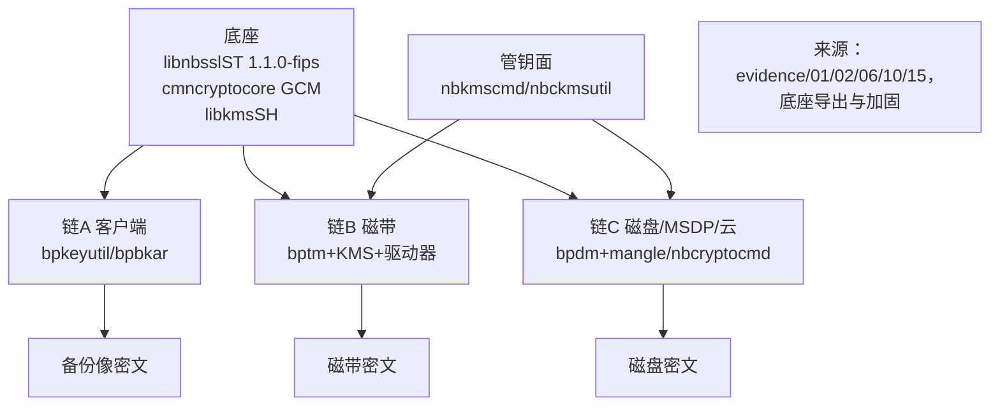
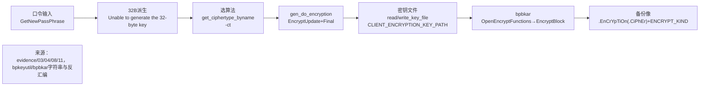
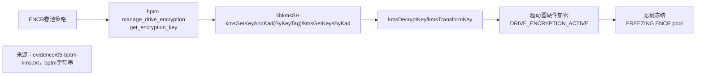
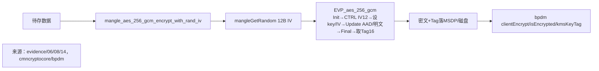

# NBU数据加密实现研究报告（T2071，详细版）

> 对象：`/home/black/Public/aio/F/143/NBU`（NetBackup 10.3.0.1）
> 工具：`file / readelf / ldd / nm -D / strings / objdump -d / r2`
> 边界：仅 NBU 现状，不做 SM4 对比
> 证据：`evidence/01-15`，收敛见 `convergence-map-v3.json`

## 1. 总览：三链一底座

NBU 数据加密 = 底座密码库 + 三条落盘链 + 一套密钥管理：

- 底座：`libnbsslST.so（OpenSSL 1.1.0-fips-dev，NB_101_*）` + `libcmncryptoST / libcmncryptocoreST（EVPCrypter/GCMCrypter/mangle）` + `libkmsSH.so（kms*）`。
- 链 A 客户端备份加密：`bpkeyutil/bpkeyfile` 管钥 → `bpbkar EncryptBlock` 落密文像。
- 链 B 磁带介质加密：`bptm manage_drive_encryption` 按 `ENCR` 卷池向 KMS 取键，下发驱动器硬件加密。
- 链 C 磁盘/MSDP/云加密：`bpdm clientEncrypt/isEncrypted` 调 `mangle_aes_256_gcm_*`，`nbcryptocmd` 走 KMIP/GCM。
- 管钥面：`nbkmscmd` 管组/键/凭证（含 HMK/KPK 口令），`nbckmsutil` 管云，`nbcryptocmd` 管外部 KMIP。



## 2. 底座深挖

### 2.1 版本与封装

`strings libnbsslST.so`（见 `01-ssl-version.txt`）：

```text
Big Number part of OpenSSL 1.1.0-fips-dev xx XXX xxxx
SHA1/SHA-256/SHA-512 part of OpenSSL 1.1.0-fips-dev xx XXX xxxx
OpenSSL FIPS 140-2 Public Key RSA KAT
FIPS 2.0.5 validated module 10 Apr 2013
NB_101_FIPS_mode / NB_101_FIPS_mode_set / NB_101_FIPS_module_version_text
```

`ldd` 显示 `bpkeyutil/bpbkar/bptm/bpdm/nbcryptocmd` 均依赖 `libcmncryptoST / libcmncryptocoreST / libnbsslST / libjanssonST`，与系统 OpenSSL 隔离。

### 2.2 完整对称算法导出（41 个，见 02/10）

- AES-128：`cbc/cfb/cfb128/ctr/ecb/gcm/ofb`（7）
- AES-192：`cbc/cfb/cfb128/ctr/ecb/gcm/ofb`（7）
- AES-256：`cbc/cfb/cfb128/ctr/ecb/gcm/ofb`（7）
- DES：`cbc/cfb/cfb64/ecb/ofb`（5）；3DES：`ede_cfb/ede_cfb64/ede_ofb/ede3_cbc/ede3_cfb/ede3_cfb64/ede3_ecb/ede3_ofb`（8）
- BF：`cbc/cfb/cfb64/ecb/ofb`（5）；Camellia：`128-cbc/256-cbc`（2）
- 合计 41，无 `EVP_sm*`（`07-sm4-count.txt=0`）。

### 2.3 摘要/随机/FIPS

`md5/sha1/sha256/sha512`、`RAND_seed`、`cmncrypto_getRandomBytes/mangleGetRandom`、`cmncrypto_getBinaryHash/CmnCrypto_hasher_*`、`FIPS_mode/mode_set/enable_fips_mode/testFipsCompliance`。

### 2.4 加固（见 15）

`bpkeyutil/bpbkar/bptm` 均为 `GNU_RELRO + BIND_NOW`，`bptm/bpdm` 为 PIE，`GNU_STACK` 不可执行；`gen_do_encryption` 含 `fs:0x28 canary + __stack_chk_fail`。动态库缺省不可解析属正常打包形态，不代表缺失。

## 3. 链 A：客户端备份加密（bpkeyutil/bpkeyfile/bpbkar）



### 3.1 bpkeyutil 算法表（见 03）

```text
AES-128-OFB、AES-192-CFB/OFB、AES-256-OFB/CTR/GCM、ALTAES-128/256-CFB
CAST5-CFB/OFB、DES-CFB/OFB、DES-EDE-CFB/OFB、DES-EDE3-CFB、DES_EDE3-OFB
RC2-CFB/OFB、RC4-40、RC5-CFB/OFB
```

导入 `NB_101_EVP_aes/des/bf/cast/rc` 全系；`r2 afl` 见 `gen_init_encryption/gen_do_encryption/gen_do_decryption/encrypt_passphrase/decrypt_passphrase/get_ciphertype_byname`。

`objdump gen_do_encryption`（见 08）：`malloc→EncryptUpdate→EncryptFinal→memcpy→free`，失败 `V_snprintf+logmsg+return -1`。

### 3.2 bpkeyfile/bpbkar 遗留 DES 路径（见 04/11）

`bpbkar` 字符串含 `DES_40/DES_56/default_libdes_path_40/56`，`bpkeyfile` 含 `libvdes40.so/libvdes56.so/GetDecryptedKeyFile/localDecryptKeyFile/ReadEncryptedKeyFile`。

`objdump OpenEncryptFunctions`：`dlopen(40)→dlsym 8个vdes_*→dlopen(56)→dlsym 2个→任一失败InternalErrorMessage+Close+return -1`。`EncryptBlock` 经 `vdes_cbc_encrypt_p` 间接调用，按块类型分流 `memcpy`。

口令提示区分标准与 NetBackup 口令：`Enter old/new key file pass phrase (standard...)` vs `Enter new NetBackup pass phrase`。

## 4. 链 B：磁带介质加密（bptm + KMS + 驱动器）



证据（见 05）：`FREEZING ... ENCR pool`、`DRIVE_ENCRYPTION_ACTIVE/BH_MAY_BE_ENCRYPTED`、`KMSCLIB::kmsGetKeyAndKad(ByKeyTag)/kmsGetKeysByKad/kmsDecryptKey/kmsTransformKey`、`begin writing encrypted backup id ... to (WORM) media`、`-fix_encrypt/FIX_ENCRYPT_KEYFILE`、`Encrypting data-in-transit/DTE IN-APP-TLS`。

`objdump -T bptm` 仅见 `CmnCrypto_hasher_*`，无 EVP 直调，证明加密下沉到库与硬件，bptm 只做调度与 KAD 标签管理。

## 5. 链 C：磁盘/MSDP/云加密（bpdm + mangle + nbcryptocmd）



`nm`（见 06）：`mangle_aes_256_gcm_encrypt_with_rand_iv/decrypt` + `EVPCrypter(7方法)` + `GCMCrypter(encrypt/decrypt/reset/getEncrypted/getDecrypted/add_authenticated_data_*)`。

`bpdm`（见 14）：`clientEncrypt/isEncrypted/kmsKeyTag/MSDPLB+/dedupeRatio/is_dedupe_to_cloud_storage/WORM lock/MSDP multi-domain`，去重与云共用同一调度。

`nbcryptocmd`（见 13）：自带 `GCMCrypter` + `NB_101_EVP_aes_256_gcm/FIPS_mode` + 全套 `NB_EKMS_KMIP::KMIP_* boost` 模板，为外部 KMIP 主力。

## 6. 管钥面深挖（nbkmscmd/nbckmsutil）

`nbkmscmd`（见 12）：`Key Group/Group Name/Info List`、`-createKey/-passphrasePath`、`HMK/KPK passphrase`（含 `Enter/Re-enter/Failed to read/did not match`）、`netbackup/security/passphrase-constraints`、`random passphrases`、`createKeyArg/createKeyRKSs`、`KMIP Attributes`。即组→键→凭证三级，HMK 护 KPK，KPK 护键口令，支持随机口令与文件口令。

## 7. 落盘形态与密钥生命周期

| 落盘 | 形态 | 取键 |
|---|---|---|
| 备份像 | `.EnCrYpTiOn(.CiPhEr)` 标记 + 密文 + `ENCRYPT_KIND` | 客户端密钥文件口令派生 32B 钥 |
| 磁带 | 驱动器硬件密文 + KAD 标签 | `ENCR` 卷池 → `kmsGetKeyAndKad(ByKeyTag)` → `kmsDecryptKey` |
| 磁盘/MSDP/云 | AES-256-GCM 密文 + 12B 随机 IV + 16B Tag | `clientEncrypt/kmsKeyTag` 或 KMIP |

口令丢、KMS 库丢即无法解密；`FIX_ENCRYPT_KEYFILE` 仅为修复镜像的离线手段。

## 8. 安全提示（secure-coding 视角）

- 新备份禁用 `DES_40/56、RC4-40、BF、CAST`，统一 `AES-256-GCM/CTR` 并开 FIPS。
- `dlopen libvdes` 路径须锁定权限，仅留读旧备份用途。
- KMS 的 HMK/KPK 口令文件与 `KMS_DATA` 分离备份，权限最小化，日志禁记口令。

## 9. 结论与收敛映射

- AC-1：通过。ev-evp/ev-ciphers/ev-mangle 覆盖底座、工具表、GCM 封装。
- AC-2：通过。ev-client/ev-tape 覆盖客户端与磁带，4 图每图 1 来源。
- AC-3：通过。ev-report/ev-map3 覆盖报告与映射，复现命令如下。

## 10. 复现命令

```bash
strings NBU/lib/libnbsslST.so | grep -E "OpenSSL 1.1.0|FIPS"
nm -D NBU/lib/libnbsslST.so | grep -E "EVP_(aes|des|bf|camellia)"
strings NBU/bin/bpkeyutil | grep -E "^(AES|DES|CAST|RC|ALTAES)"
strings NBU/bin/bpkeyfile | grep -E "pass phrase|vdes|EncryptKeyFile"
strings NBU/bin/bpbkar | grep -E "vdes_|EnCrYpTiOn|ENCRYPT_KIND"
strings NBU/bin/bptm | grep -E "kmsGetKey|manage_drive_encryption|ENCR pool"
strings NBU/bin/bpdm | grep -E "MSDP|clientEncrypt|kmsKeyTag"
strings NBU/bin/nbkmscmd | grep -E "Key Group|HMK|KPK|KMIP"
nm -D NBU/lib/libcmncryptocoreST.so | grep -E "mangle_aes|GCMCrypter"
nm -D NBU/bin/nbcryptocmd | grep -E "GCM|KMIP|FIPS"
objdump -d NBU/bin/bpkeyutil --disassemble=gen_do_encryption | grep EVP_Encrypt
objdump -d NBU/lib/libcmncryptocoreST.so --disassemble=mangle_aes_256_gcm_encrypt_with_rand_iv | grep -E "aes_256_gcm|mangleGetRandom"
readelf -l NBU/bin/bptm | grep -E "GNU_STACK|GNU_RELRO"
```
