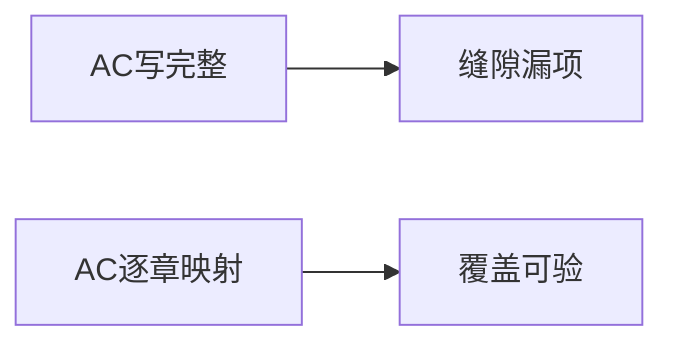
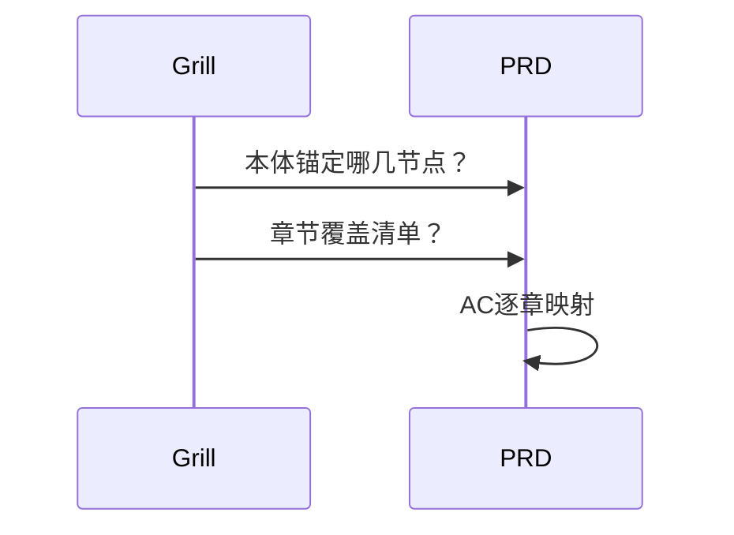
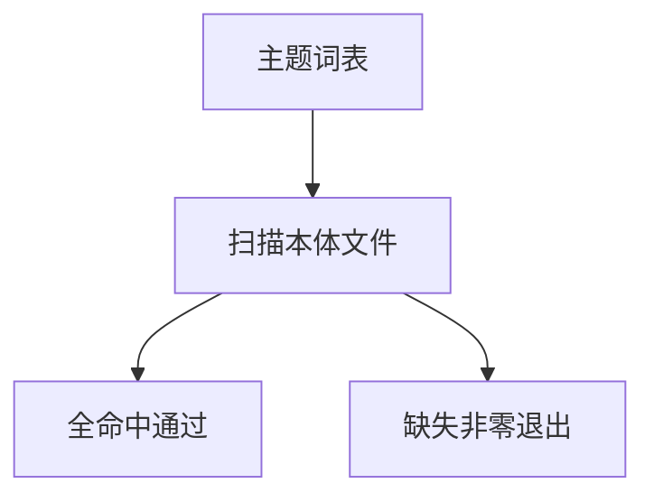

# 原因分析报告：本体缺口三原因（T2115）

> T2107归档后复盘：本体有形式无覆盖。三个病根与落点如下，修法在母票Do一次落地。

## 原因1：AC把“全”写成了不可判定词

- T2107的AC-2“落改点清单完整”中“完整”无章节映射，Do按字面交付，NFS/密钥/门禁从缝隙漏出。
- 修法：`ontology:concept/pdca-acceptance-criterion`追加章节映射规则——research类AC必须逐源文档章节编号映射，禁“完整/齐全”等词，附坏好例子。

## 原因2：Grill没问覆盖

- 三轮Grill只问范围/深度/本体锚定，没问“本体覆盖方案哪些章节”，缺口无人点名。
- 修法：`ontology:concept/grilling-methodology`追加覆盖必问轮——research必问本体锚定+沉淀计划+章节覆盖清单。

## 原因3：门禁只验形式不验覆盖

- `check-research-ontology-settlement.py`只查record引用与`ontology:`字样，不查内容覆盖；T2107形式全绿内容缺三块。
- 修法：新增`scripts/check-ontology-topic-coverage.py`（主题词表→本体文件覆盖校验，缺失即非零退出），`scenario-research-first-gate`引用为Act推荐自检。

## Sources

- Source: 本次实测 `pdca/tasks/0909-guomi-storage-research/prd.md` AC-2“完整”原文与R3五条摘录（任务工作区可验）
- Source: 门禁脚本只验形式 `scripts/check-research-ontology-settlement.py:84-96`（record引用+字样检查，无覆盖语义）
- Source: 子票硬门禁与叶豁免 `scripts/pdca_core.py:647-658`（T2084）、先调研门禁（T2092/T2103）
- Source: 待修目标 `ontology:concept/pdca-acceptance-criterion.md`、`grilling-methodology.md`（均20余行薄规范，见上文引用）
- Source: 覆盖脚本实现参考（标准库argparse/退出码约定） — https://docs.python.org/3/library/argparse.html
- Source: 系统化文档完整性思路（文档四象限覆盖检查，呼应flow-do文档路径） — https://diataxis.fr/
