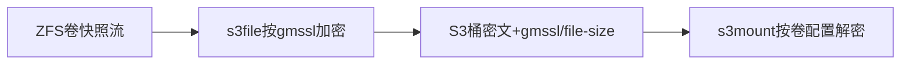
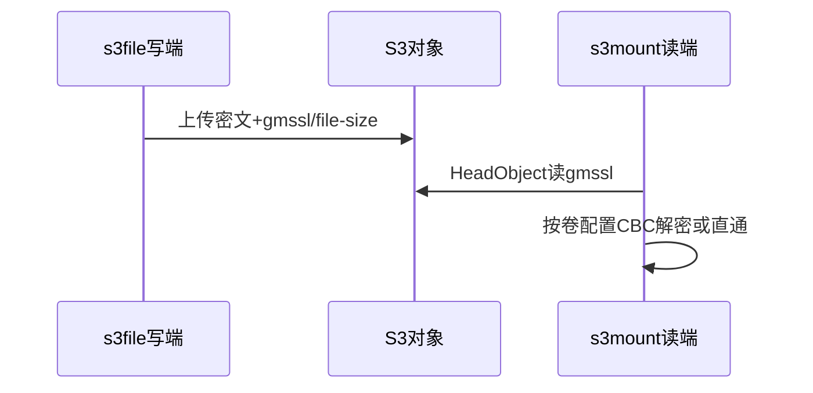
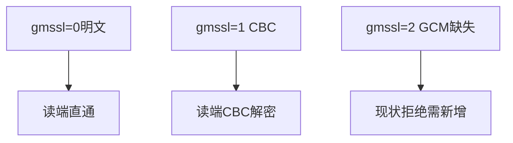
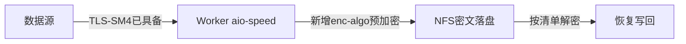
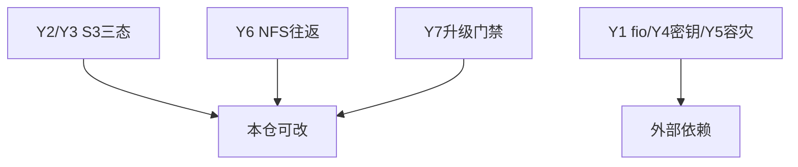

# 调研报告：存储国密方案在本仓落改点（T2099·纯调研）

> 性质：纯结论性调研，不改代码。复核路径：每条差距均给文件行号，`grep`+`Read`可重走；Do结束时`git status`须干净。

## 1. S3现状（s3file/s3mount）

- 写端只分支`gmssl==1` CBC（`s3tools/s3file/main.cpp:923,954,1155`），无GCM分支；密钥IV硬编码固定复用（`main.cpp:919-922`）。
- CLI `--gmssl`（`main.cpp:139,165,1246`，`atoi`无值域校验）与配置文件`gmssl`（`config.cpp:129-136` bool型仅0/1，`config_test.cpp:72-76`拒`2`）口径不一致。
- 读端按卷配置解密（`s3mount/fuse-file.cpp:224,823,914`），未按对象元数据自适应；元数据仅`gmssl`+`file-size`（`s3_service_frame.h:50-58`，`obs-service.cpp:319-329,380-390`，`meta_data_count=2`），无`sm4-nonce`。
- 卷级强一致校验（`main.cpp:1488-1493`）阻断三态过渡。

## 2. NFS与aio-speed（传输/存储拆分）

- 传输国密已具备：`--tls-algorithm TLS_SM4_GCM_SM3`（`rpc/rpc-client.cpp:489,693-704`），本次不动。
- 存储预加密缺失：全仓无`--enc-algo`；现有`--encrypt`为静态XOR（`rpc/rpc-common.cpp:446-464`），非真加密，不得计入合规。
- 落改点：新增`--enc-algo sm4-gcm/sm4-cbc`（默认明文）+ 管理侧清单（算法/nonce/长度/校验和）+ 半写清理重传。

## 3. ZFS承接（外部依赖）与Y对齐

- 本仓无ZFS内核源码：ICP第9套件、包裹双支持均记外部依赖；本仓只承接`encryption=sm4-gcm`、`load/unload-key`、`send/recv`继承、内测灰度。
- Y1/Y4/Y5外部依赖；Y2/Y3/Y6/Y7本仓可改；3.8清单S3走对象元数据、NFS走管理侧清单；3.9日志落点fail-closed错误码。

## Sources

- Source: 本仓实测 `s3tools/s3file/main.cpp:139,165,919-923,954,1155,1246,1488-1493` 与 `config.cpp:129-136`（行号可复核）
- Source: 本仓实测 `s3tools/s3mount/fuse-file.cpp:224,819-823,914-930` 与 `s3_service_frame.h:50-58`（行号可复核）
- Source: 本仓实测 `rpc/rpc-client.cpp:489,693-704` 传输SM4已具备与 `rpc/rpc-common.cpp:446-464` XOR非加密（行号可复核）
- Source: 方案原文 §3.2三态/§3.3预加密/§3.8清单/§3.9可观测/五Y1-Y7（`/home/black/Public/aio/F/143/存储国密加密技术方案.md`）
- Source: OpenZFS原生加密属性表达（`encryption/keystatus`语义，方案§3.1.5引文） — https://arstechnica.com/gadgets/2021/06/a-quick-start-guide-to-openzfs-native-encryption/
- Source: GmSSL库（本仓`third_party/gmssl`链接的SM4/GCM实现来源） — https://github.com/gmssl/GmSSL
- Source: OpenZFS官方文档（原生加密与收发继承语义参照） — https://openzfs.github.io/openzfs-docs/
