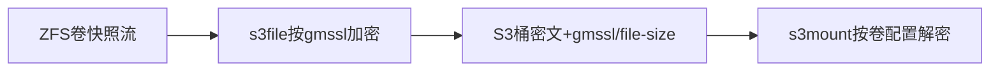
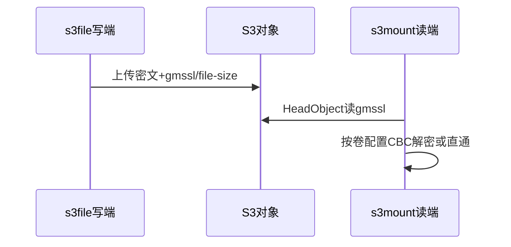
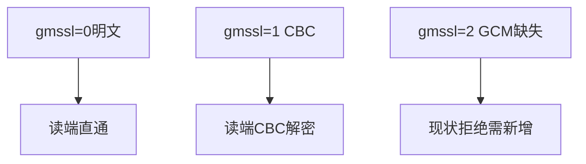
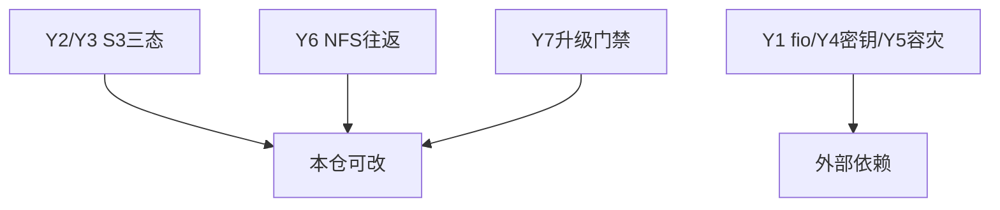

# 调研报告：存储国密方案在本仓落改点（T2107）

> 纯调研，不改代码。每条结论后附复核命令，`grep`可重走；报告定稿时本仓`git status`须干净。

## 1. S3写端（s3file）：缺GCM分支，口径不一致

- 加解密只分支`gmssl==1`（CBC），无GCM分支：
  `grep -n "gmssl ==" s3tools/s3file/main.cpp` → 仅954/1155两处`==1`。
- SM4密钥与IV硬编码固定复用，不满足GCM每对象随机nonce：
  `grep -n "uint8_t key\[16\]\|uint8_t iv\[16\]" s3tools/s3file/main.cpp` → 919/921。
- CLI与配置文件口径不一致：CLI `--gmssl`经`atoi`无值域校验（`main.cpp:139`选项注册）；
  配置文件走bool型仅0/1（`config.cpp:129-136`，`? 1 : 0`），`gmssl=2`被拒绝（`tests/config_test.cpp:72-76`）。
- 落改点：CLI+config统一0/1/2三态；`=2`走SM4-GCM每对象随机12B nonce；密钥收发同钥、本次不换钥。

## 2. S3读端与元数据：未按对象自适应

- s3mount读端只看卷开关`enable_gmssl`（`fuse-file.cpp:224`来自卷配置，`823/914`分支），不读对象`gmssl`元数据。
- 对象元数据只有`gmssl`+`file-size`两键（`s3_service_frame.h:50-58`，`obs-service.cpp:309/370 meta_data_count=2`），无`sm4-nonce`。
- 卷级强一致校验（`main.cpp:1488 enableGmssl != gmssl`直接失败）阻断三态过渡。
- 落改点：读端按对象`gmssl`分支（2→GCM、1→CBC、0→直通），缺nonce则fail-closed不跨模式重试；
  新增`sm4-nonce`元数据（`meta_data_count` 2→3）；读端先行升级再允许写GCM，清理关闭解密的旧挂载点。

## 3. NFS与aio-speed：传输已具备，存储缺失

- 传输国密已具备：`--tls-algorithm`支持`TLS_SM4_GCM_SM3`（`rpc/rpc-client.cpp:489,1154-1161,1244-1246`），本次不动。
- 存储预加密缺失：全仓无`--enc-algo`；现有`--encrypt`是静态XOR（`rpc/rpc-common.cpp:446-447`四字节密钥），非真加密，不得计入合规。
- 落改点：新增`--enc-algo sm4-gcm/sm4-cbc`（默认明文）+ 管理侧清单（算法/nonce/长度/校验和）+ 半写清理重传。

## 4. ZFS承接与Y1-Y7对齐（外部依赖明确）

- 本仓无ZFS内核源码：ICP第9套件`sm4-gcm`、包裹双支持记外部依赖；承接`encryption=sm4-gcm`、`load/unload-key`、`send/recv`继承、内测灰度。
- Y2/Y3/Y6/Y7本仓可改；Y1/Y4/Y5外部依赖；3.8清单S3走对象元数据、NFS走管理侧清单；3.9日志落点fail-closed错误码；容量/传输改造/密钥轮换为显式非目标。

## Sources

- Source: 本仓实测 `s3tools/s3file/main.cpp:139,919-923,954,1155,1488`、`config.cpp:129-136`（复核命令见§1）
- Source: 本仓实测 `s3tools/s3mount/fuse-file.cpp:224,823,914`、`s3_service_frame.h:50-58`、`obs-service.cpp:309-329,370-390`（复核命令见§2）
- Source: 本仓实测 `rpc/rpc-client.cpp:489,1154-1161`传输已具备、`rpc/rpc-common.cpp:446-464` XOR非加密（复核命令见§3）
- Source: 方案原文 §3.2三态/§3.3预加密/§3.8清单/§3.9可观测/五Y1-Y7（`/home/black/Public/aio/F/143/存储国密加密技术方案.md`）
- Source: OpenZFS原生加密属性表达（方案§3.1.5引文） — https://arstechnica.com/gadgets/2021/06/a-quick-start-guide-to-openzfs-native-encryption/
- Source: GmSSL库（本仓`third_party/gmssl`的SM4实现来源） — https://github.com/gmssl/GmSSL
- Source: OpenZFS官方文档（原生加密与收发继承语义参照） — https://openzfs.github.io/openzfs-docs/
