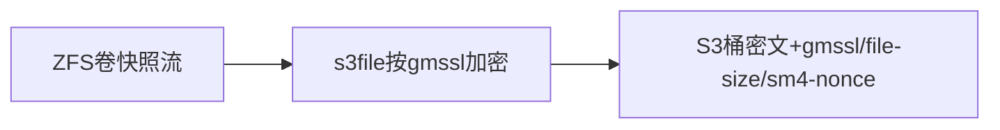
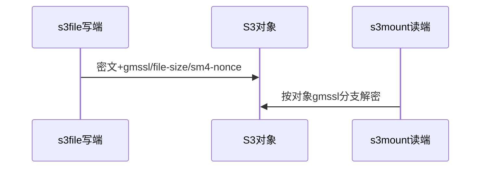
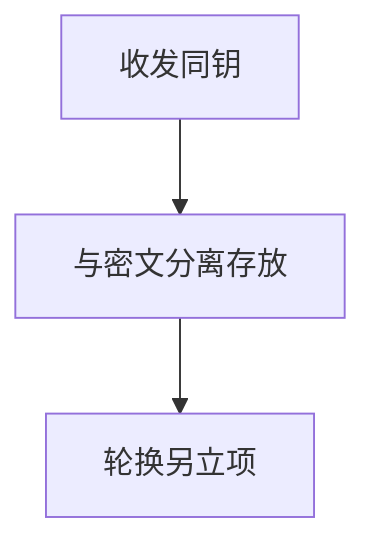
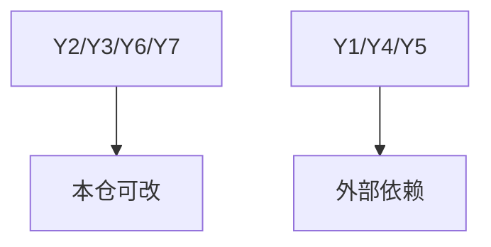

# 调研报告：存储国密方案落改重做（T2125）

> 方法：逐方案章节映射（AC-1~AC-5），行号今日重验，复核命令附后；零代码改动。

## §3.2 S3三态写（AC-1）

- 写端只分支`gmssl==1`（`s3tools/s3file/main.cpp:954,1155`），无GCM分支；key/IV硬编码（`:919`）。
- CLI `--gmssl`无值域校验（`:139`）vs 配置bool仅0/1（`config.cpp:130`），`gmssl=2`被拒。
- 复核：`grep -n "gmssl == 1\|uint8_t key\[16\]" s3tools/s3file/main.cpp`
- 落改：三态统一；`=2`走SM4-GCM每对象随机12B nonce记`sm4-nonce`，`file-size`存原文长度。

## §3.2/§3.4 读端自适应与升级门禁（AC-2）

- s3mount只看卷开关（`fuse-file.cpp:823,914`），不按对象`gmssl`分支；元数据仅两键（`obs-service.cpp:309,370 count=2`）。
- 卷级强一致校验（`main.cpp:1488`）阻断过渡。
- 复核：`grep -n "enable_gmssl" s3tools/s3mount/fuse-file.cpp`
- 落改：按对象分支fail-closed不重试；`meta_data_count` 2→3；读端先行升级+清理关闭解密的旧挂载点。

## §3.3 NFS清单（AC-3）

- 全仓无`--enc-algo`（`grep -rn enc-algo rpc/ s3tools/`零命中）；`--encrypt`系静态XOR（`rpc-common.cpp:446`）。
- 落改：新增`--enc-algo sm4-gcm/sm4-cbc`（默认明文）；管理侧清单四字段算法/nonce/长度/校验和；半写清理重传。

## §四 密钥管理（AC-4）

- 现状收发同钥（硬编码同一key，`main.cpp:919`/`fuse-file.cpp:819`同值）；无轮换机制、无版本登记。
- 落改：本次只换模式不换钥；分离存放、轮换按卷/桶另立项、丢钥丢数据纳入变更流程。

## §3.1/§3.5/Y ZFS承接与灰度（AC-5）

- 本仓无内核源码：ICP第9套件记外部依赖；承接`encryption=sm4-gcm`、`load/unload-key`、`send/recv`继承。
- Y2/Y3/Y6/Y7本仓可改；Y1/Y4/Y5外部依赖；灰度只限内部测试环境。

## Sources

- Source: §3.2重验 `s3tools/s3file/main.cpp:139,919,954,1155,1488`、`config.cpp:130`（复核命令见§3.2节）
- Source: §3.2/§3.4重验 `s3mount/fuse-file.cpp:823,914`、`obs-service.cpp:309,370`（复核命令见节）
- Source: §3.3重验 `rpc/rpc-common.cpp:446` XOR、`rpc/rpc-client.cpp:489` TLS已具备、`enc-algo`零命中
- Source: 方案原文 §3.1–§3.5/§四/§五（`/home/black/Public/aio/F/143/存储国密加密技术方案.md`）
- Source: OpenZFS原生加密属性表达 — https://arstechnica.com/gadgets/2021/06/a-quick-start-guide-to-openzfs-native-encryption/
- Source: GmSSL库（本仓`third_party/gmssl`来源） — https://github.com/gmssl/GmSSL
- Source: OpenZFS官方文档 — https://openzfs.github.io/openzfs-docs/
