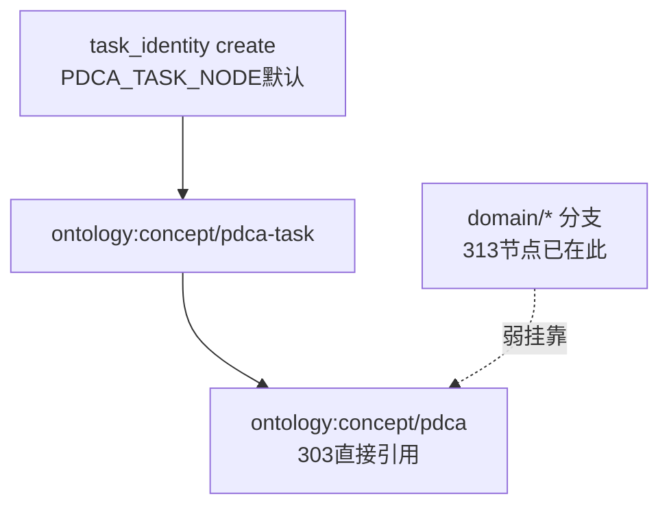
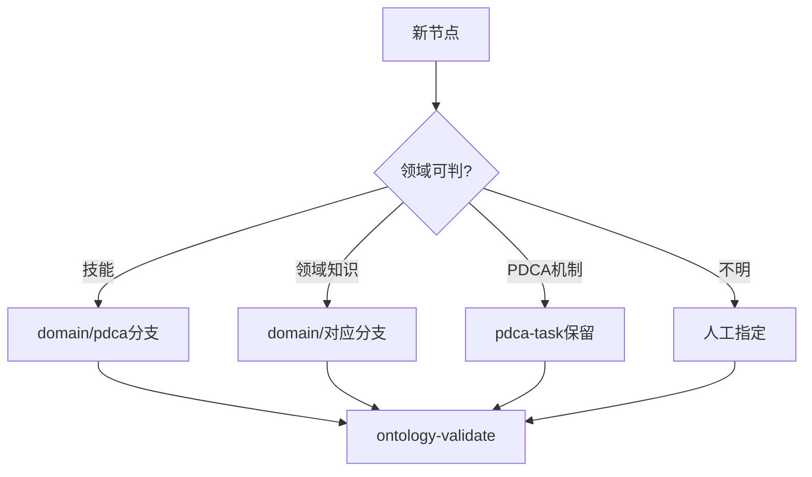
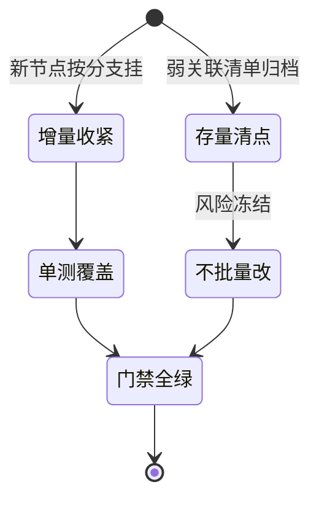

# T2152 research-report：收紧默认锚定方案

## 调研目标

设计 `task_identity` 默认锚定收紧方案：新节点按领域挂分支，
不再默认全挂 `pdca-task`；存量只清点不批量改。

## 方法

代码取证默认锚定逻辑 + 子树分布统计 + 增量/存量分流设计。

## 发现

### 架构图 C4 L2（mermaid）

Source: scripts/task_identity.py:44（`PDCA_TASK_NODE` 默认锚定常量）

### 逻辑图 目标锚定流（mermaid）

Source: scripts/task_identity.py:292-315（未显式锚定时继承/默认逻辑）

### 生命周期图 迁移策略（mermaid）

Source: https://docs.pytest.org/（单测方法背景）

## 结论与建议

1. 改 `task_identity` 默认策略为领域分支挂靠，保留显式 `--ontology-anchor` 覆盖。
2. 存量 303 直接引用只清点出迁移清单，不批量改（冻结风险）。
3. 新策略单测覆盖创建路径，回归全绿进 Check。

## 术语表

- 默认锚定：未显式指定时自动继承/回落的 ontology 挂接。
- 弱关联：仅 `relates_to` 的挂靠（789 条，近 specializes 两倍）。

## 参考资料

- pytest 单测方法背景：https://docs.pytest.org/
- Git 变更追溯方法背景：https://git-scm.com/doc
- Source: ontology/concept/pdca-task.md（锚定目标节点，可复核）
- Source: https://docs.pytest.org/（单测方法背景）
