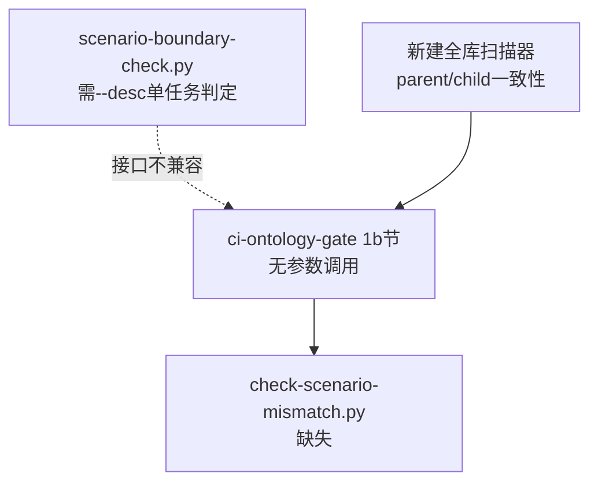
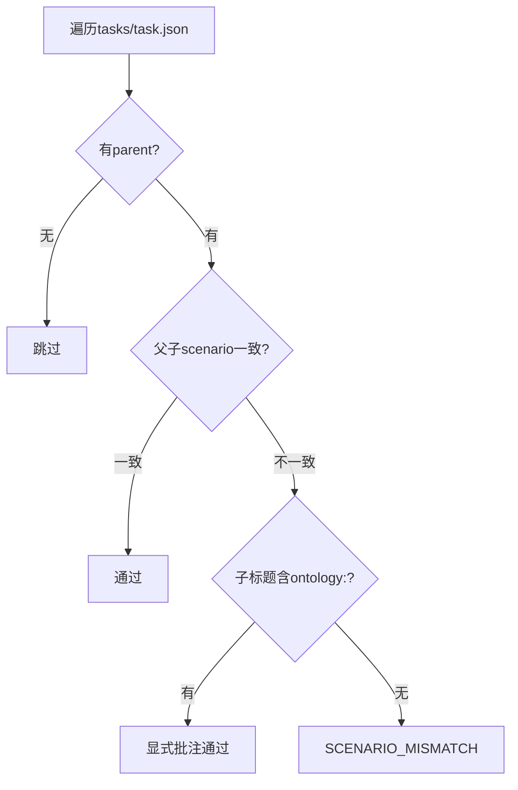
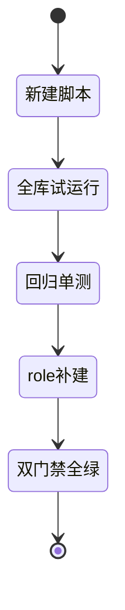

# T2149 research-report：CI 悬空引用根因与修复方案

## 调研目标

确定 `ci-ontology-gate.py` 1b 节悬空引用的正确修法，并确认 `role/` 缺失范围。

## 方法

接口比对（缺失脚本期望语义 vs 现存判定器接口）+ 全库引用审计。

## 发现

### 架构图 C4 L2（mermaid）

Source: scripts/ci-ontology-gate.py:45（无参数调用缺失脚本）

### 逻辑图 判定语义（mermaid）

Source: scripts/task_identity.py:353-362（创建时跨层批注规则，扫描器复用此语义）

### 生命周期图 实施步骤（mermaid）

Source: https://docs.pytest.org/（回归验证方法背景）

## 结论与建议

1. 新建 `scripts/check-scenario-mismatch.py`（全库 parent/child 一致性扫描，复用创建时语义），不改 ci 调用方。
2. `role/` 补建：目录 + 至少一占位说明（领域角色暂无实例，目录先行，_meta 对齐）。
3. 单测覆盖扫描器（一致/跨层无批注/跨层有批注三例）。

## 术语表

- 双层闸：创建时（task_identity）+ CI 全库扫描两层 scenario 一致性校验。
- 跨层批注：子标题含 `ontology:` 即视为显式跨层授权。

## 参考资料

- pytest 回归验证方法背景：https://docs.pytest.org/
- Git 变更追溯方法背景：https://git-scm.com/doc
- Source: scripts/scenario-boundary-check.py:12-16（单任务判定器接口，需 --desc）
- Source: https://docs.pytest.org/（回归验证方法背景）
