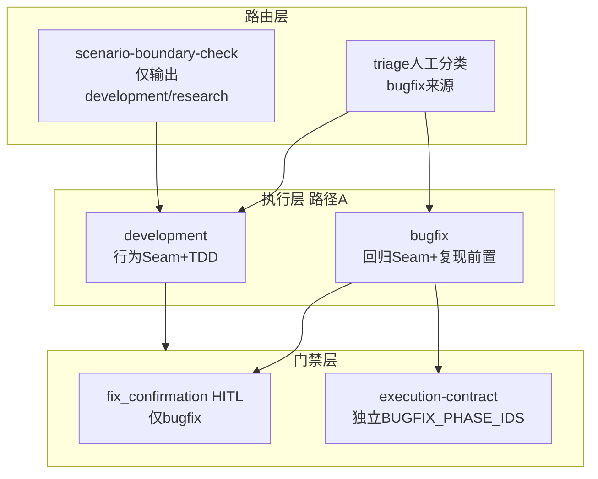
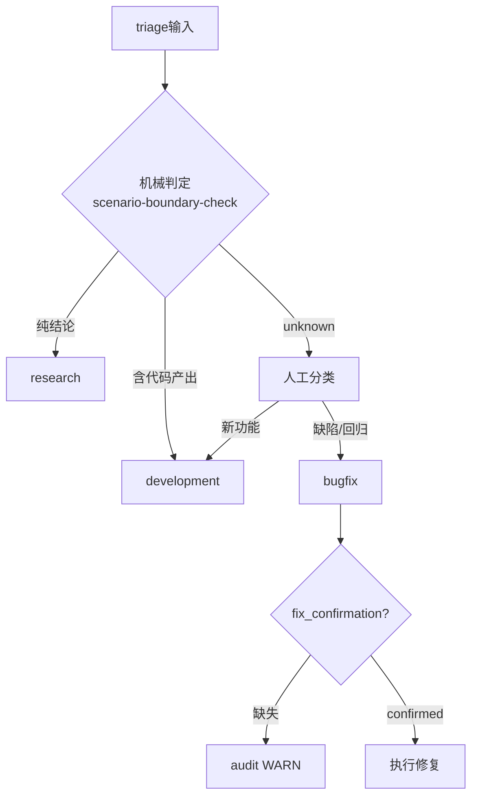
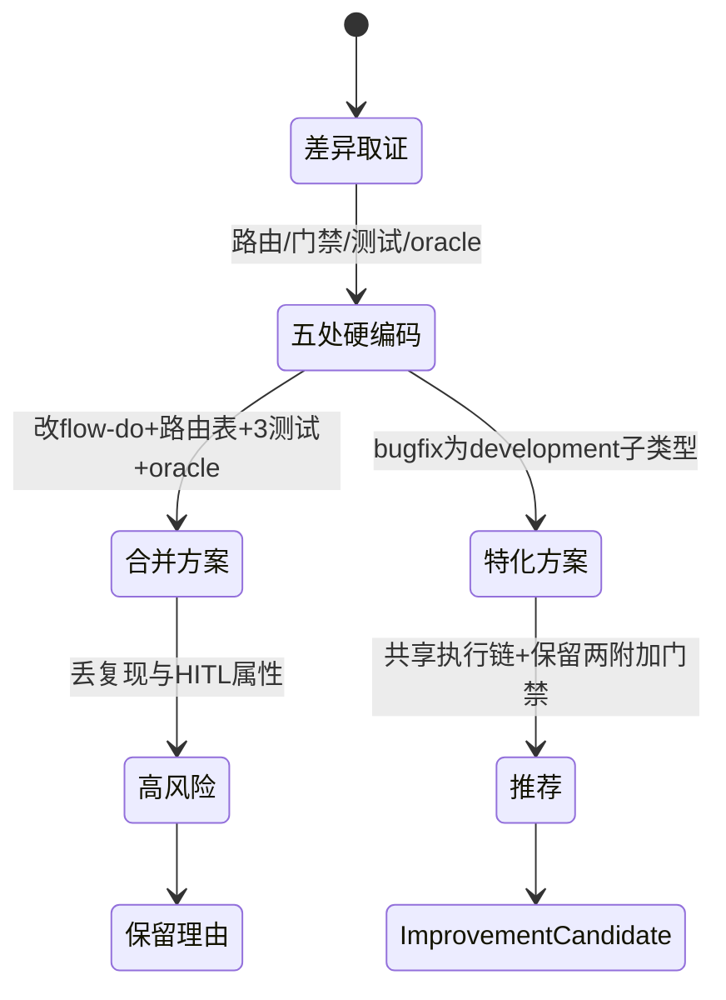

# T2148 research-report：A场景不再区分 development/bugfix 可行性论证

## 调研目标

论证 `flow-do` 路径A内 development 与 bugfix 是否可合并。
结论二选一：可行的 Improvement Candidate，或保留区分的理由。

## 方法

全库 `grep` 定位所有按 `scenario_type == bugfix` 分支的硬编码，
对照 `flow-do` 文字与场景边界规则，逐条判定差异是本质还是历史遗留。
每条结论附可复核的 file:line 引用。

## 发现

### 架构图 C4 L2（mermaid）

Source: ontology/process/flow-do.md:64（bugfix 以回归 Seam 代替行为 Seam，须先复现）

### 逻辑图 判定流程（mermaid）

Source: scripts/flow_audit.py:154-157（bugfix 需 `fix_confirmation:confirmed`，HITL 门禁）

### 生命周期图 合并决策状态机（mermaid）

Source: scripts/resolve-ai-execution-contract.py:19（`SCENARIOS = ("development", "bugfix")`，bugfix 独立 phase 序列）

## 结论与建议

差异清单（五处硬编码，均可复核）：

1. 执行语义：bugfix 须先复现 + 失败回归测试，以回归 Seam 代替行为 Seam。
2. 安全门禁：bugfix 须 `fix_confirmation:confirmed`（HITL，防未确认代码改动）。
3. 执行路由：`execution-contract` 为 bugfix 维护独立 `BUGFIX_PHASE_IDS`。
4. 评测 oracle：路由合约与三测试文件对 bugfix 有独立锚点与断言。
5. 机械判定缺口：`scenario-boundary-check` 仅输出 development/research，bugfix 归属完全依赖人工分类——这是真正的构建问题，而非 development/bugfix 之争。

核心判断：**不建议无条件合并**。复现前置与 HITL 确认是安全属性，合并会静默丢失。
推荐 **特化方案**：bugfix 明确为 development 的特化子类型，共享 A 路径执行链，
仅保留复现 + `fix_confirmation` 两个附加门禁；同步补机械判定对 bugfix 的输出
（改动清单见 Improvement Candidate）。若坚持完全合并，需同步改评测 oracle，
风险高，不推荐。

## 术语表

- 回归 Seam：bugfix 路径的测试接缝，锚定失败回归测试而非行为测试。
- HITL：human-in-the-loop，此处指修复前的人工确认门禁。
- 特化子类型：共享父类型执行链，仅附加额外约束的子类型。

## 参考资料

- pytest 回归测试方法背景：https://docs.pytest.org/
- Git 变更追溯方法背景：https://git-scm.com/doc
- Source: ontology/concept/pdca-scenario-boundary-rule.md（机械判定无 bugfix 输出，判定规则节）
- Source: tests/test_fix_confirmation_gate.py:116-120（bugfix 路由 marker 断言，可复核）
- Source: https://docs.pytest.org/（回归测试方法背景，bugfix 核心差异的依据）
