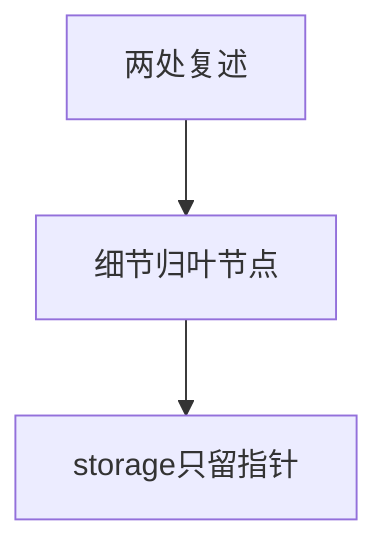
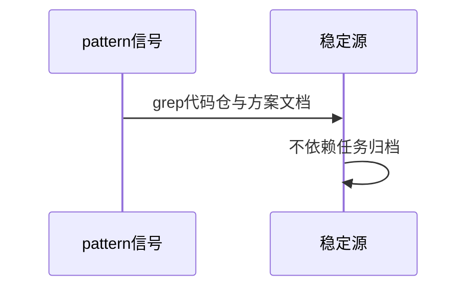

# 缺陷分析：本体混层三硬伤（T2143）

> bugfix前置调研：复现=grep定位任务痕迹在模式正文；修复=分层重构；回归=validate+覆盖脚本+无任务痕迹残留。

## 硬伤1：任务清单污染模式节点

- R3/R4正文含F/143行号（`main.cpp:139/919/954`、`fuse-file.cpp:224`）、票号动作（“改为”“新增”），属一次性TODO，非可复用模式。
- 复现：`grep -n "main.cpp\|fuse-file\|record" ontology/pattern/sm4-storage-encryption.md`命中R3/R4区。
- 修法：规则模型化（三态机/自适应分支规则/清单模型/密钥四原则），任务痕迹只留`来源record`行。

## 硬伤2：NFS内容两处重复

- 四字段清单在R4与`sm4-nfs-encryption`各写一遍；s3细节R3与s3节点重复。
- 修法：细节只留叶节点（nfs/s3/zfs），storage只留一句话指针。

## 硬伤3：signal自证

- nfs节点signal grep `records/.../evidence/`——任务归档是易变下游，模式信号应指稳定源（代码仓/方案文档）。
- 修法：signal改指`/home/black/Public/aio/`下稳定路径与方案文档。

## Sources

- Source: 复现 `grep -n "main.cpp\|record" ontology/pattern/sm4-storage-encryption.md` R3/R4区命中 — 本仓实测
- Source: 重复定位 `grep -n "落改" ontology/pattern/sm4-nfs-encryption.md ontology/pattern/sm4-s3-encryption.md` — 本仓实测
- Source: 自证signal `ontology/pattern/sm4-nfs-encryption.md:21` 指records evidence — 本仓实测
- Source: 分层原则 `ontology:concept/pdca-architecture`（资产分层Knowledge/Skill，模式节点属Knowledge层）
- Source: 仓库脚本CLI约定参考（自查命令均走argparse脚本） — https://docs.python.org/3/library/argparse.html
- Source: 系统化文档思路参考（与flow-do文档路径的Diátaxis引用一致） — https://diataxis.fr/
