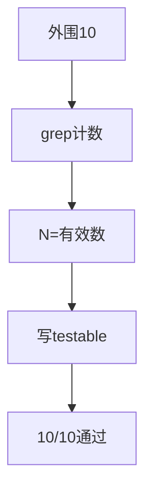
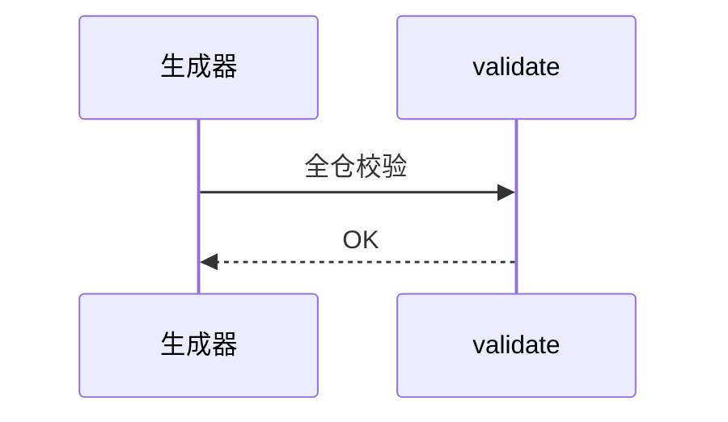
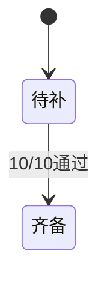

# Research Report — 外围10节点引用型testable（T2137）

## 调研目标
复用T2136同法，为外围10概念节点补引用存活断言。

## 方法
grep三源计数去自身取N，写frontmatter testable_signal，逐条严格复验+validate。

## 发现
10/10严格通过；N分布2~19；pdca-*概念层testable覆盖至此齐备（核心11+外围10+根子树校验）。

### 生成流程（mermaid）

Source: ontology/concept/pdca-continuous-improvement.md testable_signal字段

### 验证时序（mermaid）

Source: ontology/concept/pdca-gate-do.md testable_signal字段

### 覆盖状态机（mermaid）

Source: https://lean.org/lexicon-terms/pdca

## 结论与建议
AC全达成；概念层testable齐备；改时bump规则仍待立项。

## 术语表
- 引用存活：被引用文件数不低于基线N

## 参考资料
- Source: https://lean.org/lexicon-terms/pdca
- Source: https://www.researchgate.net/publication/349440276_PDCA_Cycle_Method_implementation_in_Industries_A_Systematic_Literature_Review
