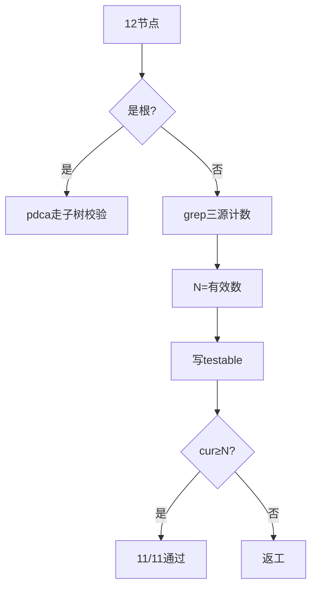
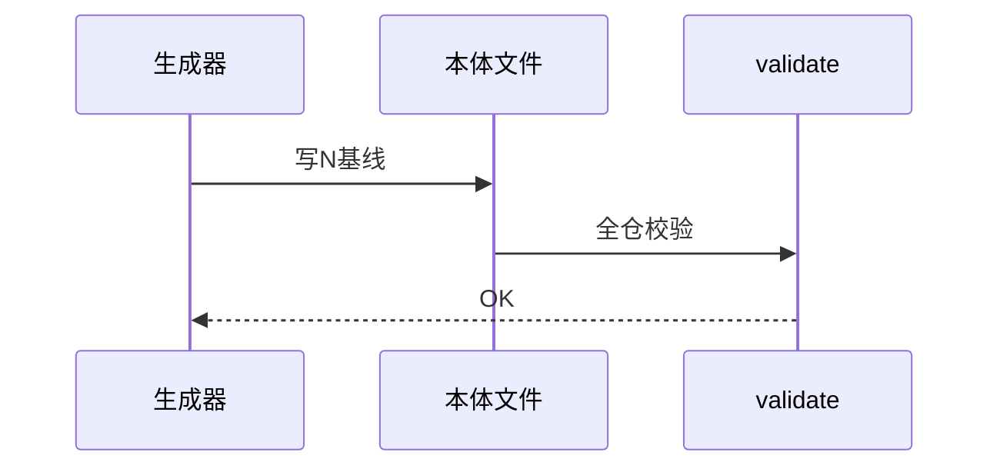
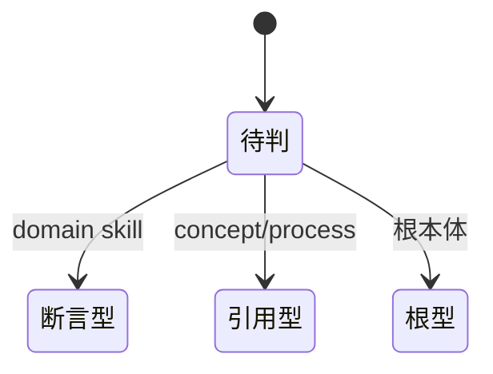

# Research Report — 引用型testable批量产出（T2136）

## 调研目标
为核心12节点（flow-*×4 + 8概念，pdca根走子树校验除外实做11）补引用存活型testable，不断言行为、只断言被引用存活。

## 方法
grep三源（ontology/tests/scripts）统计被引用文件数，去自身后取有效数为下限N，写入frontmatter testable_signal，逐条严格复验（cur≥N）+ validate。

## 发现
11/11严格通过；N分布2~92（flow-check最低2，pdca-task最高92）；pdca根按分层验证决议不加，走子树整体校验。

### 生成流程（mermaid）

Source: ontology/concept/pdca-task.md testable_signal字段

### 验证时序（mermaid）

Source: ontology/process/flow-do.md testable_signal字段

### 分层验证状态机（mermaid）

Source: https://lean.org/lexicon-terms/pdca

## 结论与建议
AC-1/AC-3达成（11条严格通过+validate OK）；外围10节点（acceptance-criterion/ai-friendly-confirmation/architecture/continuous-improvement/gate-do/home/ready/provable/boundary/source-doc）照同法后续批次。

## 术语表
- 引用存活：被引用文件数不低于基线N

## 参考资料
- Source: https://lean.org/lexicon-terms/pdca
- Source: https://www.researchgate.net/publication/349440276_PDCA_Cycle_Method_implementation_in_Industries_A_Systematic_Literature_Review
