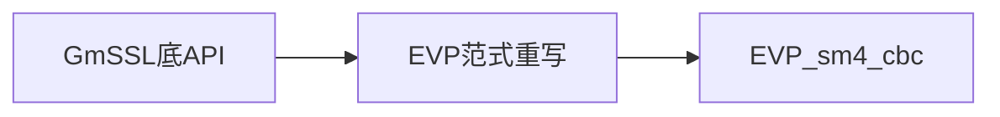
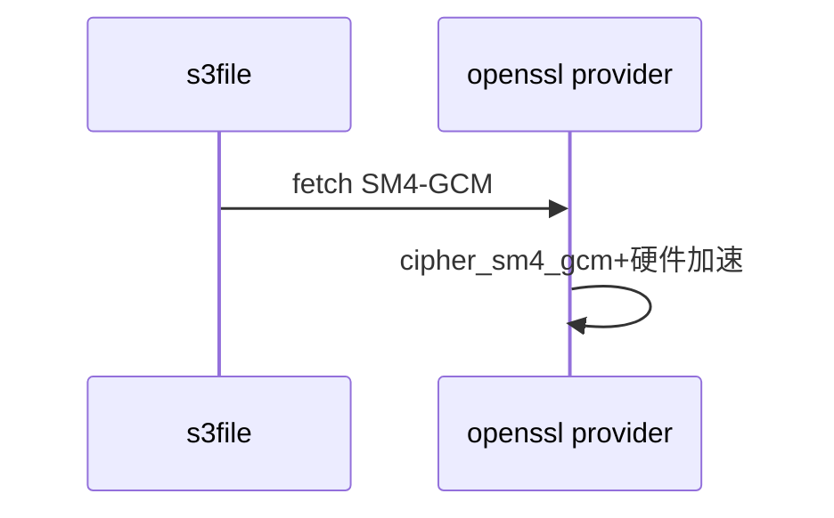
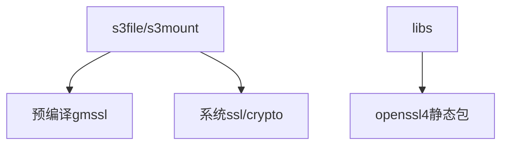

# 审查报告：openssl替换gmssl SM4（T2151）

> 结论先行：可替换，但须重写调用层；CBC有EVP等价，GCM须走provider接口；构建上openssl4已在libs静态链接，s3侧切库需改xmake。

## AC-1 CBC对照

s3现用4个GmSSL底API（`s3file/main.cpp`、`s3mount/fuse-file.cpp`均`#include "gmssl/sm4.h"`）：

| GmSSL现状 | openssl4等价 | 语义差 |
|---|---|---|
| `sm4_set_encrypt_key` / `sm4_set_decrypt_key` | `EVP_sm4_cbc` + `EVP_EncryptInit_ex`（`evp.h:1094`有声明） | 等价，需改EVP范式 |
| `sm4_cbc_padding_encrypt` / `sm4_cbc_padding_decrypt` | `EVP_EncryptUpdate/Final`（padding由EVP处理） | GmSSL系一次性padding封装，EVP须分段改写 |
| `SM4_KEY` + 硬编码key/iv | `EVP_CIPHER_CTX` + 随机IV | 顺手消除固定IV复用 |

## AC-2 GCM对照

- GmSSL：`sm4_gcm_*`全套（`sm4.h:106-136`，init/update/finish加解密）。
- openssl4：legacy `evp.h`无`EVP_sm4_gcm`、legacy `e_sm4.c`无GCM；但provider有
  `providers/implementations/ciphers/cipher_sm4_gcm.c`（+CCM与x86_64/rv64硬件加速）。
- 结论：GCM替换必须走provider接口（`EVP_CIPHER_fetch("SM4-GCM")`类），不能平替头文件。

## AC-3 构建链接归属

- s3file/s3mount：链预编译`third_party/gmssl`（xmake显式`lib_/include/`）+ 系统`ssl/crypto`；SM4只走gmssl。
- `libs/`：`add_requires("openssl4 4.0.1", {system=false, static})`，源码即`third_party/openssl4`（`packages/o/openssl4/xmake.lua`，upstream 3.x线Apache-2.0）。
- 全仓无`EVP_sm4`/`EVP_CIPHER_fetch`调用（s3tools/rpc/libs零命中）：替换=新增调用+改xmake，无存量EVP代码可复用。

## 替换结论（AC-4沉淀用）

1. 技术可行：CBC有EVP等价，GCM走provider（含硬加速），openssl4已在工程内静态构建。
2. 代价：调用层全部重写（底API→EVP范式，padding/nonce/Tag处理），s3侧xmake由预编译gmssl切到openssl4包。
3. 前提：provider运行时可用性验证 + GCM互通测试（与GmSSL产出互解），本次只审查未验证。

## Sources

- Source: 调用点 `s3tools/s3file/main.cpp:16`、`s3mount/fuse-file.cpp:8`均include gmssl/sm4.h；4API频次统计（复核命令见AC-1）
- Source: GmSSL接口 `third_party/gmssl/include/gmssl/sm4.h:41-82,106-136`（cbc_padding与gcm全套）
- Source: openssl legacy缺GCM `third_party/openssl4/include/openssl/evp.h:1093-1098`、`crypto/evp/e_sm4.c`无GCM；provider有GCM `providers/implementations/ciphers/cipher_sm4_gcm.c`
- Source: 构建归属 `s3tools/s3file/xmake.lua:33-44`、`libs/xmake.lua:3`、`packages/o/openssl4/xmake.lua:1-10`
- Source: EVP SM4接口语义参考 — https://docs.openssl.org/3.0/man3/EVP_EncryptInit/
- Source: provider取 cipher 机制参考 — https://docs.openssl.org/3.0/man3/EVP_CIPHER_fetch/
