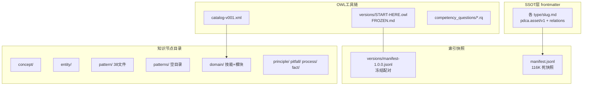
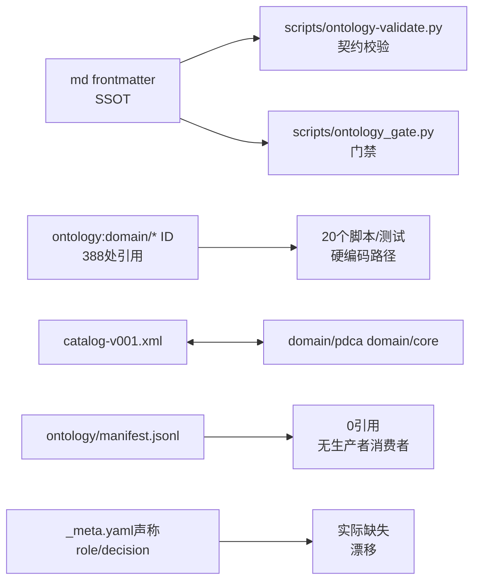
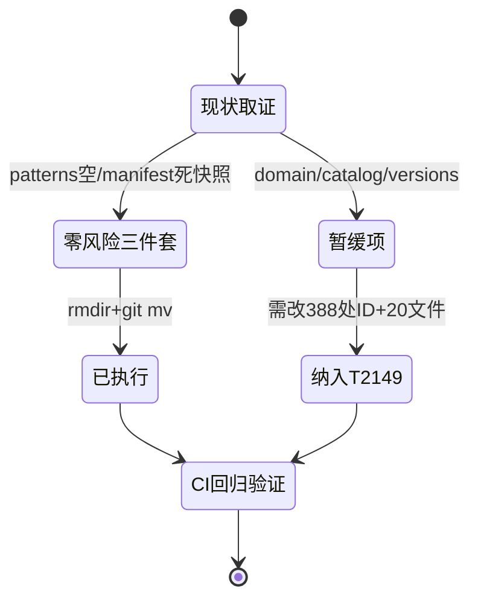

# T2147 research-report：ontology/ 目录知识/工程混放清理调研

## 调研目标

判定 `ontology/` 根目录混放的三类内容（知识节点、工程产物、元数据/治理）的归位方案，
回答：`manifest.jsonl` 性质、`patterns/` 与 `pattern/` 关系、`domain/` 定位，
给出分阶段迁移命令。

## 方法

直接取证：`ls` 清点目录内容、`cat` 查 `catalog-v001.xml` 与 `_meta.yaml`、
`grep` 统计脚本/测试对 `ontology/domain` 路径与 `ontology:domain/` ID 的引用、
确认无脚本读写 `ontology/manifest.jsonl`。每条结论附可复核途径。

## 发现

### 架构图 C4 L2（mermaid）

Source: ontology/_meta.yaml:1（语义权威为 frontmatter + relations，目录仅人类阅读索引）

### 逻辑图 引用关系（mermaid）

Source: ontology/catalog-v001.xml:4-5（`domain/pdca` 与 `domain/core` 的 URI 映射，移动任一端即断链）

### 生命周期图 迁移决策状态机（mermaid）

Source: https://www.oasis-open.org/committees/entity/release/1.0/catalogs.html（OASIS XML Catalog 规范，catalog 文件格式的 primary source）

## 结论与建议

1. `manifest.jsonl` 为死快照（无脚本读写，全库 `grep` 可复核），移入 `_index/`，零风险。
2. `patterns/` 为空目录，直接删除，无需合并。
3. `domain/` 是知识节点类型（`type: domain`，388 处 ID 引用），不可搬出；其内部混维度问题在 domain 内部分子目录整理。
4. `catalog-v001.xml` 锚定现有 `domain/` 路径，暂缓移动。
5. `_meta.yaml` 声称的 `role/`、`decision/` 实际缺失，需补建或修正元数据声明。
6. 采纳：删空目录、移死快照、补 `role/`/`decision/`、对齐 `_meta.yaml`、显式化 `schema/`；暂缓：移动 `domain/`、`catalog`、`versions/`、加 `nodes/` 层。

## 术语表

- SSOT：各 md 文件的 `pdca.asset/v1` frontmatter + relations 块。
- 死快照：无生产者、无消费者的索引文件（`ontology/manifest.jsonl`）。
- 冻结快照：`versions/2026-09-04/` 下带 `FROZEN.md` 的版本配对，不动。

## 参考资料

- OASIS XML Catalogs 规范：https://www.oasis-open.org/committees/entity/release/1.0/catalogs.html
- Protégé 本体编辑器：https://protege.stanford.edu/
- Source: ontology/pattern/（38 文件）vs ontology/patterns/（空目录），`ls` 可复核
- Source: scripts/ontology-validate.py（本体契约校验入口，`python3 scripts/ontology-validate.py` 返回 OK 可复核）
