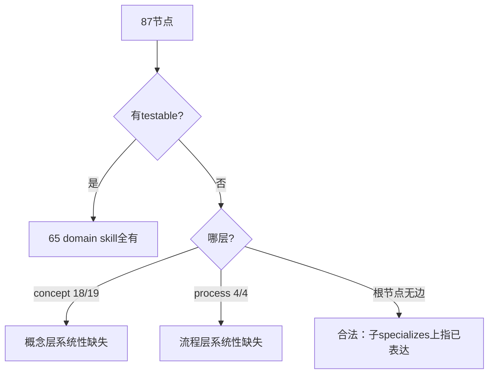
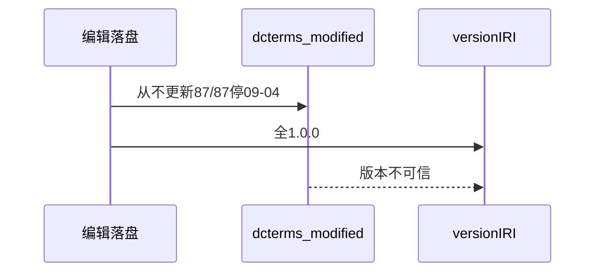
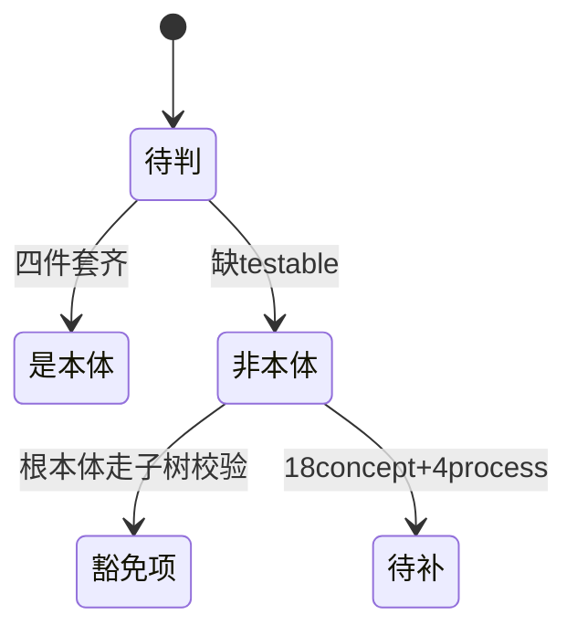

# Research Report — PDCA本体结构审查（T2135）

## 调研目标
对 PDCA 流程本体（flow-* 4节点 + concept/pdca* 19节点 + PDCA skill 64节点，共87）做结构审查：frontmatter 完备性、版本真实性、可验证信号覆盖、体量分布。

## 方法
脚本批量提取九字段/testable_signal/relations/bytes；全量核对 modified；抽查 testable 可执行性。

## 发现

87节点九字段零缺失；relations 仅根节点缺；testable_signal 缺失集中在 concept（18/19）与 process（4/4）两层，domain skill 层全有；modified 87/87 停于 2026-09-04（含本轮三次落盘）；体量前三为 ticket-dag-ready-set（9550B）、writing-great-skills（9357B）、to-tickets（9322B，含本轮新增两节）。

### 缺陷分布（mermaid）

Source: ontology/concept/pdca-gate.md 无testable_signal字段

### 版本失真链（mermaid）

Source: ontology/process/flow-do.md 含T2092/T2103修订但modified仍09-04

### 定义冲击状态机（mermaid）

Source: https://lean.org/lexicon-terms/pdca

## 结论与建议
结构问题三级：P0 新定义冲击（22节点按"本体是什么"不是本体，须补testable或修定义）；P1 版本失真100%（立改时bump规则）；P2 体量头部三节点超9KB（拆分候选）。附带修回退记：曾试给pdca.md补relates_to子节点边，引入5处双向环（子specializes上指+父relates下指），已回退，validate重过OK。结论修正：根本体无边合法，NO_RELATIONS检查应对根分层豁免；其余立项。

## 术语表
- 四件套：id/类型/关系边/可验证信号

## 参考资料
- Source: https://lean.org/lexicon-terms/pdca
- Source: https://www.researchgate.net/publication/349440276_PDCA_Cycle_Method_implementation_in_Industries_A_Systematic_Literature_Review
