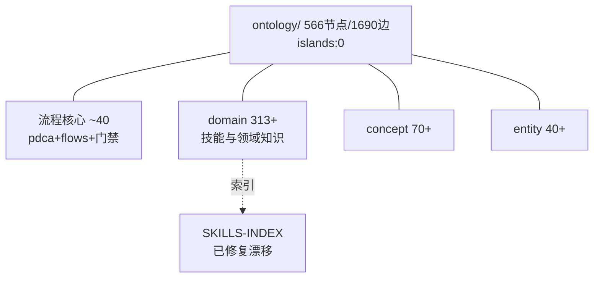
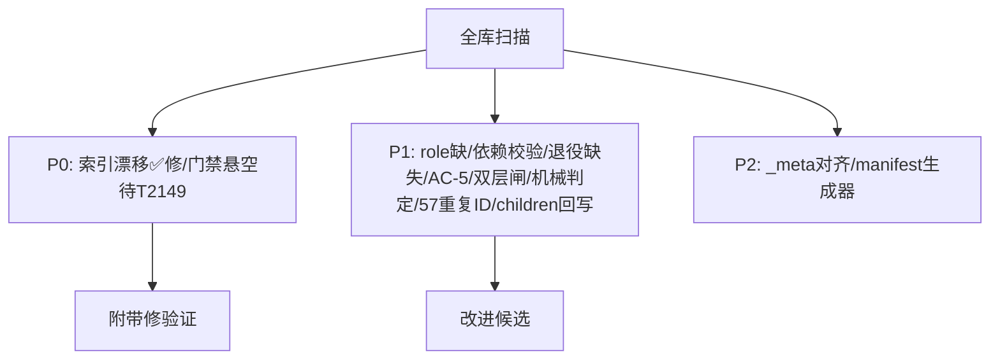
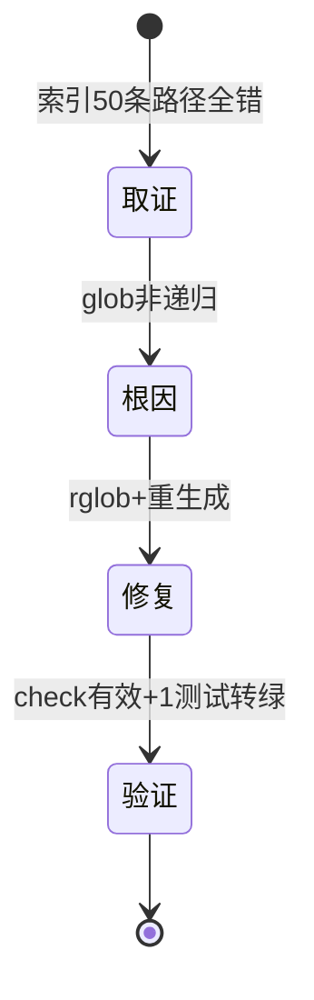

# T2153 research-report：PDCA 流程本体优化空间全库调研

## 调研目标

系统性回答 PDCA 流程本体是否有优化空间：结构维 + 语义维 + 机制维，
清单分级，结构类附带修，语义类给改进候选。

## 方法

`ontology_graph` 全库扫描 + `grep` 硬编码审计 + 基线对比（stash 前后测）
+ 生成器根因定位。每条附可复核途径。

## 发现

### 架构图 C4 L2（mermaid）

Source: ontology/_meta.yaml:1（目录仅人类阅读索引，frontmatter 为 SSOT）

### 逻辑图 分级清单流（mermaid）

Source: scripts/generate-skills-index.py:42（glob 路径无文件，根因）

### 生命周期图 附带修闭环（mermaid）

Source: https://docs.pytest.org/（回归验证方法背景）

## 结论与建议

优化清单（分级）：

P0：
1. SKILLS-INDEX 漂移 ✅ 本任务已附带修（glob→rglob，重生成，check 有效，1 测试转绿）。
2. ci 悬空引用（待 T2149，已立项未执行）。

P1（改进候选，未实施）：
3. `role/` 缺失（_meta.yaml 声称有）。
4. transition 不校验 dependencies（调度纪律，无硬门禁）。
5. 退役机制缺失（只增不减）。
6. AC-5 弱关联（relates_to 789 vs specializes 399）。
7. 双层闸 bugfix 字符串比较（T2148 已论证，特化方案）。
8. 机械判定无 bugfix 输出（T2148 已论证）。
9. doctor 57 组历史重复 ID（archive 遗留）。
10. task_identity 不回写父 children（需手工补）。

P2：
11. _meta.yaml 与现状对齐（decision 已补，role 待补）。
12. _index/manifest 无生成器（内容腐烂风险）。

## 术语表

- 附带修：结构类错字级修复，随调研任务直接实施并验证。
- 改进候选：需另立 Improvement Task 的语义/机制改动。

## 参考资料

- pytest 回归验证方法背景：https://docs.pytest.org/
- OASIS XML Catalog 规范：https://www.oasis-open.org/committees/entity/release/1.0/catalogs.html
- Source: tests/test_operations.py:143（索引新鲜度门禁，可复核）
- Source: scripts/ontology_graph.py:56-68（孤岛计算，可复核）
- Source: https://docs.pytest.org/（回归验证方法背景）
