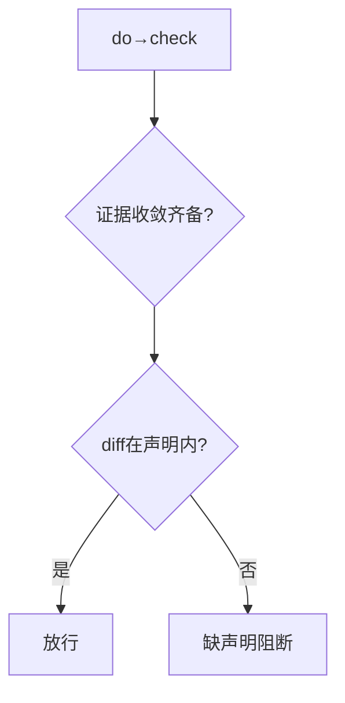
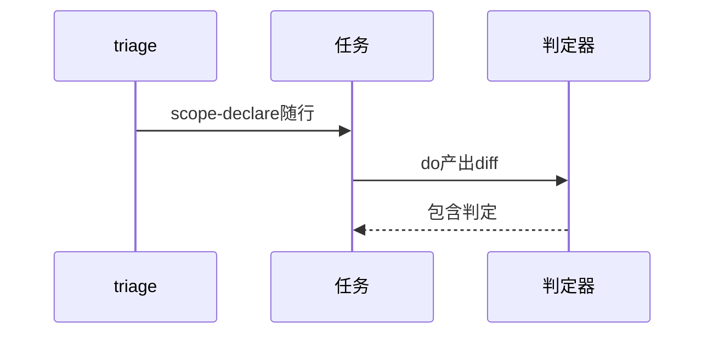
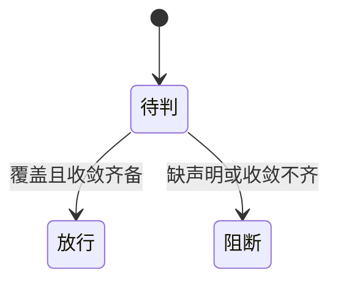

# Research Report — 覆盖判定落点调研（T2119）

## 调研目标
确定判定器在do→check的接线位与声明供给时序。

## 方法
走读do→check门禁段现有校验项，确认证据与收敛齐备时点可取diff。

## 发现
do→check已有证据与收敛校验，diff判定可同段追加；声明由triage产出随任务，门禁只验包含不产声明。

### 接线流程（mermaid）

Source: scripts/pdca_core.py 门禁段

### 声明供给时序（mermaid）

Source: ontology:concept/scope-coverage-gate

### 落点状态机（mermaid）

Source: https://lean.org/lexicon-terms/pdca

## 结论与建议
落点do→check成立，进Do实现。

## 术语表
- 接线位：门禁追加位置

## 参考资料
- Source: https://lean.org/lexicon-terms/pdca
- Source: https://www.researchgate.net/publication/349440276_PDCA_Cycle_Method_implementation_in_Industries_A_Systematic_Literature_Review
