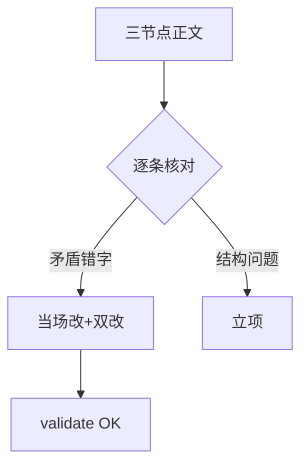
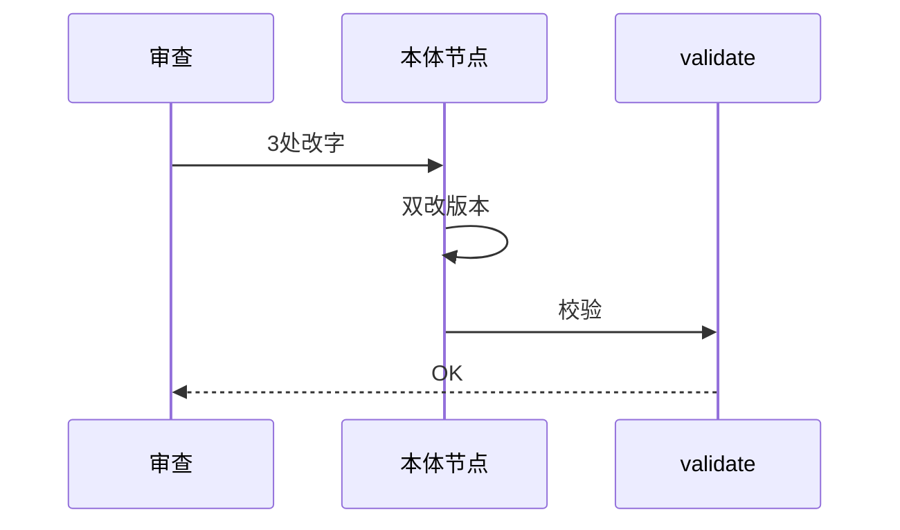
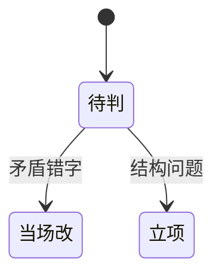

# Research Report — 语义深审首批三节点（T2139）

## 调研目标
flow-do/to-tickets/grilling正文逐条可证伪审查，错改当场、结构立项。

## 方法
通读三节点正文全文，逐条核对：与B→A→C设计核心一致性、与门禁行为一致性、内部自洽。

## 发现
当场改3处（flow-do路由句六路径→三路径；to-tickets步骤1改本体树主轴；步骤6加回链改写要求），均已双改版本（flow-do 1.0.1、to-tickets 1.0.1）并validate OK。结构问题3项立项：flow-do关键决策5段臃肿下沉；Wide-refactor与本体树关系未定义；grilling文本格式与question工具不兼容。

### 审查流程（mermaid）

Source: ontology/process/flow-do.md 路由句

### 改动时序（mermaid）

Source: ontology/domain/pdca/skill-to-tickets.md 步骤1

### 问题分级状态机（mermaid）

Source: https://lean.org/lexicon-terms/pdca

## 结论与建议
AC全达成；grilling零改字；下批候选flow-plan/check/act。

## 术语表
- 审改结合：错改当场、结构立项

## 参考资料
- Source: https://lean.org/lexicon-terms/pdca
- Source: https://www.researchgate.net/publication/349440276_PDCA_Cycle_Method_implementation_in_Industries_A_Systematic_Literature_Review
