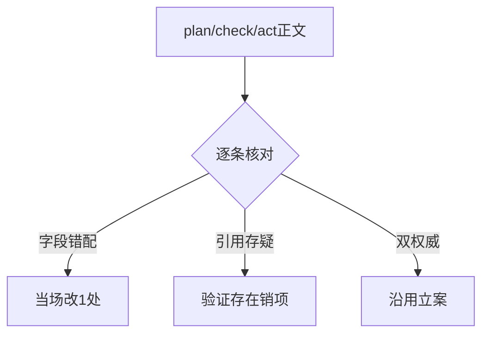
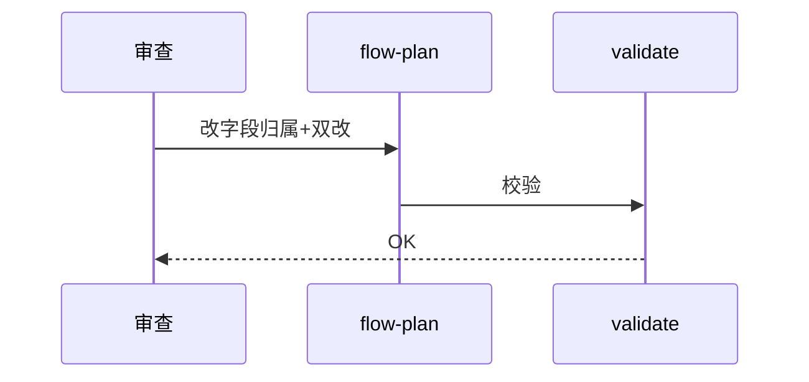
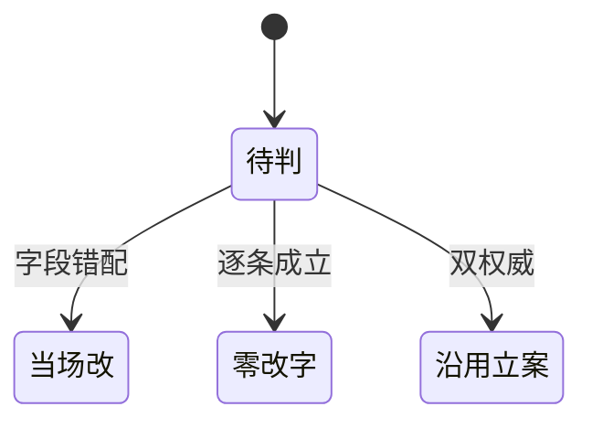

# Research Report — 语义深审下批三节点（T2140）

## 调研目标
flow-plan/check/act正文逐条审查，错改当场、结构立项。

## 方法
全文逐条核对：字段归属、引用存在性、门禁一致性。

## 发现
当场改1处（flow-plan项目操作约定：SKILL.md frontmatter→task.json meta.phase只动该字段，states由transition写；flow-plan 1.0.1，validate OK）。check/act零改字（4+3步骤与关键决策逐条成立，skill-research本体沉淀引用4处验证存在）。"近N天"销项（concept节明确days参数）。结构问题1项：check/act与advance-phase双权威漂移（沿用T2112立案，不新增）。

### 审查流程（mermaid）

Source: ontology/process/flow-plan.md 项目操作约定

### 改动时序（mermaid）

Source: ontology/process/flow-plan.md frontmatter版本行

### 结果状态机（mermaid）

Source: https://lean.org/lexicon-terms/pdca

## 结论与建议
AC全达成；三flow深审至此齐备（do/to-tickets/grilling+plan/check/act）；剩余skill层深审另批。

## 术语表
- 字段错配：字段归属写错载体

## 参考资料
- Source: https://lean.org/lexicon-terms/pdca
- Source: https://www.researchgate.net/publication/349440276_PDCA_Cycle_Method_implementation_in_Industries_A_Systematic_Literature_Review
