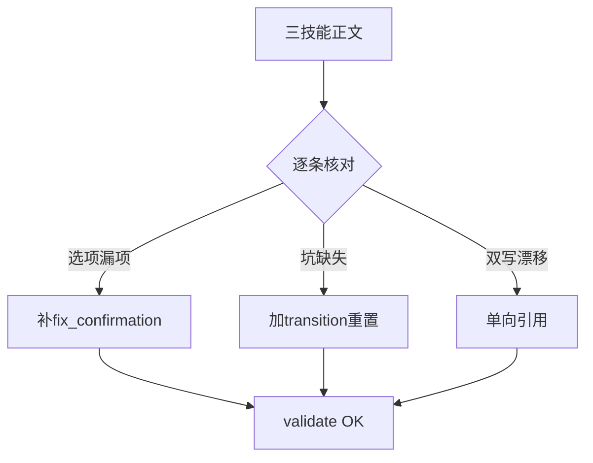
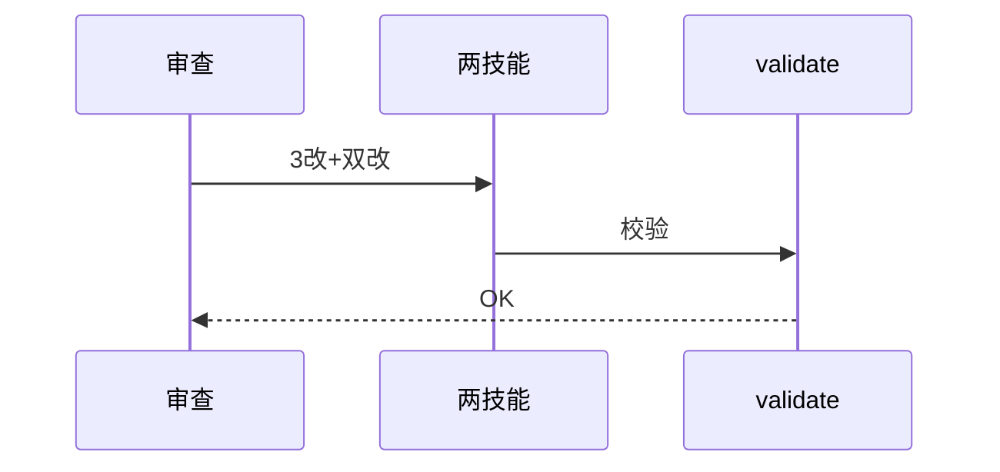
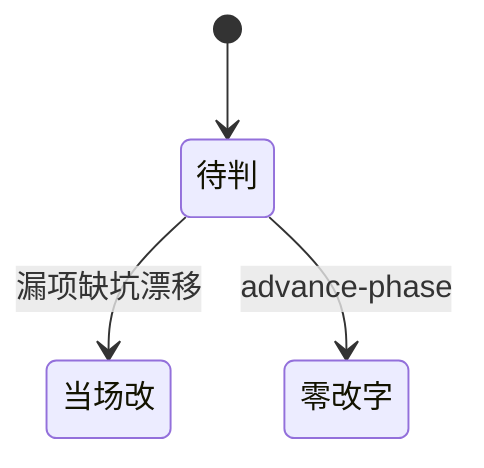

# Research Report — 语义深审门禁链三技能（T2141）

## 调研目标
advance-phase/register-evidence/verify-convergence正文逐条审查，错改当场、结构立项。

## 方法
全文逐条核对：CLI实际行为对照（本轮全套用过）、互文一致性。

## 发现
当场改3处（register用法补fix_confirmation源选项；register坑+transition重置条；verify坑去重引用register消漂移），双改版本（两技能1.0.1）validate OK。advance-phase零改字。结构问题1项：register与verify的convergence逐字规则双写（本次已单向引用，关闭）。

### 审查流程（mermaid）

Source: ontology/domain/skill-register-evidence.md 已知坑节

### 改动时序（mermaid）

Source: ontology/domain/skill-verify-convergence.md 已知坑节

### 结果状态机（mermaid）

Source: https://lean.org/lexicon-terms/pdca

## 结论与建议
AC全达成；门禁链三技能深审齐备；skill层剩余triage/research等另批。

## 术语表
- 单向引用：只一处写规则余处引用，防漂移

## 参考资料
- Source: https://lean.org/lexicon-terms/pdca
- Source: https://www.researchgate.net/publication/349440276_PDCA_Cycle_Method_implementation_in_Industries_A_Systematic_Literature_Review
