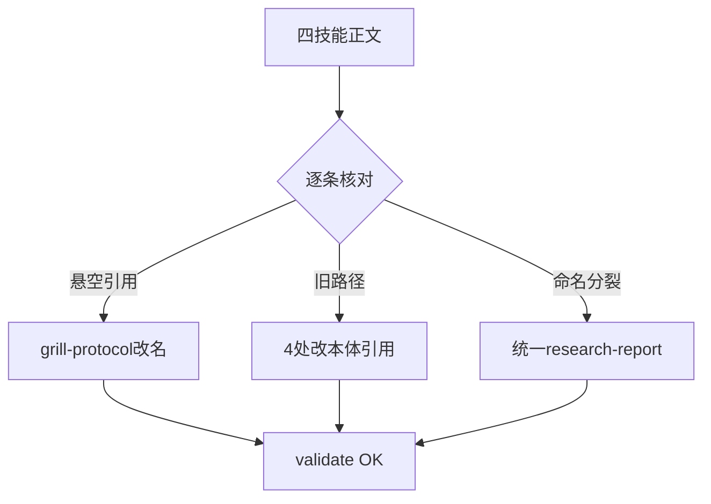
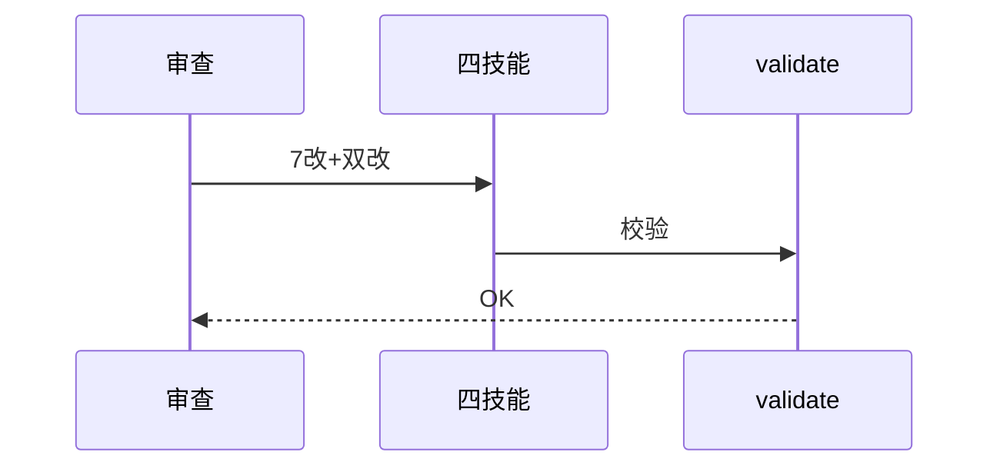
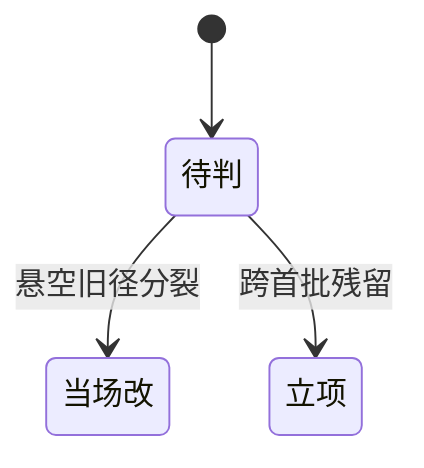

# Research Report — 语义深审triage-research线（T2142）

## 调研目标
triage/triage-work/research/web-research正文逐条审查，错改当场、结构立项。

## 方法
全文逐条核对：引用存在性、平台机制一致性、命名统一性。

## 发现
当场改7处（triage悬空grill-protocol→skill-grilling；triage-work旧SKILL.md路径；web-research工作目录+产物命名统一research-report.md；research旧路径+自引规则改Dispatch引用+burn-down节改单向引用），四文件双改1.0.1，validate OK。结构问题1项：skills旧路径残留另3处（improve-codebase-architecture/wayfinding-work/grill，非首批不改）。

### 审查流程（mermaid）

Source: ontology/domain/pdca/skill-triage.md Grill门禁节

### 改动时序（mermaid）

Source: ontology/domain/pdca/skill-research.md Burn-down节

### 结果状态机（mermaid）

Source: https://lean.org/lexicon-terms/pdca

## 结论与建议
AC全达成；triage-research线齐备；旧路径3处残留立项改。

## 术语表
- 单向引用：只一处写规则余处引用

## 参考资料
- Source: https://lean.org/lexicon-terms/pdca
- Source: https://www.researchgate.net/publication/349440276_PDCA_Cycle_Method_implementation_in_Industries_A_Systematic_Literature_Review
