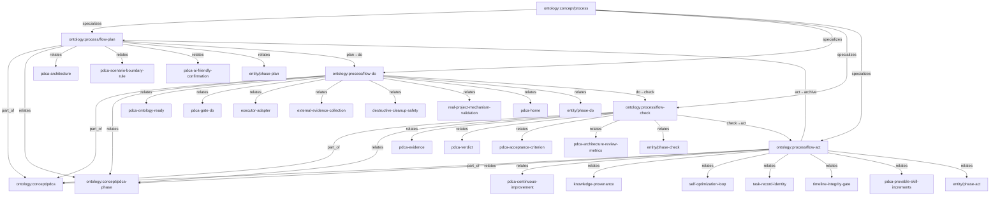

# PDCA 流程本体关系图（T2130）

边全部取自各节点 frontmatter `specializes/part_of/relates_to`，非手编。
来源：`ontology/process/flow-plan.md`、`flow-do.md`、`flow-check.md`、`flow-act.md`。

## 解读

- 主干：`process` 被四 flow 特化，四 flow 组成 `pdca` 且循环推进（plan→do→check→act→archive）。
- Plan 锚架构/边界/确认三概念；Do 锚 ready/门禁/执行器/证据收集/销毁安全/真实验证/家目录七概念；Check 锚证据/ verdict/验收/评审四概念；Act 锚改进/溯源/自优化/身份/时间线/可证增量六概念。
- 每 flow 各对接一个 phase 实体（plan/do/check/act）。
