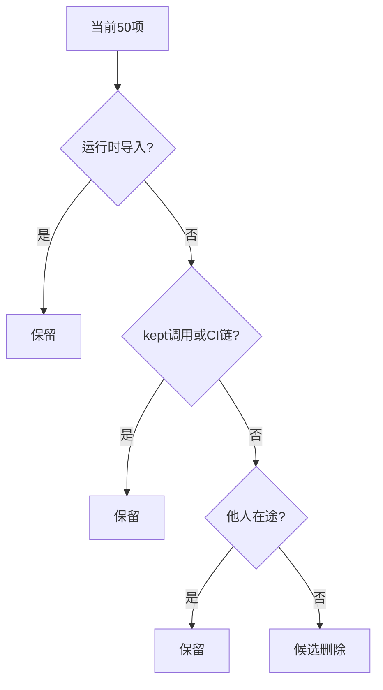
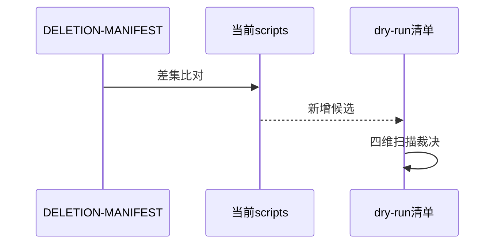
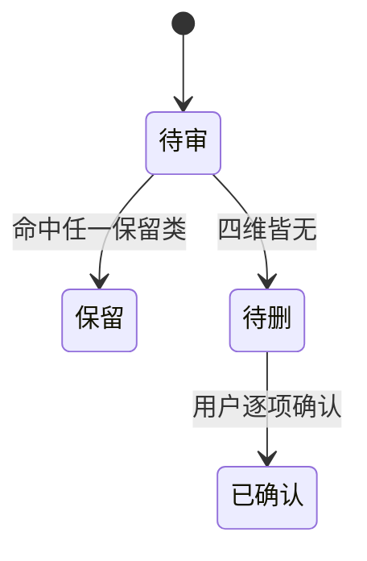

# Research Report — 第二轮purge判据复核与全量盘点（T2130）

## 调研目标
复核T2127四类保留判据对当前scripts/全量的适用性，盘点T2127后新增脚本，确定dry-run分级方法。

## 方法
复用T2127 blast-report判据（运行时导入/kept调用/CI链/他人在途），比对当前scripts/清单与DELETION-MANIFEST，识别新增文件；沿用import/调用/CI/在途四维扫描法。

## 发现
T2127删25留10后，当前scripts/约50项；新增疑似项含resolve-ai-*第三件、scenario-boundary-check.py、run-ai-friendliness-fixtures.py、grilling-rounds-demo.py、arch_review.py等，需四维扫描逐项裁决；T2127已删25项不重审。

### 判据复用流程（mermaid）

Source: records/T2127-0910-uncovered-scripts-purge/evidence/research-report.md

### 新增识别时序（mermaid）

Source: scripts/transition-phase.py

### 分级状态机（mermaid）

Source: https://lean.org/lexicon-terms/pdca

## 结论与建议
判据沿用成立，进Do做四维扫描出dry-run清单。

## 术语表
- 四维扫描：运行时导入、kept调用、CI链、他人在途四类保留检查

## 参考资料
- Source: https://lean.org/lexicon-terms/pdca
- Source: https://www.researchgate.net/publication/349440276_PDCA_Cycle_Method_implementation_in_Industries_A_Systematic_Literature_Review
