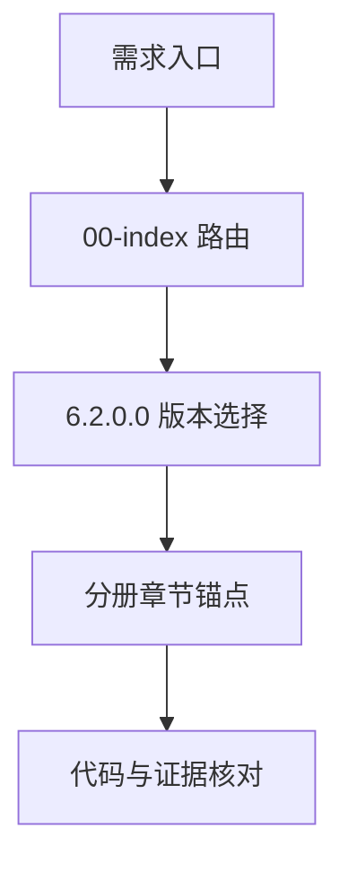
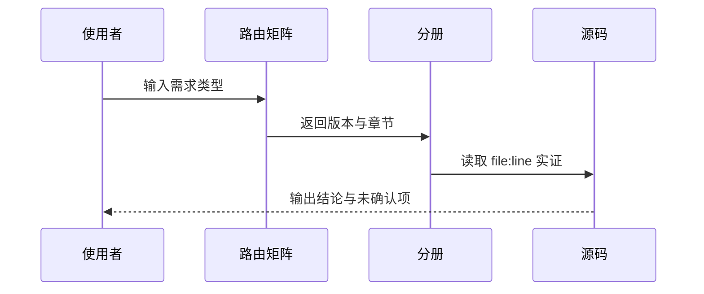
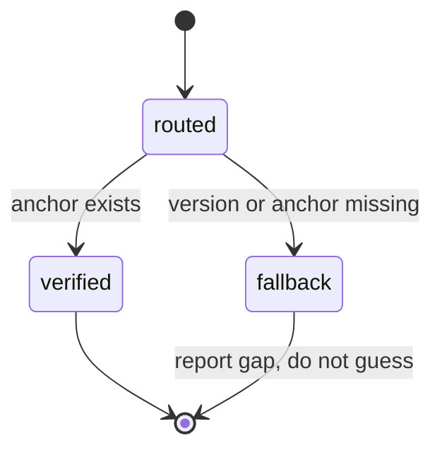

# T2155 research-report：T2154 调用链细节增量调研

## 调研范围

本次只复核 T2154 已归档的知识地图、目标 skill 的现行目录结构，以及
`6200/release` 中可作为入口判断依据的代码锚点。目标是确定增量文档应补齐的调用链步骤，
不重新审计 T2154 的五份分册事实。

## 复核结论

- 入口先经过 `00-index.md` 路由，再进入对应分册的版本文件；因此调用链协议应明确“入口类别→分册→版本→章节锚点”。
- 现有地图已覆盖 fs-backup、rpc/rdbcomm、libs、s3/xbsa、build/release 五类入口，但调用者仍需自行拼接阅读顺序；增量应提供统一的输出约束和失败回退。
- T2154 已将 6.2.0.0 作为基线，T2155 只增加导航约定，不改变已有代码结论或版本目录。

## 调研关系图

Source: T2154 evidence/00-index-6.2.0.0.md and target skill references.

Source: T2154 evidence/SKILL-6.2.0.0-v2.md and evidence/convergence-v3.json.

Source: T2154 conclusion.md and its three-item evidence rule.

## 参考资料

- Source: `/home/black/Documents/pdca-workflow-pro/records/T2154-0910-aio-tools-knowledge-map/conclusion.md`
- Source: `/home/black/Documents/pdca-workflow-pro/records/T2154-0910-aio-tools-knowledge-map/evidence/00-index-6.2.0.0.md`
- Source: `/home/black/Public/aio/rdb-skills/skills/rdb-tools-design/SKILL.md`
- Source: https://git-scm.com/docs/git-grep
- Source: https://spec.commonmark.org/current/
