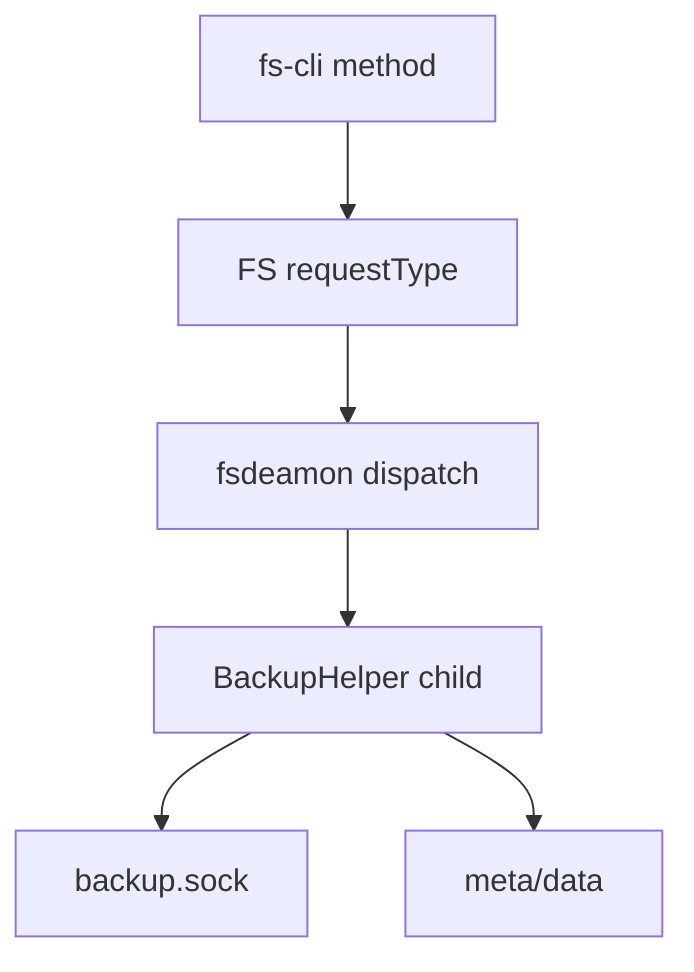
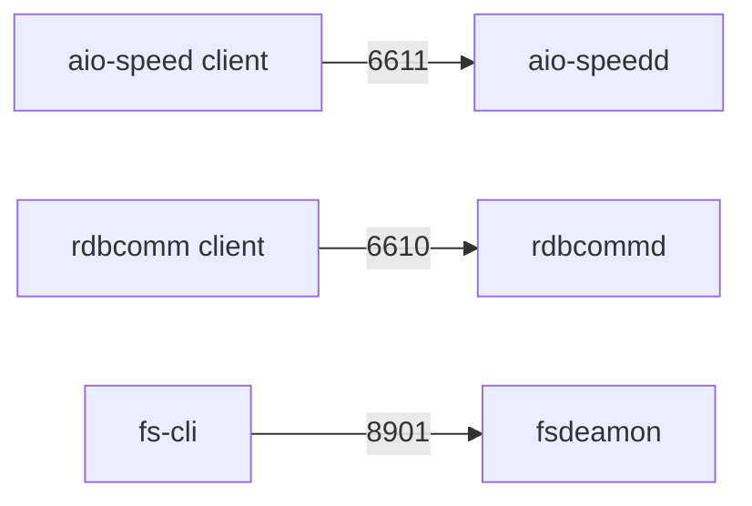
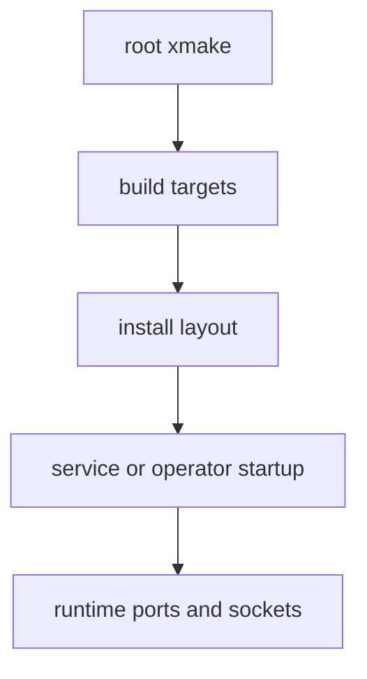
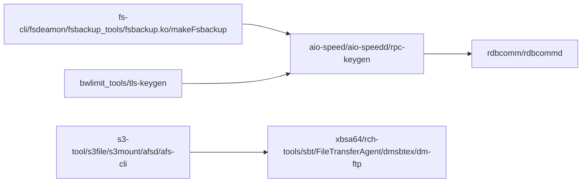

# T2157 research-report：6200 运行时调用链增量复核

## 调研结论

- `fsdeamon` 会按监控目录 fork/exec `--backup-helper`，通过每目录 `backup.sock` 管理本地快照和元数据。
- `fs-cli` 的 method 表与 `fsdeamon` 的 `FS_*` 分发是两层协议，必须分开记录。
- `aio-speedd` 默认使用 6611，rdbcomm/rdbcommd 默认使用 6610；两者都提供网络传输但不是同一协议。
- 根 xmake 同时聚合业务现行 target、对外交付 target 和构建工具，地图应标注 build-only 与 runtime-consumer 的差异。
- 独立可交付入口不止 fs-backup/rpc/rdbcomm：根 xmake 与子目录 target 还包含 S3、AFS、XBSA、SBT、DMSBT、限速和 key 工具；这些必须逐项登记，不能用“介质扩展”代替工具名。
- `fsbackup` 本身也是独立工具链节点，不能被 `fs-backup` 子系统名覆盖：内核模块负责 hook/driver 和事件日志，`fsbackup_tools` 负责 ioctl/meta/done 等人工入口，`makeFsbackup` 负责内核构建、安装和加载。

Source: `fs-backup/fsclient/main.cpp:506-529`; `fs-backup/fsdeamon/fs_source.cpp:286-304`.

Source: `rpc/rpc-config.h:35`; `rdbcomm/rdbcommd-main.c:39`; `fs-backup/fsdeamon/config.cpp:116`.

Source: `xmake.lua:57-80`; `rpc/xmake.lua:68-85`; `main.go:73-119`.

Source: root `xmake.lua:57-80` and each production target's `xmake.lua`.

## 参考资料

- Source: `/home/black/Public/aio/rdb-skills/skills/rdb-tools-design/references/01-fs-backup-knowledge-map/6.2.0.0.md`
- Source: `/home/black/Public/aio/rdb-skills/skills/rdb-tools-design/references/02-rpc-rdbcomm-knowledge-map/6.2.0.0.md`
- Source: `/home/black/Public/aio/rdb-skills/skills/rdb-tools-design/references/05-build-release-knowledge-map/6.2.0.0.md`
- Source: https://git-scm.com/docs/git-grep
- Source: https://spec.commonmark.org/current/
