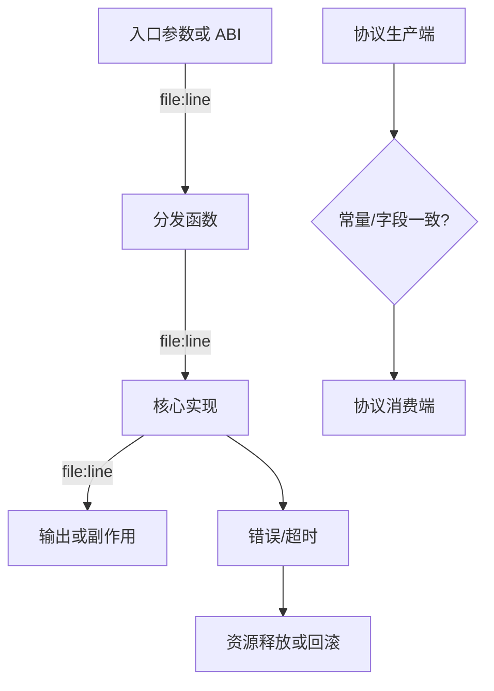
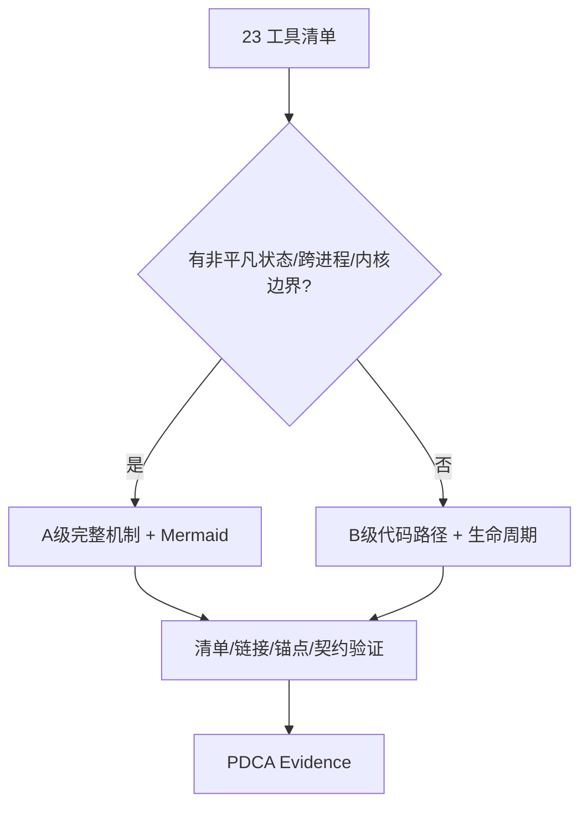

# T2176 Research-first：rdb-tools-design 深化基线

## 研究问题

现有 skill 已列出 23 个独立工具，但怎样把“清单”深化为 agent 可执行、可按需加载、可从源码复核的设计知识，同时避免把 `SKILL.md` 扩成难以使用的大手册？

## 现状实证

- `rdb-tools-design/SKILL.md` 为 121 行，负责版本选择、五类路由、代码实证和失败回退；职责清晰，但 §4 清单只给状态级摘要。
- `references/00-index.md` 为 187 行，23 个工具各有一行入口与单个锚点；它能证明工具没有被大类隐藏，却不能解释参数分发、内部状态、错误与资源生命周期。
- 五个 6.2.0.0 分册合计 844 行，主要以子系统能力和短调用链为单位；若继续在分册内平铺 23 个工具的全部机制，会让每次调用加载大量无关内容。
- 目标源码具有天然的工具边界：独立 xmake target、`main`/导出 ABI、服务进程或内核模块入口，可作为逐工具详解的稳定根节点。

Source: `/home/black/Public/aio/rdb-skills/skills/rdb-tools-design/`

Source: `/home/black/Public/aio/aio-tools/6200/release/`

Source: https://developers.openai.com/api/docs/guides/latest-model

Source: https://learn.chatgpt.com/use-cases

## 结论一：入口与正文必须分层

OpenAI 官方模型指导强调，skill 与 `AGENTS.md` 中不清晰或冲突的指令会直接影响 agent 行为；同时，官方 Codex 用例把“理解大型代码库”和“保持文档更新”作为独立工程任务。结合本地 `skill-creator` 规范，入口文件应保存选择规则和硬约束，工具机制放在按需读取的 references 中。

## 结论二：详细度以证据闭合判定

“增加段落”不是有效指标。每个工具的成功链至少应拆成入口、分发、核心、输出/清理四个阶段，并各自绑定源码锚点；跨模块协议需要生产端和消费端两个锚点。无法闭合时应保留为明确的未确认项。

## 结论三：按复杂度分级，但不降低事实标准

A 级运行工具必须解释线程/进程/状态/协议并配图；B 级外部、operator 或辅助工具可以省略没有实际机制的章节，但仍须覆盖入口、分发、核心、数据流、错误清理和消费者边界。分级只减少无意义模板，不允许 B 级退回单行摘要。

## 推荐实施结构

1. 保留 `SKILL.md` 为短入口与硬规则。
2. `00-index.md` 管理版本、工具清单和跨子系统跳转。
3. 01–05 分册保留共享机制及工具索引。
4. 工具正文落在所属分册的 `tools/6.2.0.0/<tool>.md`。
5. 以清单一致性、内部链接、源码锚点、Mermaid 配对和 skill frontmatter 校验收敛。

## 边界

官方资料只支持 agent 指令需清晰、工作需可验证这一信息架构判断；23 个工具的函数、协议、数据结构和运行语义必须全部来自 6.2.0.0 本地源码，不从通用资料推断。静态研究不能替代部署、内核装载或第三方产品联调。
