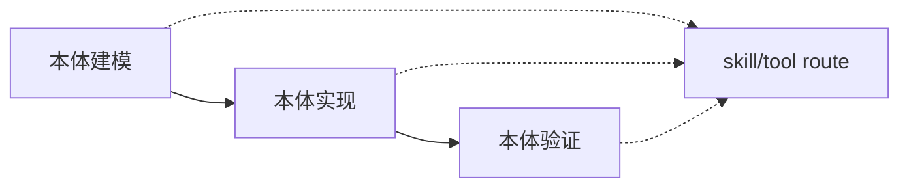
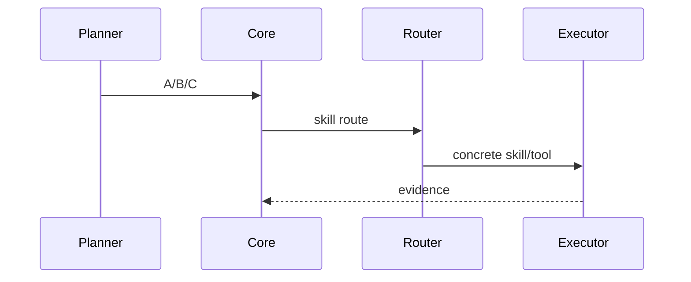
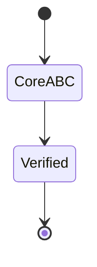

# T2165 实施前研究摘要

## 调研目标

承接 T2156，确认实施目标为 A/B/C 核心场景、skill/tool 执行路由，且不保留旧六值兼容读取。

## 发现

现有 `pdca.md:32-41` 已表达 B→A→C，但 `flow-do.md:40-90` 与 `schemas/task.schema.json:84-92` 仍把六值作为核心路由，因此必须同步迁移。

Source: `ontology/concept/pdca.md:32-41`。

Source: `ontology/process/flow-do.md:40-49`。

Source: `schemas/task.schema.json:61-92`。
Source: https://www.w3.org/TR/owl-primer/。

## 结论

直接将生产模型统一为 A/B/C；旧六值不保留兼容读取，差异由 skill/tool route 表达。

## 参考资料

- `records/T2156-0911-pdca-core-opt-review/conclusion.md`
- https://www.w3.org/TR/owl-primer/
- https://www.w3.org/TR/skos-reference/
