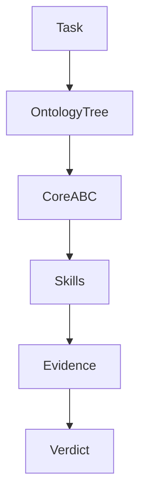
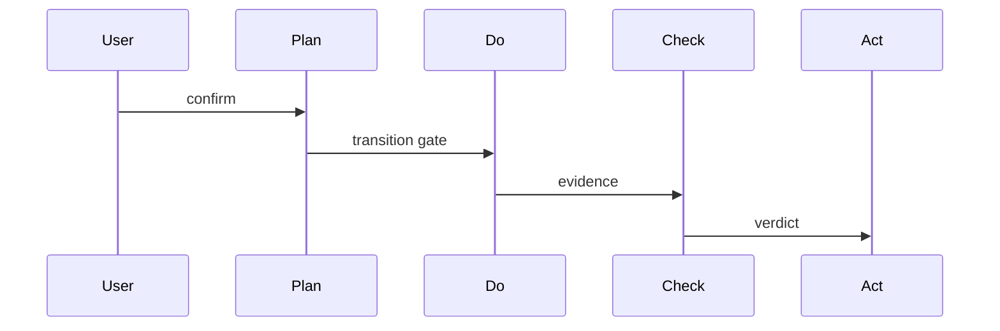

# T2166 前置研究摘要

## 调研目标

为 PDCA 流程本体建模提供权威输入，并检查阶段、转换、门禁、证据与 AI 执行边界是否已有定义。

## 发现

`flow-plan`、`flow-do`、`flow-check`、`flow-act` 已分别描述阶段流程；`skill-advance-phase` 描述转换门禁；`pdca.md` 描述本体树驱动的 B/A/C 核心职责。当前缺口是这些节点之间的统一模型与 AI 工作流消费关系。

Source: `ontology/process/flow-plan.md`、`ontology/process/flow-do.md`、`ontology/process/flow-check.md`、`ontology/process/flow-act.md`。

Source: `ontology/concept/pdca.md:32-42`、`ontology/process/flow-do.md:40-49`。

Source: `ontology/domain/pdca/skill-advance-phase.md:20-31`、`ontology/process/flow-check.md:20-29`。
Source: https://www.w3.org/TR/owl-primer/。

## 结论

应先形成统一流程本体模型，再审查 AI 工作流是否能消费该模型并完整保留证据和人工确认边界。

## 参考资料

- `ontology/process/flow-plan.md`
- `ontology/process/flow-do.md`
- https://www.w3.org/TR/owl-primer/
- https://www.w3.org/TR/skos-reference/
