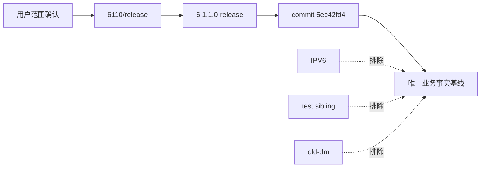
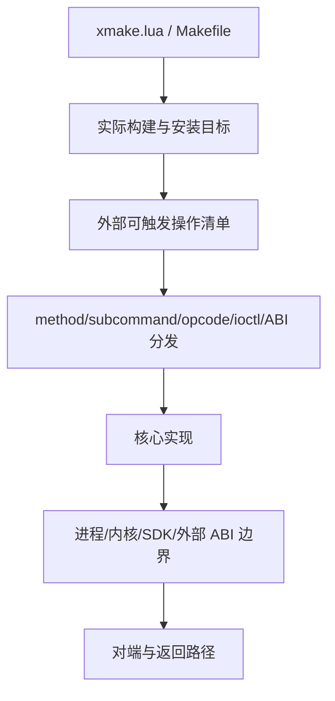
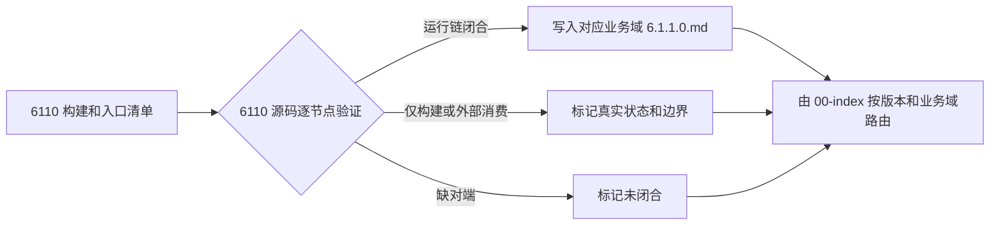

# 6110 release 调用链 Plan 调研报告

## 结论

6110 唯一基线固定为 `/home/black/Public/aio/aio-tools/6110/release` 的 `6.1.1.0-release` 分支、提交 `5ec42fd4`。调用链必须完全从该基线独立建立，不读取、复制、比较或引用 6200 源码以及现有 `6.2.0.0.md` 的业务事实；共享 `SKILL.md` 与 `00-index.md` 只承担多版本路由。

从 6110 release 自身的 Xmake/Makefile 和业务入口独立枚举出 23 个候选交付工具；最终清单以每个 target 的 kind、安装配置、入口和公开操作证据裁决，不以其它版本的工具数量为目标。

## 基线与范围证据

- `git branch --show-current`：`6.1.1.0-release`。
- `git rev-parse --short HEAD`：`5ec42fd4`。
- 顶层 `xmake.lua` 递归包含 `libs/bwlimit/s3-tool/dmsbtex/libobk/rpc/fs-backup/huanweicloun-sdk-s3-data-backup/rdbcomm/s3tools/rpc-keygen/xbsa`。
- `s3tools/xmake.lua` 明确包含 `libs/s3file/s3mount`；`s3file` 属于 release 构建图，不能因目录层级漏掉。
- `fsbackup.ko` 由 `fsbackup_kernel_4.x/Makefile` 产生，不是 Xmake target，但属于交付及运行调用链。
- 用户已明确：“只需要发布分支”；`6110/IPV6`、`6110/test`、`6110/old-dm` sibling 树不作为事实源。

## 交付工具边界

由 6110 release 自身独立发现的候选业务工具为 23 项：`fs-cli`、`fsdeamon`、`fsbackup_tools`、`fsbackup.ko`、`makeFsbackup`、`aio-speed`、`aio-speedd`、`rpc-keygen`、`rdbcomm`、`rdbcommd`、`s3-tool`、`s3file`、`s3mount`、`afsd`、`afs-cli`、`xbsa64`、`rch-tools`、`sbt`、`FileTransferAgent`、`dmsbtex`、`dm-ftp`、`bwlimit_tools`、`tls-keygen`。

测试 binary、内部 static/shared target 和辅助库只作为实现或验证节点，不提升为与业务工具并列的独立入口；如果源码证明其有对外交付入口，再以证据调整状态。

## 6110 内部分析风险

源码规模与协议边界表明，优先核验区域是：FS 命令/daemon/helper/内核 ioctl、aio-speed/aio-speedd 的 `MT_*` 与 persistent opcode、rdbcomm 双端协议、S3/FUSE callback、XBSA/SBT/DMSBT 外部 ABI，以及内核 hook/ioctl。每个区域都从自身入口和常量表开始枚举，不预设操作数量。

公共库、构建 target 与测试程序只用于解释依赖、交付或示例消费者；不得用 target 名替代运行时链，也不得用测试调用者冒充真实外部消费者。

## 推荐文档结构

按用户给出的 `rdb-feature-design/references/` 树采用版本化知识地图：沿用现有 `rdb-tools-design/SKILL.md` 与 `references/00-index.md`，在 01–05 五个业务域目录各新增 `6.1.1.0.md`。共享入口先定版本再定业务域；每份 6110 页面自完备保存该域逐操作真实链路，不依赖同目录的 `6.2.0.0.md`。

## 方法来源

- Source: Xmake 官方 Project Targets 文档说明 `target(name)` 定义可执行、静态库或动态库目标，因此用 target + kind + install 配置界定候选交付物：https://xmake.io/api/description/project-target.html
- Source: Git 官方 `rev-parse --verify` 文档说明可把 revision 验证并解析为确定对象，因此将本轮源码事实固定到提交 `5ec42fd4`：https://git-scm.com/docs/git-rev-parse
- Source: Git 官方 `git status --short` 文档说明短格式可显示工作树与索引状态，因此用它证明 6110 产品树在分析前后没有被修改：https://git-scm.com/docs/git-status

## 已确认方向

1. 不新建带后缀的 skill；沿用现有 `rdb-tools-design`，按 `rdb-feature-design` 的方式增加 `6.1.1.0` 版本地图。
2. 覆盖由 6110 release 独立枚举的全部业务工具和公开操作，测试/内部 target 仅作证据节点。
3. 以静态源码、构建配置、协议双端和符号锚点为完成边界，不要求真实编译、部署或外部系统联调。
4. 更新共享 `SKILL.md` 与 `00-index.md`，在五个现有知识域目录各新增自完备 `6.1.1.0.md`；6110 事实不读取或依赖 `6.2.0.0.md`。
