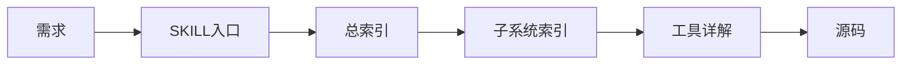
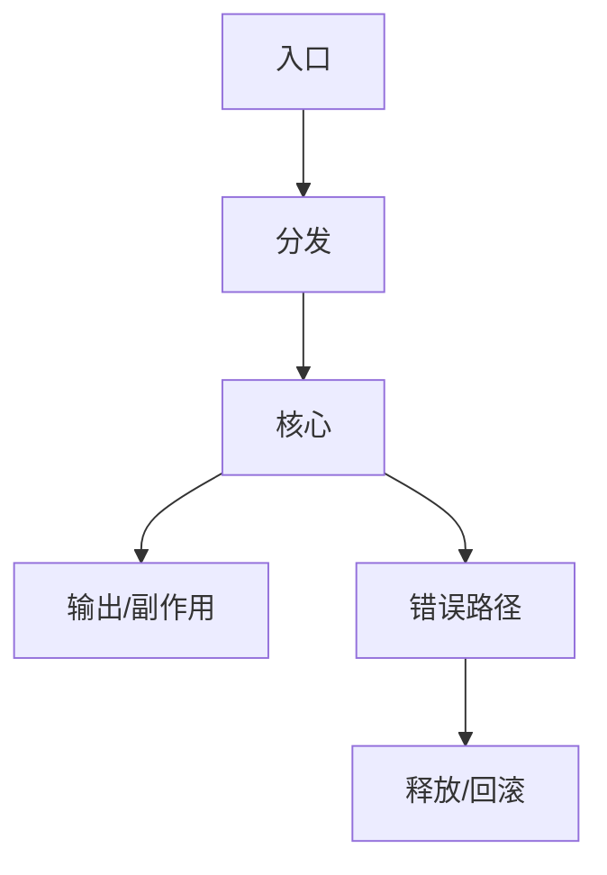
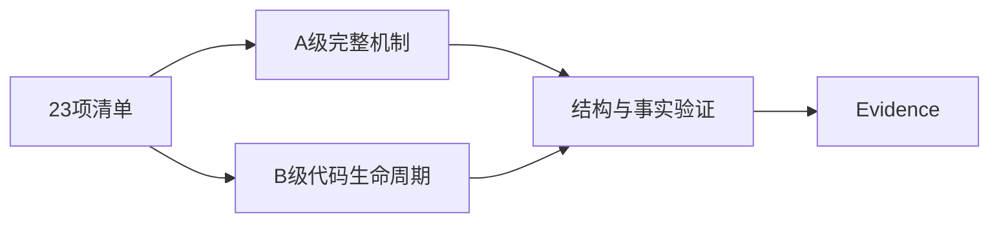

# T2177 Research-first：rdb-tools-design 深化基线

## 研究问题

如何把 T2176 已确认的 23 工具清单投射为可按需加载、可从 6.2.0.0 源码复核的代码级 skill 文档？

## 实证与来源

现有 `SKILL.md`、`00-index.md` 和五分册能够完成版本及子系统路由，但 23 项工具清单大多只有单行链路和一个锚点。目标源码则提供独立 target、程序入口、导出 ABI、服务进程和内核入口，可作为工具页根节点。OpenAI 官方资料说明，skills/AGENTS 指令会影响 agent 的执行行为，且大型代码库理解与文档持续更新属于明确的工程用例；因此入口应短而确定，条件性机制应按工具渐进加载。

Source: `/home/black/Public/aio/rdb-skills/skills/rdb-tools-design/`

Source: `/home/black/Public/aio/aio-tools/6200/release/`

Source: https://developers.openai.com/api/docs/guides/latest-model

Source: https://learn.chatgpt.com/use-cases

## 深度判据

每个工具的主链拆为入口、分发、核心、输出/清理，并分别绑定 `file:line`。跨模块契约绑定生产端和消费端；无法闭合的事实明确标记未确认。

## 分级与验证

A 级工具补齐线程、进程、状态、协议、异常和图示；B 级工具仍需覆盖实际存在的入口、数据流、错误清理和消费者边界。两级共同经过工具清单、链接、源码锚点、契约和 skill 校验。

## 边界

外部资料仅支持信息架构与 agent 可执行性判断；工具机制全部以 `/home/black/Public/aio/aio-tools/6200/release` 为事实源。静态文档不替代真实部署、内核或第三方联调测试。
