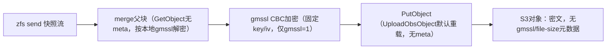
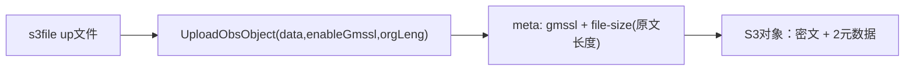
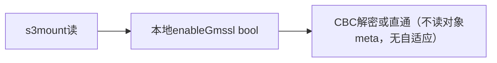

# 调研报告：s3tools SM4-GCM 落盘与 openssl4 替换可行性（T2157）

> 场景 development 前置调研：回答 GCM 落盘格式、openssl4 替换 CBC 安全性、
> 快照 bundle 元数据缺口三个硬问题，结论已写入 PRD。

## 1. 现状写路径（快照 bundle 无对象元数据）

结论：`gmssl`/`file-size` 元数据只用在 `up/get` 文件路径；快照主路径
`PutObject` 无元数据，读端无自适应——GCM 必须先补元数据通道。

Source: s3tools/libs/obs-service.cpp:291-340（UploadObsObject 两重载写 2 元数据）
Source: s3tools/libs/s3-service.cpp:212-228（PutObject 走无 meta 默认重载）
Source: s3tools/s3file/main.cpp:1184（快照上传用 PutObject）、954-983/1155-1182（CBC 加解密点）
Source: s3tools/s3mount/fuse-file.cpp:914-936（本地 enableGmssl 决定解密）
Source: https://www.openssl.org/docs/man3.0/man3/EVP_EncryptInit.html（EVP 对称加解密接口语义）
Source: https://github.com/gmssl/GmSSL/blob/master/include/gmssl/sm4.h（sm4_cbc_padding 与 sm4_gcm 接口定义）

## 2. openssl4 替换 gmssl CBC 的字节一致性证据

- 同机实测：项目内 `third_party/openssl4` 构建的 4.0.1 静态库，
  `EVP_sm4_cbc`（PKCS7）与 `gmssl sm4_cbc_padding_*` 在固定 key/iv 下，
  长度 0/1/15/16/17/31/32/100/1024/4096/65536/4M 全部密文逐字节一致、
  双向交叉解密通过。
- GCM：`EVP_CIPHER_fetch("SM4-GCM")` 与 `gmssl sm4_gcm_*` 在 12B nonce /
  16B tag 下 ct+tag 一致、交叉解密通过、翻转 1bit 拒绝。
- 证据已落盘为正式测试：`s3tools/s3file| s3mount/tests/sm4_openssl_compat_test.cpp`，
  `xmake run` 双路 ALL TESTS PASSED（OpenSSL 4.0.1）。

Source: s3tools/s3file/tests/sm4_openssl_compat_test.cpp（CBC 12 组长度断言）
Source: https://www.openssl.org/docs/man3.0/man7/provider-cipher.html（SM4-GCM provider 语义与 12B IV/16B tag 常规）
Source: https://github.com/openssl/openssl/blob/master/providers/implementations/ciphers/cipher_sm4_gcm.c（SM4-GCM 实现存在性）

## 3. GCM 落盘格式决策：纯元数据方案

| 候选 | nonce | tag | 评价 |
| --- | --- | --- | --- |
| A.Tag 缀尾 | meta `sm4-nonce` | 对象尾部 16B | 需按 file-size 切分，空明文/截断边界易错 |
| B.全元数据 | meta `sm4-nonce` | meta `sm4-tag` | 内容即纯密文，HeadObject 可审计，GCM 内容长恒等于 file-size 可交叉校验 |
| C.尾部打包 | 尾部前 12B | 尾部后 16B | 快照无 meta 仍无法区分模式，否决 |

采用 B（纯元数据方案）：`gmssl`(0/1/2) + `file-size`(原文长度不变) +
`sm4-nonce`(hex，GCM 独有) + `sm4-tag`(hex，GCM 独有)；CBC/明文对象保持
原 2 元数据，零扰动；`matadata` 数组 2→4。

Source: 存储国密加密技术方案 3.2（`gmssl` 值域与 `sm4-nonce` 命名、file-size 语义）
Source: 存储国密加密技术方案 3.8（HeadObject 审计视图：算法/随机数/完整性三段核对）
