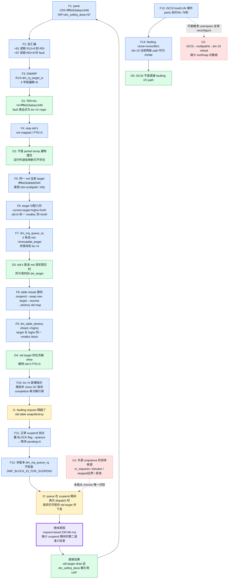
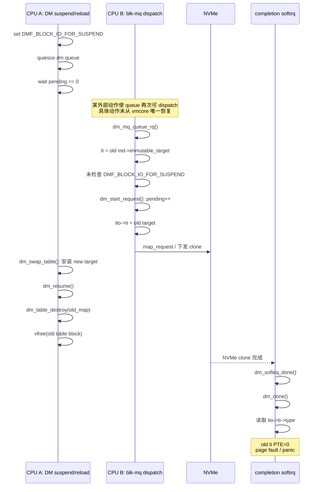
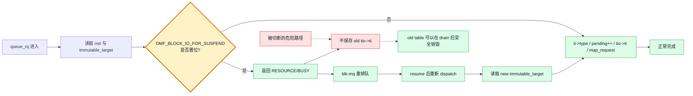

# T0144 根因逻辑闭合审查与图示

## 审查输入

- `root-cause-proof.md`
- `proof-rerun-expanded.md`

辅助校验底稿：

- `crash-proof-rerun.log`
- SHA-256：
  `838b78c6e89b8046b35c9510bfc3ef17e2806a565e873d8fcdfde2c18b00dc9c`

## 总体判定

| 结论层次 | 闭合状态 | 判定 |
|---|---|---|
| fault 指令与 C 表达式 | 闭合 | 确定 |
| fault 指针是请求保存的 `tio->ti` | 闭合 | 确定 |
| `tio->ti` 页面已解除映射 | 闭合 | 确定 |
| 该指针是同一 md 的旧 dm table target | 闭合 | 高置信 |
| 旧 target 通过 old table 生命周期被 `vfree` | 闭合 | 高置信 |
| 请求持有旧 target 跨越 table swap/destroy | 闭合 | 高置信 |
| 缺少 suspend guard 是安全不变量缺口 | 闭合 | 高置信 |
| 具体哪个外部动作重新 unquiesce queue | 未闭合 | 静态 vmcore 不可唯一恢复 |
| iSCSI 是直接 I/O path | 闭合 | 已排除 |
| iSCSI 间接触发 multipathd reload | 未闭合 | 缺少 iSCSI→dm-19 ioctl/map 对象链 |
| 上游 guard 对本故障路径的静态充分性 | 闭合 | 成立 |
| 3.10 回移植二进制运行时已修复 | 未验证 | 需要 A/B 压测 |

准确表述：

> **内核直接原因和代码级根因已经闭合；事故的具体外部触发者没有闭合。**

## 图例

- `F`：crash/DWARF/源码直接事实
- `D`：由完整前提得到的确定推导
- `I`：多项事实共同支持的高置信机制推断
- `U`：未证实分支

## 完整逻辑链路图



## 竞态时序图



## 修复切断图



## 每个关键跳转的闭合检查

### 1. RIP → C 表达式

闭合依据：

- `bt` 给出 RIP 和寄存器；
- `dis` 给出 `R13+8`、`RDI+8`；
- 模块 DWARF 给出 `dm_rq_target_io.ti@8`；
- 源码给出 `tio->ti->type->rq_end_io`。

不存在仅凭符号名猜测的跳步。

### 2. 无效地址 → 已解除映射

闭合依据：

- `rd` 失败；
- `vtop` 显示 PTE 本身为 0。

因此排除“有效映射的物理页未被 partial dump 保存”。

### 3. 无效指针 → 旧 dm target

闭合依据：

- 指针来自 `tio->ti`；
- `tio->ti` 在提交路径只保存 `md->immutable_target`；
- 当前同一 md 的 target 已是另一个地址；
- 新旧地址均符合 `dm_target` 的 `vmalloc-base+0x40` 布局；
- target 是 request-based immutable singleton。

这一跳是高置信闭合，而非仅凭地址后缀猜测。

### 4. 旧 target → vfree

闭合依据：

- live table 更换必须经过 suspend；
- bind 更新 immutable target；
- ioctl resume 后 destroy old map；
- target/highs 同块分配；
- destroy 对 highs 执行 `vfree()`；
- 现场 old target PTE=0。

仍属于源码生命周期与现场状态的高置信闭合；静态 dump 不保存过去的
`dm_table_destroy(old_map)` 调用栈。

### 5. vfree → 为什么仍有请求引用

闭合依据：

- `tio->ti` 是跨异步 I/O 的裸指针；
- completion 发生在 table 已更换以后；
- fault 位于 pending 递减之前；
- 正常 suspend 理应 quiesce并 drain；
- request-based `dm_mq_queue_rq()` 缺少 block flag 检查。

因此代码级缺陷可归纳为“suspend 期间缺少二次准入检查”。

### 6. 缺少 guard → 具体外部触发

这里没有完全闭合：

- 已证明：只要 queue 在 block flag 置位期间再次 dispatch，请求就能闯入；
- 未证明：此次究竟由哪个具体操作触发再次 dispatch。

因此报告可以确定代码根因，但不能确定 `nr_requests`、elevator、iSCSI 或某个
特定 userspace 操作就是现场触发者。

## 两份文档的展示缺口

`proof-rerun-expanded.md` 的 P9 只嵌入了 `mapped_device` 当前状态，没有完整
嵌入以下两条命令的原始输出：

```text
log | grep -E 'scsi host11112|11112:0:0:|BUG: unable|dm_softirq_done'
log | grep -Ei 'mce|machine check|hardware error|memory failure|corrupt|Oops:'
```

底层证据存在于 `crash-proof-rerun.log`，所以这属于“扩展文档不完全自包含”，
不属于实际取证缺失。后续若生成最终面向审计人员的单文件报告，应把相关原始
输出或 transcript 行号补入。

## 最终结论

逻辑闭合边界如下：

```text
已闭合：
panic → fault 指令 → tio->ti → old dm_target → PTE=0
→ old table vfree → 请求跨 table 生命周期 → suspend guard 缺失
→ completion UAF

未闭合：
具体外部动作 → blk-mq unquiesce
iSCSI事件 → multipathd → dm-19 reload
回移植补丁 → 运行时长期无复现
```

因此最严谨的根因表述是：

> 此次崩溃直接由 `dm_softirq_done()` 解引用已被旧 dm table 销毁解除映射的
> `tio->ti` 引发；代码级根因是 request-based DM blk-mq 提交路径没有在
> `DMF_BLOCK_IO_FOR_SUSPEND` 置位期间拒绝并重排队新请求，从而允许请求
> 持有旧 target 跨越 table swap/destroy。具体引发 queue 再次 dispatch
> 的外部动作，以及 iSCSI 是否间接促成 reload，当前证据不能唯一确定。

