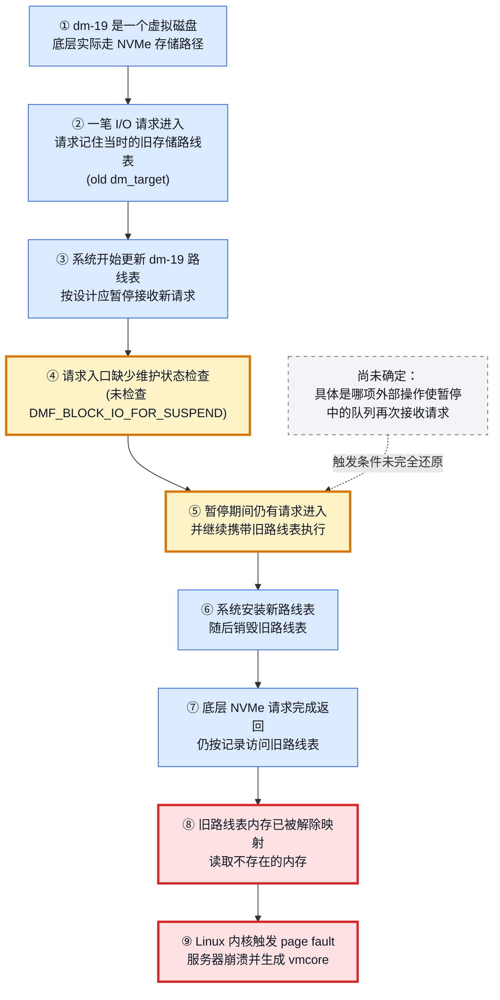
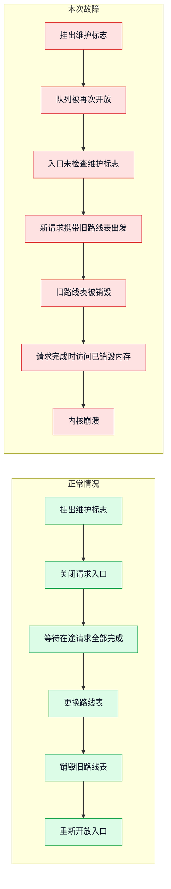
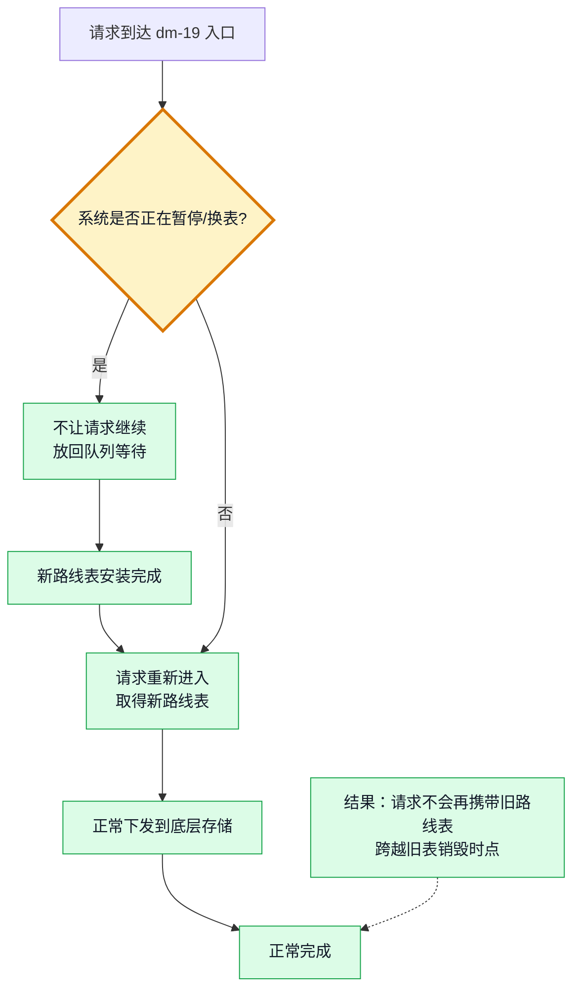
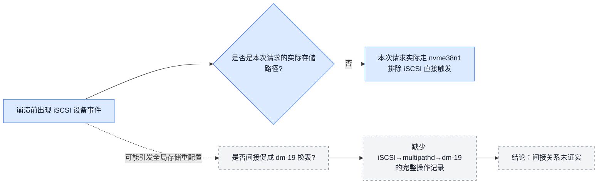

# T0144 根因链路图（非技术版）

## 一句话结论

系统在更换 dm-19 的“存储路线表”时，本应关闭请求入口；但入口缺少一次维护状态检查，
一个请求拿着旧路线表出发。旧路线表随后被销毁，请求完成回来时再次查阅旧路线表，
因该内存已经不存在而导致内核崩溃。

## 根因主链



## 正常设计与本次故障对比



## 为什么一个入口检查就能修复



修复本质：

```text
维护标志已置位
    → 请求入口立即让请求等待
    → 不记录旧路线表
    → 不向底层设备下发
    → 换表完成后重新尝试
    → 此时取得新路线表
```

## iSCSI 在图中的位置



## 面向管理和事故复盘的表述

| 层次 | 通俗表述 | 结论 |
|---|---|---|
| 直接原因 | 请求返回时访问了一张已经销毁的旧路线表 | 已证明 |
| 根本原因 | 存储请求入口没有在系统暂停换表时再次检查维护标志 | 已证明 |
| 促成条件 | 暂停期间队列被某个外部动作重新允许接收请求 | 机制明确，具体动作未确定 |
| 实际数据路径 | 本次故障请求走 `dm-19 → nvme38n1` | 已证明 |
| iSCSI | 不是本次请求的直接路径；是否间接促成换表无法确认 | 直接排除，间接未证实 |
| 修复方向 | 暂停标志置位时，把请求退回队列，换表后再试 | 与根因直接对应 |

