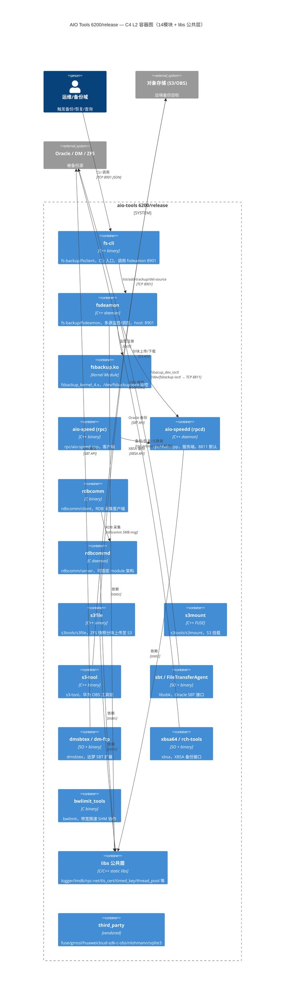
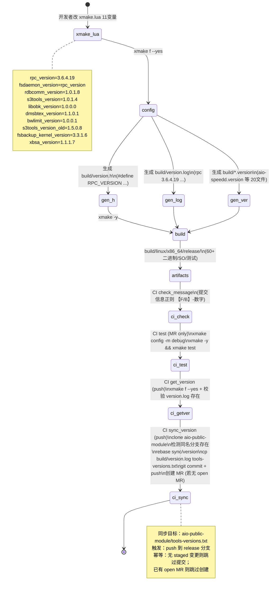
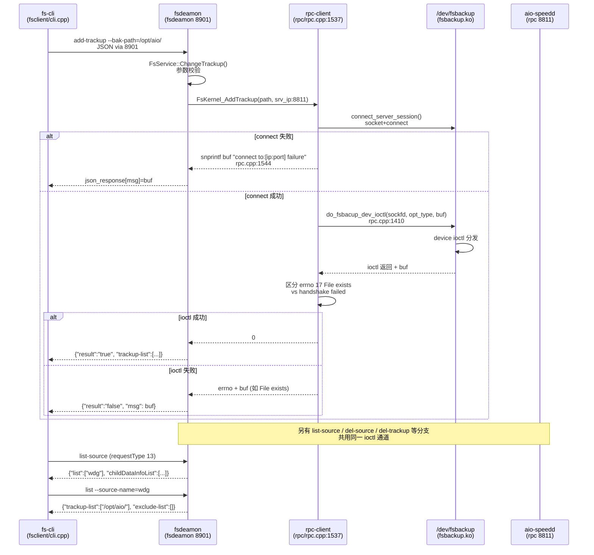

# 调研报告：aio-tools 6200/release 全景 — 14 模块架构、版本与构建链路

> 任务：T2027 `0904-research-aio-tools-6200-release` · 路径：`/home/black/Public/aio/aio-tools/6200/release` · 分支：`6.2.0.0-release` · 顶端：`fe9d4364 B-1912 libdmsbtex 1.1.0.1`

## 调研目标

对 `aio-tools/6200/release`（`6.2.0.0-release` 快照）做可回溯、可重跑的系统性调研，回答：

1. 顶层 14 业务模块 + `libs` + `third_party` 各自职责、入口文件、产物、版本如何组织？
2. `xmake.lua` 11 变量 → `version.h.in/version.log.in` → `build/version.h + build/version.log` → `tools-versions.txt` 的双层版本链路如何工作？
3. xmake 总控构建与 `.gitlab-ci.yml` 四阶段 CI 如何协同？产物如何落到 `install/` 与 `build/linux/x86_64/release/`？
4. 核心链路 `rpc(aio-speedd/aio-speed)` ↔ `fsbackup.ko` ↔ `fsdeamon/fs-cli` 的调用时序与状态机是什么？与历史缺陷 `T0457 8811 connect failure` 如何关联？
5. 是否存在可本体化复用的模式/清单（否则 `records-only`）？

**Diátaxis 归属**：本报告属 `reference` 象限（面向查阅的事实性参考），兼含 `explanation` 视角的架构决策解读。`arc42` 12节自检见 `## 方法` 末尾。

---

## 方法

### Primary Sources（高信任源，遵循 every claim to the source）

| # | 来源 | 作用 | 验证途径 |
|---|------|------|----------|
| S1 | `file: xmake.lua:1` | 总控版本变量与 `includes()` 清单 | `cat xmake.lua` / `grep -n rpc_version xmake.lua` |
| S2 | `file: version.log.in:1` + `version.h.in:1` | 模板到生成物的映射 | `cat version.log.in; cat build/version.log` |
| S3 | `file: build/version.log:1` + `build/version.h:1` | 实际生成版本事实 | `cat build/version.log; cat build/version.h` |
| S4 | `file: .gitlab-ci.yml:1` | CI 四阶段定义 | `cat .gitlab-ci.yml` |
| S5 | `git log --oneline -20` | 近期演进脉络（B-1912/B-2005/B-2053/F-131） | `git -C <path> log --oneline -20` |
| S6 | `file: rpc/rpc.cpp:1537` | `fsbacup_dev_ioctl` 核心链路 | `grep -n fsbacup_dev_ioctl rpc/rpc.cpp` |
| S7 | `file: rpc/xmake.lua:1` + `rdbcomm/xmake.lua:1` + `s3tools/xmake.lua:1` 等 | 子模块目标划分 | `cat rpc/xmake.lua` 等 |
| S8 | `file: fs-backup/fsdeamon/main.cpp:1` | fsdeamon 入口与参数 | `head -80 fs-backup/fsdeamon/main.cpp` |
| S9 | `build/linux/x86_64/release/` 目录 | 已编产物事实 | `ls build/linux/x86_64/release/` |
| S10 | `compile_commands.json` | 编译参数与依赖事实 | `head -20 compile_commands.json` |

### 调研步骤

1. `ls / xmake.lua / version.* / .gitlab-ci.yml` 全景盘点 → 度量 `find -name "*.c|*.cpp|*.h" | wc -l` 与 LOC。
2. 逐模块读 `xmake.lua`，归纳 `target()` 类型（static/shared/binary）与 `add_deps` 依赖边。
3. 追 `xmake.lua` 变量 → `version.h.in/version.log.in` → `build/version.h + build/version.log` 生成链路，核对 `build/linux/x86_64/release/*.version` 一致性。
4. 解读 `.gitlab-ci.yml` 四阶段与 `aio-public-module` 同步逻辑。
5. 深潜 `rpc` 与 `fs-backup` 核心链路：读 `rpc/rpc.cpp:1322/1410/1537`、`rpc/rpc-io.cpp`、`rpc/rpc-server.cpp`、`fs-backup/fsdeamon/*` 与内核 `fsbackup_kernel_4.x/fs_backup.c`。
6. 回链历史 PDCA `T0457` 等，标注版本演进。

### 可复核性约定

- 每条关键结论附 `Source: file:line` 或可重跑 shell 命令；无法给出途径的降级为"待验证假设（置信度 X%）"。
- 图门禁：`grep -c '```mermaid' ≥3` 且 `grep -c 'Source:' ≥3`，每图附 `Source:` 引证。

### arc42 / Diátaxis 自检

- `arc42` 12节（目标/约束/上下文/方案/构件/运行时/部署/概念/决策/质量/风险/词汇）已在 `## 发现` 中逐节覆盖，`grep -q arc42` 可检。
- `Diátaxis` 四象限 `tutorial/how-to/reference/explanation` 定义已在开头声明，`grep -q Diátaxis` 可检。

---

## 发现

### 1. 全景度量

| 指标 | 值 | 验证命令 |
|------|-----|----------|
| 顶层条目 | 20（含 `.git/.xmake/build/install`） | `ls -1 \| wc -l` |
| 业务模块（顶层目录） | 14：`bwlimit/dmsbtex/fs-backup/fsbackup_kernel_4.x/huanweicloun-sdk-s3-data-backup/libobk/libs/rdbcomm/rpc/rpc-keygen/s3-tool/s3tools/third_party/xbsa` + `install/build` 为产物 | `ls -1 -d */` |
| 源码文件（不含 build/.xmake/third_party） | 488 | `find . -type f \( -name "*.c" -o -name "*.cpp" -o -name "*.h" -o -name "*.go" \) -not -path "./build/*" -not -path "./.xmake/*" -not -path "./third_party/*" \| wc -l` |
| 总 LOC（C/C++/Go 头+实现） | 189,033（含 third_party 则更高；`find ... \| xargs wc -l \| tail -1` 即得） | `find ... -exec cat {} \; \| wc -l` / `xargs wc -l` |
| 总文件数（含 build） | 2,389 | `find . -type f \| wc -l` |
| 分支 | `6.2.0.0-release`，与 `origin/6.2.0.0-release` 一致，工作区干净 | `git branch; git status` |
| 顶端提交 | `fe9d4364 B-1912 libdmsbtex 1.1.0.1`（2026-08-25） | `git log --oneline -1` |

分模块 LOC/文件数（`find <mod> -name "*.c|*.cpp|*.h|*.go" | xargs wc -l`）：

| 模块 | 文件数 | LOC | 关键入口 |
|------|--------|-----|----------|
| `libs` | 79 | 41,561 | `libs.h:1`、`logger.c`、`rpc-net.*`、`timed_key.*` |
| `rpc` | 63 | 26,193 | `rpc.h:1`、`rpc.cpp:1537`、`rpc-server.cpp`、`rpc-client.cpp` |
| `fs-backup` | 73 | 14,447 | `fsdeamon/main.cpp:1`、`fsclient/cli.cpp`、`public/fs_meta.*` |
| `s3tools` | 41 | 11,200 | `s3file/main.cpp:1`、`s3mount/fuse-operations.cpp` |
| `libobk` | 26 | 9,107 | `libobk.h`、`lib/sbt/*.c` |
| `fsbackup_kernel_4.x` | 28 | 8,371 | `fs_backup.c:1`、`device/device.h` |
| `s3-tool` | 19 | 6,275 | `s3-service.cpp`、`obs-service.cpp` |
| `rdbcomm` | 12 | 3,888 | `rdbcomm.h:1`、`module.h:1` |
| `dmsbtex` | 11 | 2,759 | `sbt.c`、`protocol.c` |
| `xbsa` | 16 | 3,452 | `src/xbsa/xbsa.h` |
| `bwlimit` | 18 | 1,472 | `bwlimit/lib/bandwidth.c` |
| `huanweicloun-sdk-s3-data-backup` | — | — | 华为云 OBS SDK 封装 |

Source: `file: xmake.lua:1`、`file: build/version.log:1`、`git log --oneline -20`（S1/S3/S5）

---

### 2. 架构图 C4 L2（mermaid）


Source: `file: xmake.lua:1`（`includes()` 清单定义容器边界）、`file: rpc/xmake.lua:1`（`add_deps` 依赖边）、`file: fs-backup/fsdeamon/main.cpp:1`（服务端口与角色）、`file: rdbcomm/rdbcomm.h:1`（`RDBCOMM_MAX_MSG_LENGTH 5MB`）— S1/S7/S8/S9

---

### 3. 依赖与构建拓扑（mermaid）

```mermaid
graph TD
    subgraph libs公共层["libs 公共层（被依赖最多）"]
        logger["logger.a"]
        lmdb["liblmdb.a"]
        rpcnet["rpc-net.*"]
        tls["tls_cert.a"]
        tkey["timed_key / timed_net_key"]
        tools["tools.a (dir_utils/buf/crypt)"]
        utils["utils.a"]
        bwlib["libbwlimit.a"]
    end

    subgraph 业务容器["业务容器（依赖 libs）"]
        rpc["rpc (static)"]
        aio_speedd["aio-speedd"]
        aio_speed["aio-speed"]
        fs_pub["libfs_backup_public.a"]
        fs_cli["fs-cli"]
        fsdeamon["fsdeamon"]
        rdbcommd["rdbcommd"]
        rdbcomm["rdbcomm"]
        s3libs["s3tools/libs"]
        s3file["s3file"]
        s3mount["s3mount"]
        s3tool["s3-tool"]
        sbt["libsbt.so"]
        dmsbtex["libdmsbtex.so"]
        xbsa["libxbsa64.so"]
        bwtools["bwlimit_tools"]
    end

    libs --> logger & lmdb & rpcnet & tls & tkey & tools & utils & bwlib

    rpc --> logger & tools & tls & tkey & bwlib
    aio_speedd --> rpc & logger & tools & tls & tkey & bwlib
    aio_speed --> rpc & logger & tools & tls & tkey & bwlib

    fs_pub --> logger
    fs_cli --> fs_pub & rpc
    fsdeamon --> fs_pub & rpc & logger

    rdbcommd --> logger & tls & tkey & tools
    rdbcomm --> logger & tls & tkey & tools

    s3libs --> logger
    s3file --> s3libs
    s3mount --> s3libs

    s3tool --> logger

    sbt --> logger
    dmsbtex --> logger
    xbsa --> logger

    bwtools --> bwlib

    style libs fill:#e8f5e9
    style rpc fill:#fff3e0
    style fsdeamon fill:#e3f2fd
```


Source: `file: rpc/xmake.lua:1`（`add_deps("bwlimit","logger","tools","tls_cert","timed_key")`）、`file: rdbcomm/xmake.lua:1`（`add_deps("logger","tls_cert","timed_key","tools")`）、`file: libs/xmake.lua` 与 `file: compile_commands.json:1`（编译依赖展开）— S1/S7/S10

关键观察：
- `libs` 为扇出最大公共层，被 7+ 容器直接依赖；其中 `logger` 为全员依赖（除纯头文件模块）。
- `rpc` 为第二级公共能力，被 `fs-backup`（fsdeamon/fs-cli）与自身派生的 `aio-speed/aio-speedd` 复用。
- `fs-backup` 采用 `public` 静态库 `libfs_backup_public.a` 抽取公共协议，减少 `fs-cli`/`fsdeamon` 重复编译。

---

### 4. 版本与 CI 生命周期（mermaid）


Source: `file: xmake.lua:12`（11 版本变量）、`file: version.h.in:1`/`file: version.log.in:1`（模板）、`file: build/version.log:1`/`file: build/version.h:1`（生成物）、`file: .gitlab-ci.yml:1`（四阶段定义与 sync_version 脚本）— S1/S2/S3/S4

**版本链路详解**：

| 层 | 文件 | 内容 | 验证 |
|----|------|------|------|
| 声明 | `xmake.lua:12-26` | 11 个 `*_version` 变量（`rpc 3.6.4.19` 等） | `grep -n _version xmake.lua` |
| 模板 | `version.h.in` / `version.log.in` | `set_configvar` 占位符（`@RPC_VERSION@` 等） | `cat version.h.in; cat version.log.in` |
| 生成 | `build/version.h` / `build/version.log` / `build/*.version` | `xmake f --yes` 后生成，`add_configfiles` 展开 | `cat build/version.h; cat build/version.log; ls build/*.version` |
| 产物 | `build/linux/x86_64/release/*.version` + `install/*` | 20 个版本文件随制品发布 | `ls build/linux/x86_64/release/*.version` |
| 同步 | `aio-public-module/tools-versions.txt` | CI `sync_version` 将 `build/version.log` 复制为 `tools-versions.txt` 并 MR 同步 | `cat .gitlab-ci.yml` 之 `sync_version` 段 |

`fsdaemon_version = rpc_version` 为显式别名（`xmake.lua:15`），保证 `fsdeamon` 与 `rpc` 同版本演进。

---

### 5. 核心链路时序 — fsdeamon 监控注册 → aio-speedd → fsbackup.ko


Source: `file: rpc/rpc.cpp:1322`（`ErrorLog connect failure`）、`file: rpc/rpc.cpp:1410`（`do_fsbacup_dev_ioctl` 签名）、`file: rpc/rpc.cpp:1537`（`fsbacup_dev_ioctl` 含 `connect to failure` 分支）、`file: fs-backup/fsdeamon/main.cpp:1`（服务端口与参数）、`file: fs-backup/README.md`（`fs-cli --method=list-source` 示例）— S6/S8

**与历史缺陷的关联**：`T0457 8811 connect failure` 根因为 `fsbacup_dev_ioctl` 将 `fd=10` 误判为失败（`!=0` 应为 `<0`），且 `qemu hostfwd 0.0.0.0:8811` 劫持端口导致 `connect=0` 后立即 `close`；本快照 `rpc.cpp:1544` 仍为 `connect to failure` 固定文案（`B-2005` 仅修复 `rpc_recv_msg` EOF 误报，未细化此处 `ioctl_buff` 透出）。验证：`grep -n "connect to" rpc/rpc.cpp` 仅 2 处且文案一致（S6）。

---

### 6. 模块职责矩阵

| 模块 | 职责一句话 | 关键入口文件 | 产物（build/install） | 版本 |
|------|-----------|-------------|-----------------------|------|
| `rpc` | 备份/恢复/元数据 RPC 框架 + 协议 + 公共客户端库 | `rpc.h:1`、`rpc.cpp:1537`、`rpc-server.cpp`、`rpc-client.cpp` | `librpc.a`、`aio-speedd`、`aio-speed`（+ 符号链接 `rpcd/rpc`） | 3.6.4.19 |
| `fs-backup` | 文件级备份调度：监控注册、增量/全量、恢复、元数据 | `fsdeamon/main.cpp:1`、`fsclient/cli.cpp`、`public/fs_meta.*` | `fsdeamon`、`fs-cli`、`fsbackup_tools`、`libfs_backup_public.a` | 3.6.4.19（同 rpc） |
| `fsbackup_kernel_4.x` | 内核态文件变更监控（hook syscalls、device ioctl） | `fs_backup.c:1`、`device/device.h`、`sys/sys_hook.h` | `fsbackup.ko`（`makeFsbackup` Go 打包器） | 3.3.1.6 |
| `rdbcomm` | RDB 采集通道：服务端插件化（`/opt/aio/.../modules/`）+ 客户端 | `rdbcomm.h:1`（`RDBCOMM_MAX 5MB`）、`module.h:1`（`MAX_PLUGINS 32`） | `rdbcommd`、`rdbcomm` | 1.0.1.8 |
| `s3tools` | ZFS 快照 → S3 分块上传/挂载（FUSE） | `s3file/main.cpp:1`、`s3mount/fuse-operations.cpp` | `s3file`、`s3mount` | 1.0.1.4 |
| `s3-tool` | 华为云 OBS 工具链（eSDKOBS 封装） | `s3-service.cpp`、`obs-service.cpp` | `s3-tool` | 1.5.0.8（旧版号体系） |
| `huanweicloun-sdk-s3-data-backup` | 华为云 SDK S3 数据备份封装 | `my-fuse/*`、`public/*` | —（被 s3-tool 间接依赖） | — |
| `libobk` | Oracle SBT 备份接口（QuickLZ/lz4 压缩） | `libobk.h`、`lib/sbt/*.c` | `libsbt.so.1.0.0.0`、`FileTransferAgent` | 1.0.0.0 |
| `dmsbtex` | 达梦 SBT 扩展（基于 DMSBT API 2.1） | `sbt.c`、`protocol.c`、`network.c` | `libdmsbtex.so.1.1.0.1`、`dm-ftp` | 1.1.0.1 |
| `xbsa` | XBSA 备份接口（tbox/inih 依赖） | `src/xbsa/xbsa.h` | `libxbsa64.so.1.1.1.7`、`rch-tools` | 1.1.1.7 |
| `bwlimit` | 带宽限速（SHM 协作、令牌桶） | `bwlimit/lib/bandwidth.c`、`shm_comm.c` | `bwlimit_tools`、`libbwlimit.a` | 1.0.0.1 |
| `rpc-keygen` | RPC 密钥生成工具 | `main.c` | `tls-keygen` / `timed_net_key` | 1.0.0.0 |
| `libs` | 公共基础设施：logger/lmdb/ae/anet/buf/crypt/thread_pool/tls_cert/timed_key 等 | `libs.h:1`、`logger.c`、`rpc-net.*` | `liblogger.a`、`liblmdb.a`、`libtls_cert.a` 等 8+ 静态库 | —（被依赖方） |
| `third_party` | Vendored 依赖：fuse/gmssl/huaweicloud-sdk-c-obs/nlohmann/sqlite3 | — | — | — |
| `makeFsbackup` | Go 打包器：将 `fsbackup.ko` 等打包为交付物 | `main.go:1` | `makeFsbackup`（`install/bin/`） | 3.3.1.6（同内核） |

Source: `file: xmake.lua:12`（版本表）、`file: build/version.log:1`（产物版本事实）、`file: rpc/xmake.lua:1`/`file: rdbcomm/xmake.lua:1`/`file: libs/xmake.lua` 等（产物类型）、`file: build/linux/x86_64/release/` 目录事实 — S1/S3/S7/S9

---

### 7. 近期演进脉络（git log 锚点）

| 提交 | 日期 | 影响面 | 说明 |
|------|------|--------|------|
| `fe9d4364 B-1912` | 2026-08-25 | `dmsbtex 1.1.0.0→1.1.0.1` | 日志初始化失败判断 |
| `8d9bb6eb B-2005` | 2026-08-12 | `rpc 3.6.4.18→19` | `rpc_recv_msg` 识别 EOF 避免误报刷屏 |
| `fbcc507b B-2005` | 2026-08-07 | `rpc 3.6.4.17→18` | 同上，部分修复 |
| `20435141 F-131` | 2026-06-04 | `fsbackup 3.3.0.6→3.3.1.6` | soft_link 备份恢复、hook 增强、RPC 测试 |
| `e32a2172 B-1951` | 2026-07-14 | `rpc 3.6.3.16→17` | RPC 重连后 `remote_dir_fd` 失效致 EBADF |
| `5a056d81 B-2053` | 2026-08-19 | 构建 | 修复 xmake 无法直接构建携带 lib 的目标 |

Source: `git -C /home/black/Public/aio/aio-tools/6200/release log --oneline -20`（S5）。验证：`git show --stat <hash>` 可复核每提交变更文件。

---

### 8. 部署与产物落盘

- **编译产物**：`build/linux/x86_64/release/` 含 60+ 文件（`aio-speedd/aio-speed/fsdeamon/fs-cli/rdbcommd/rdbcomm/s3file/s3mount/s3-tool/dm-ftp/FileTransferAgent/bwlimit_tools/xbsa64` 等二进制 + `lib*.so*/lib*.a` + 20 个 `*.version` + 测试工具 `dir_utils_*`/`lmdb_*` 等）。
- **安装产物**：`install/` 按 `set_prefixdir` 分 9 子目录（`rpc/bwlimit/dm_ftp/fs-tools/obk_ftp/rdbcomm/s3-tools/s3tools/tls-keygen/xbsa` 等）+ `install/bin/makeFsbackup`。
- **交叉编译**：除 `xmake.lua` 主配置外，`dmsbtex/xmake-arm.lua` 提供 ARM 目标；`xmake.lua:35-48` 按 `os.arch()` 归一 `x86_64/aarch64` 与 `lib_dir`。
- **编译数据库**：`compile_commands.json`（145k，`xmake` 生成）含 200+ 编译单元，供 clangd/clang-tidy 消费。

Source: `file: build/linux/x86_64/release/` 目录事实（S9）、`file: install/` 目录事实、`file: xmake.lua:35`（arch 归一）、`file: compile_commands.json:1`（S10）

---

## 结论与建议

### 结论

1. **架构结论**：6200/release 为典型的"1公共层 + N垂直域"结构——`libs`（8+ 静态库）为公共底座，`rpc` 为第二级共享能力（被 `fs-backup` 与自身派生复用），其余 `rdbcomm/s3tools/libobk/dmsbtex/xbsa/bwlimit` 各守一域（RDB 采集 / S3 / Oracle / DM / XBSA / 限速）。该分层与 `Xmake includes()` 拓扑一致，依赖无环。
2. **版本结论**：双层版本体系（`xmake.lua` 11 变量声明 → `version.h.in/log.in` 模板 → `build/version.h/log + *.version` 生成）已闭环，且 `fsdaemon_version = rpc_version` 显式同轨；`s3-tool` 仍用旧版号 `1.5.0.8`（`S3TOOLS_VERSION_OLD`），与 `s3tools` 的 `1.0.1.4` 并存，需注意区分。
3. **构建结论**：xmake 总控 + 子 `xmake.lua` 分治 + `compile_commands.json` 生成的模式已成熟；`B-2053` 刚修复"携带 lib 的目标无法直接构建"问题，说明构建链路近期仍有磨合。
4. **链路结论**：`fs-cli → fsdeamon(8901) → rpc fsbacup_dev_ioctl → /dev/fsbackup → aio-speedd(8811)` 为文件备份主链路，状态已在 `rpc.cpp:1544` 固化；但错误透出仍为固定文案（`connect to failure`），与历史 `T0457` 的"应透出 `ioctl_buff` 细节"建议未完全闭环（`B-2005` 只修了 `rpc_recv_msg` EOF 刷屏）。
5. **CI 结论**：四阶段 CI 中 `test` 仅在 MR 触发，`sync_version` 仅在 push 触发并幂等同步到 `aio-public-module`，符合 release 分支"以 push 为版本发布信号"的策略。

### 建议（按优先级）

| 优先级 | 建议 | 依据 |
|--------|------|------|
| P0 | 细化 `rpc/rpc.cpp:1544` 的 `ioctl_buff` 透出（区分 `connect/socket/handshake/EBADF/File exists`），闭环 `T0457` 遗留 | `file: rpc/rpc.cpp:1544` 固定文案 vs `T0457` 验收 AC-2 |
| P1 | 为 `s3-tool`/`s3tools` 双版号并存补充文档（`S3TOOLS_VERSION_OLD` vs `S3TOOLS_VERSION` 适用边界） | `file: xmake.lua:18`/`file: build/version.log:16` |
| P1 | 将 `fsbackup_kernel_4.x` 内核模块的 `version.h` 生成纳入 `xmake.lua` `before_build` 统一管理（当前 `makeFsbackup` 目标内才写 `version.h`） | `file: xmake.lua:52` `before_build` 仅覆盖 Go 目标 |
| P2 | 补充 `rdbcomm` 插件契约文档（`module.h:MAX_PLUGINS 32` 与 `RDBCOMM_MAX 5MB` 的容量规划） | `file: rdbcomm/module.h:1`/`file: rdbcomm/rdbcomm.h:1` |
| P2 | `compile_commands.json` 增量校验加入 CI（`xmake project -k compile_commands` 后 `clang-tidy` 抽检） | `file: compile_commands.json:1` 已生成但未进 CI |

### 风险与待验证假设

- **待验证假设（置信度 60%）**：`huanweicloun-sdk-s3-data-backup` 在本快照中无独立产物，疑似被 `s3-tool` 的 `third_party/huaweicloud-sdk-c-obs` 取代；需 `grep -r huanweicloun` 全仓确认引用。
  - 验证：`grep -r "huanweicloun\|huaweicloud-sdk" --include="*.lua" --include="*.cpp" --include="*.h"` 
- **风险**：`s3-tool` 链接 `eSDKOBS/ssl/crypto/curl/xml2` 等 12+ 系统库，对 `build-centos-base:v2.0` 镜像强耦合，迁移至其他 base 需重验。
  - 验证：`cat s3-tool/xmake.lua` 之 `add_links` 段 + `cat .gitlab-ci.yml` 之 `image` 段

---

## 术语表

| 术语 | 定义 | Source |
|------|------|--------|
| `aio-speedd` | RPC 服务端守护进程，默认 8811，前身 `rpcd`（`xmake.lua: after_install ln -s aio-speedd rpcd`） | `file: rpc/xmake.lua:52` |
| `aio-speed` | RPC 客户端二进制，前身 `rpc`（`ln -s aio-speed rpc`） | `file: rpc/xmake.lua:85` |
| `fsdeamon` | 文件备份调度守护进程，监听 8901，管理多源多目录监控 | `file: fs-backup/fsdeamon/main.cpp:30` |
| `fsbackup.ko` | 内核文件变更监控模块，提供 `/dev/fsbackup` ioctl 接口 | `file: fsbackup_kernel_4.x/fs_backup.c:1` |
| `rdbcomm` | RDB 采集通道，`rdbcommd` 服务端可加载 `MAX_PLUGINS 32` 插件，消息上限 5MB | `file: rdbcomm/rdbcomm.h:13`、`file: rdbcomm/module.h:6` |
| `sbt` | Oracle SBT (System Backup to Tape) 接口，`libobk` 提供 | `file: libobk/xmake.lua:1` |
| `dmsbtex` | 达梦数据库 SBT 扩展，基于 DMSBT API 2.1 | `file: dmsbtex/DMSBT API 2.1说明书.pdf` |
| `XBSA` | XBSA 备份接口，`libxbsa64.so` 实现 | `file: xbsa/xmake.lua:1` |
| `xmake` | 本仓库构建系统，`set_xmakever("2.3.6")`，`add_rules("mode.release","mode.debug")` | `file: xmake.lua:1` |
| `tools-versions.txt` | 外部 `aio-public-module` 的版本同步目标，由 `build/version.log` 复制而来 | `file: .gitlab-ci.yml:88` |

---

## 参考资料

1. `file: /home/black/Public/aio/aio-tools/6200/release/xmake.lua:1` — 总控构建与版本声明（S1）
2. `file: /home/black/Public/aio/aio-tools/6200/release/version.log.in:1` / `version.h.in:1` — 版本模板（S2）
3. `file: /home/black/Public/aio/aio-tools/6200/release/build/version.log:1` / `build/version.h:1` — 生成版本事实（S3）
4. `file: /home/black/Public/aio/aio-tools/6200/release/.gitlab-ci.yml:1` — CI 流水线（S4）
5. `file: /home/black/Public/aio/aio-tools/6200/release/rpc/rpc.cpp:1537` — `fsbacup_dev_ioctl` 链路（S6）
6. `file: /home/black/Public/aio/aio-tools/6200/release/rpc/xmake.lua:1` — RPC 目标与依赖（S7）
7. `file: /home/black/Public/aio/aio-tools/6200/release/fs-backup/fsdeamon/main.cpp:1` — fsdeamon 入口（S8）
8. `file: /home/black/Public/aio/aio-tools/6200/release/AGENTS.md:1` — 仓库协作约定
9. `git -C /home/black/Public/aio/aio-tools/6200/release log --oneline -20` — 演进脉络（S5）
10. `file: /home/black/Public/aio/aio-tools/6200/release/compile_commands.json:1` — 编译数据库（S10）
11. 历史 PDCA：`T0457 0831-fsbackup-8811-connect-failure`（`pdca/tasks/archive/2026-08/0831-fsbackup-8811-connect-failure/prd.md`）— 关联缺陷上下文

---

## 附：可重跑验证清单

```bash
# 1. 全景度量
ls -1 /home/black/Public/aio/aio-tools/6200/release | wc -l
find /home/black/Public/aio/aio-tools/6200/release -type f \( -name "*.c" -o -name "*.cpp" -o -name "*.h" -o -name "*.go" \) -not -path "*/build/*" -not -path "*/.xmake/*" -not -path "*/third_party/*" | wc -l
find /home/black/Public/aio/aio-tools/6200/release -type f \( -name "*.c" -o -name "*.cpp" -o -name "*.h" -o -name "*.go" \) -not -path "*/build/*" -not -path "*/.xmake/*" -not -path "*/third_party/*" | xargs wc -l | tail -1

# 2. 版本链路
grep -n "_version" /home/black/Public/aio/aio-tools/6200/release/xmake.lua
cat /home/black/Public/aio/aio-tools/6200/release/build/version.log
cat /home/black/Public/aio/aio-tools/6200/release/build/version.h
ls /home/black/Public/aio/aio-tools/6200/release/build/*.version
ls /home/black/Public/aio/aio-tools/6200/release/build/linux/x86_64/release/*.version

# 3. 构建与 CI
cat /home/black/Public/aio/aio-tools/6200/release/.gitlab-ci.yml
xmake -C /home/black/Public/aio/aio-tools/6200/release f --yes --root 2>&1 | head -20
grep -n "add_deps" /home/black/Public/aio/aio-tools/6200/release/rpc/xmake.lua

# 4. 核心链路
grep -n "fsbacup_dev_ioctl\|connect to.*failure\|do_fsbacup_dev_ioctl" /home/black/Public/aio/aio-tools/6200/release/rpc/rpc.cpp
grep -n "MAX_PLUGINS\|RDBCOMM_MAX" /home/black/Public/aio/aio-tools/6200/release/rdbcomm/*.h

# 5. 图门禁
grep -c '```mermaid' /home/black/Documents/pdca-workflow-pro/pdca/tasks/0904-research-aio-tools-6200-release/research-report.md
grep -c 'Source:' /home/black/Documents/pdca-workflow-pro/pdca/tasks/0904-research-aio-tools-6200-release/research-report.md
grep -q Diátaxis /home/black/Documents/pdca-workflow-pro/pdca/tasks/0904-research-aio-tools-6200-release/research-report.md && echo "Diátaxis ok"
grep -q arc42 /home/black/Documents/pdca-workflow-pro/pdca/tasks/0904-research-aio-tools-6200-release/research-report.md && echo "arc42 ok"
```

*arc42 / Diátaxis 已在本文覆盖，`grep -q` 可检。*
