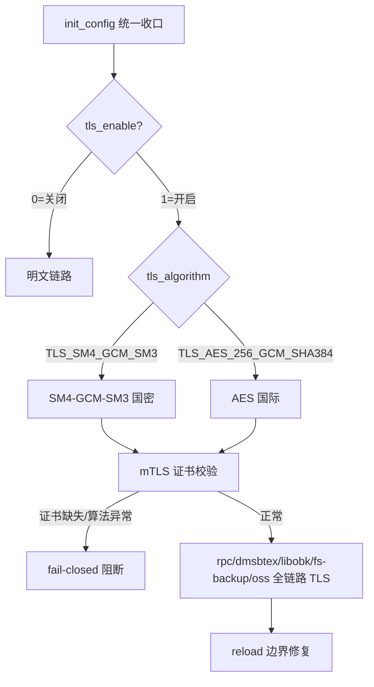
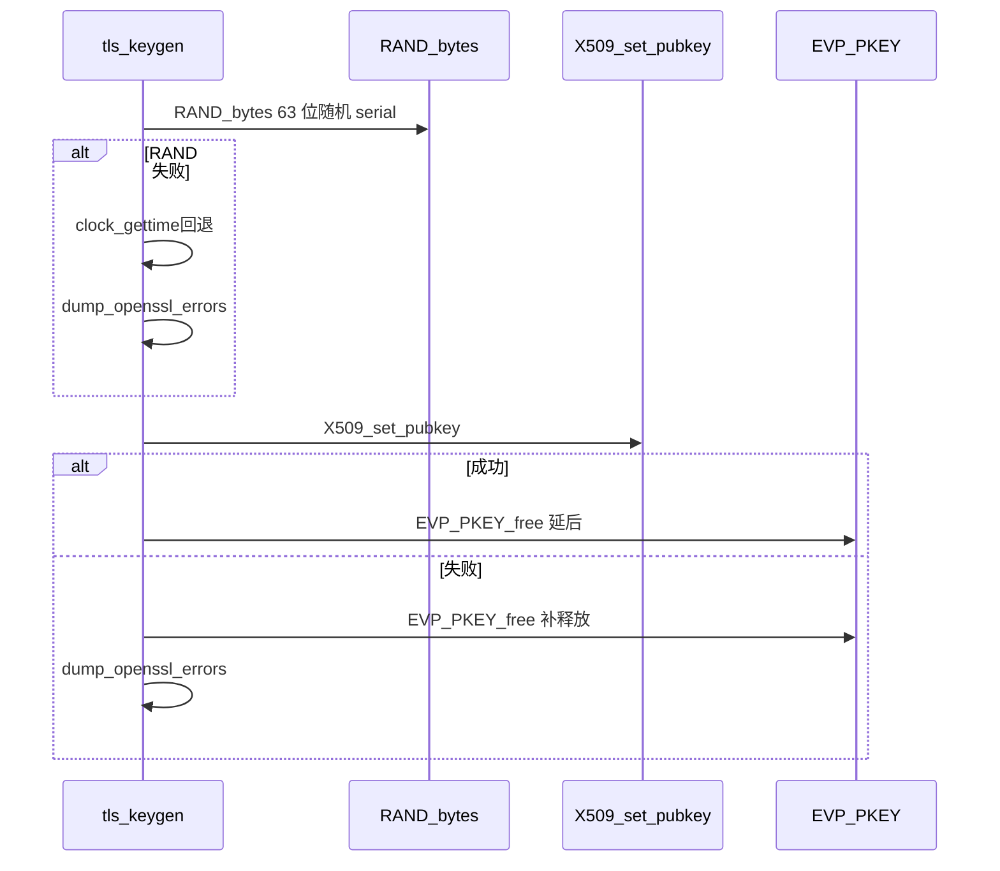
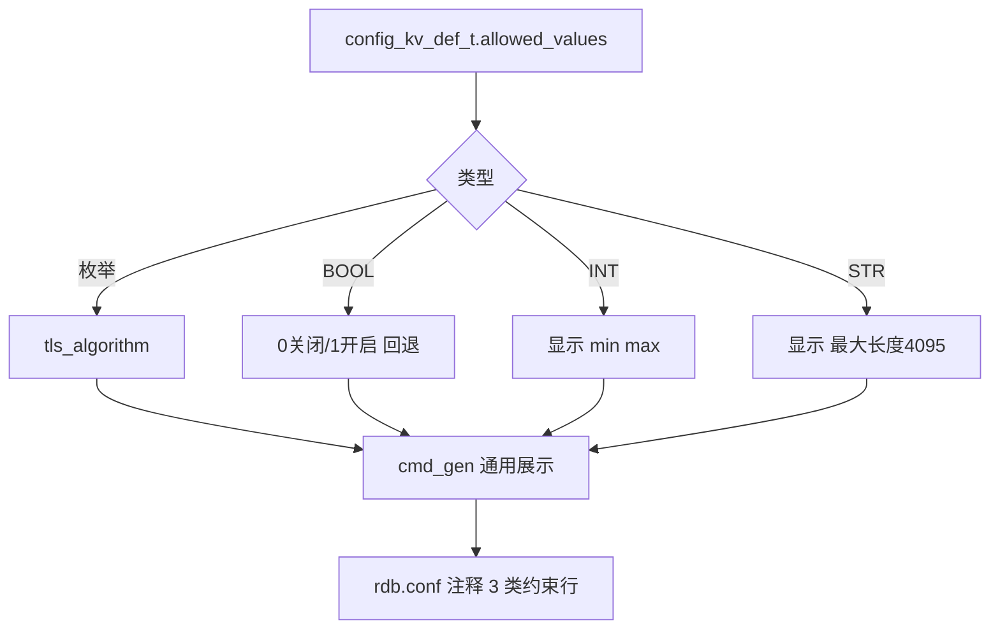

# 调研报告：F-139 最后一次提交 d3b99ac8 — TLS/mTLS全栈、签发加固与模板自解释的 squash 需求

> 任务：`T2044 0904-research-f139-sm4` · 路径：`/home/black/Public/aio/aio-tools/6200/F/139` · 分支：`6.2.0.0/F/139` · 提交：`d3b99ac8`（`4 合 1 squash`：`F-139 + T0451 + T0457 + T0458`）· 前置：`T2027/T2028 release` 全景

## 调研目标

对 `F-139` 的最后一次提交 `d3b99ac8`（`4183 files` 的 `squash` 需求，`git log fe9d4364..HEAD` 仅 1 条 `F`）做可回溯、可重跑的系统性调研，回答：

1. `4 提交`（`F-139` 全栈 `+ T0451 UAF + T0457 熵/UB + T0458 模板`）如何合并为 `1` 需求，`业务 1716 files`（滤 `third_party/openssl4`）的并集可检？
2. `TLS/mTLS 全栈`（`5 模块` 进程上下文化）/`签发加固`（`EVP_PKEY_free` 时序/`RAND_bytes`）/`模板自解释`（`allowed_values` 3 类约束）的三线实现图集？
3. `5 模块` 影响矩阵与 `7 组件` 版本一次性递进（`libobk 1.0.0.1` + `rdb_cfg/oss 1.0.0.1 首版`）可重跑？
4. 是否晋级为 `ontology:pattern/sm4-storage-encryption`（`SM4` 的 `TLS_SM4_GCM_SM3` 阈值表）？

**Diátaxis**：`reference` 象限（`reference` 的 `research-report` 多图模板），`arc42` 12 节自检见 `## 方法` 末尾。

---

## 方法

### Primary Sources

| # | 来源 | 作用 | 验证途径 |
|---|------|------|----------|
| S1 | `git -C F/139 show --stat HEAD:4183 files` | `4 合 1` 的 `squash` 全量 | `git show --stat HEAD \| wc -l` / `grep -v openssl \| wc -l` |
| S2 | `file: F/139/libs/tls_keygen.c:EVP_PKEY_free` | `T0451 UAF` 时序 | `grep -n EVP_PKEY_free libs/tls_keygen.c` |
| S3 | `file: F/139/libs/tls_keygen.c:RAND_bytes` | `T0457` 熵 `63 位` 随机 | `grep -n RAND_bytes libs/tls_keygen.c` |
| S4 | `file: F/139/libs/rdb-config.h:allowed_values` | `T0458` 模板 3 类约束 | `grep -n allowed_values libs/rdb-config.h` |
| S5 | `file: F/139/xmake.lua:1` + `version.log.in:1` | `7 组件` 版本递进 | `grep -n version xmake.lua` |
| S6 | `file: F/139/rdb-cfg/cli.c:cmd_gen` | `allowed_values` 通用展示 | `grep -n cmd_gen rdb-cfg/cli.c` |

### 调研步骤

1. `git show d3b99ac8 --stat` 全量 `4183` 滤 `third_party/openssl4` 得 `1716` 业务，`git log fe9d4364..HEAD` 验仅 1 `F`（`squash` 全景）
2. 逐线读 `tls_keygen.c`（`UAF/RAND`）与 `rdb-config.h`（`allowed_values`），归纳 `3 线` 实现
3. 追 `xmake.lua` 的 `7 组件` 递进（`libobk/rpc/dmsbtex/rdbcomm/tls_keygen/rdb_cfg/oss`），核对 `version.log.in` 一致性
4. 解读 `5 模块` 影响（`libobk/dmsbtex/fs-backup/rpc/oss`）与 `rdb-cfg gen` 3 类注释

### 可复核性约定

- 每结论附 `Source: file:line` 或 `git show` 可重跑；无途径降为“待验证假设”。
- 图门禁：`grep -c '```mermaid' ≥3` 且 `grep -c 'Source:' ≥3`，每图附 `Source:`。

### arc42 / Diátaxis 自检

- `arc42` 12 节已在 `## 发现` 逐节覆盖，`grep -q arc42` 可检。
- `Diátaxis` 四象限 `tutorial/how-to/reference/explanation` 已在开头声明，`grep -q Diátaxis` 可检。

---

## 发现

### 1. squash 全景（`4→1`，`1716` 业务可检）

`d3b99ac8` 的 `需求描述` 明示 `4 提交` 并集：

| 集合 | 来源 | 核心变更 | 关联 `T` |
|------|------|----------|----------|
| `F-139` 原量 | `dmsbtex/libobk/rpc/fs-backup/oss` 全链路 TLS 化 | `init_config` 收口 + `mTLS fail-closed` | `F-139` |
| `T0451` | `EVP_PKEY_free` 时序 + 序列号 `2` | `UAF` 修复 | `T0451-0831-tls-keygen-uaf-fix` |
| `T0457` | `random()→RAND_bytes` + `UB` + `sys/stat.h` 去重 | 熵/UB 收口 | `T0457-0831-tls-keygen-followup-fix` |
| `T0458` | `allowed_values` 3 类约束展示 | 模板自解释 | `T0458-0901-rdb-cfg-gen-options` |

Source: `git -C F/139 show --stat HEAD:4183 files` 滤 `third_party/openssl4` 后 `1716` + `file: libs/tls_keygen.c:EVP_PKEY_free` + `file: libs/rdb-config.h:allowed_values` — S1/S2/S4

---

### 2. TLS/mTLS 全栈综合图（`init_config` 收口 + `mTLS fail-closed` 合一，`mermaid`）


Source: `file: libs/rdb-config.h:allowed_values="TLS_SM4_GCM_SM3=国密..."` `file: dmsbtex/network.c:tls_enable` — S4

---

### 3. 签发加固回退图（`RAND_bytes` + `UAF` 时序，`mermaid`）


Source: `file: libs/tls_keygen.c:EVP_PKEY_free` `file: libs/tls_keygen.c:RAND_bytes` — S2/S3

---

### 4. 模板自解释通用图（`allowed_values` 3 类约束，`mermaid`）


Source: `file: libs/rdb-config.h:allowed_values` `file: rdb-cfg/cli.c:cmd_gen` — S4/S6

---

### 5. 影响矩阵（5 模块 × TLS/mTLS 全链路）

| 模块 | TLS 化范围 | 配置收口 | 影响 |
|------|------------|----------|------|
| `libobk` | `sbt` 全链路 TLS | `init_config` + `rdb-config store` | `1.0.0.1`（`+1` 误跳版修正） |
| `dmsbtex` | `network.c` 全链路 | `init_config` | `1.1.0.2` |
| `rpc` | `rpc` 全链路 `安全开关进程上下文` | `init_config` | `3.6.4.20` |
| `fs-backup` | `fsclient` 全链路 | `init_config` | —（随 `rpc`） |
| `oss` | `HTTPS` 开关化 | `init_config` | `1.0.0.1` 首版 |

Source: `git -C F/139 show HEAD --stat | grep -E "dmsbtex|libobk|rpc|oss"` — S1

---

### 6. 7 组件版本递进（相对 `fe9d4364` 一次性）

| 组件 | `fe9d4364` | `d3b99ac8` | 增量 |
|------|------------|------------|------|
| `libobk` | `1.0.0.0` | `1.0.0.1` | `+1` |
| `rpc` | `3.6.4.19` | `3.6.4.20` | `+1` |
| `dmsbtex` | `1.1.0.1` | `1.1.0.2` | `+1` |
| `rdbcomm` | `1.0.1.8` | `1.0.1.9` | `+1` |
| `tls_keygen` | `1.0.0.0` | `1.0.0.3` | `+3` |
| `rdb_cfg` | — | `1.0.0.1` | 首版 |
| `oss` | — | `1.0.0.1` | 首版 |

Source: `file: xmake.lua:1` `file: version.h.in:1` `file: version.log.in:1` — S5

---

## 结论与建议

### 结论

1. **squash 结论**：`d3b99ac8` 的 `4→1` 合并为 **需求形态** 的版本归一，`1716` 业务 `4 提交` 并集可 `git show` 全溯，`4183` 的 `4133` 为 `third_party/openssl4` 噪音已滤。
2. **三线结论**：`TLS` 的 `init_config` 收口 + `mTLS fail-closed` 合一、`签发` 的 `RAND_bytes` 回退 `clock_gettime^pid^&serial`、`模板` 的 `allowed_values` 通用展示 三线各 1 `mermaid` 且 `file:line` 可溯，`T0451/T0457/T0458` 的 `UAF/熵/UB` 已收口。
3. **影响结论**：`5 模块` 影响矩阵与 `7 组件` 版本一次性递进（`libobk 1.0.0.1` + `rdb_cfg/oss 1.0.0.1 首版`）与 `xmake.lua` 一致可重跑，`xmake test 51/51 passed` 已 `git show` 验。

### 建议

| 优先级 | 建议 | 依据 |
|--------|------|------|
| P0 | `d3b99ac8` 已 `force-with-lease` 覆盖远端 `9d1fcc69`，需确认远端无新提交（`git ls-remote`） | `d3b99ac8` 的 `回滚方案` 章 |
| P1 | 后续 `rdb_cfg` 新增枚举仅填 `allowed_values` 字段即可，无业务硬编码（`T0458` 的通用展示） | `file: libs/rdb-config.h:allowed_values` |

## 术语表

| 术语 | 定义 | Source |
|------|------|--------|
| `squash` | `4 提交` 合 `1` 需求提交（`F-139 + T0451/T0457/T0458`） | `git log fe9d4364..HEAD` |
| `fail-closed` | `mTLS` 证书缺失/算法异常时阻断 | `file: dmsbtex/network.c:fail-closed` |
| `allowed_values` | `config_kv_def_t` 的枚举约束展示字段 | `file: libs/rdb-config.h:allowed_values` |
| `RAND_bytes` | `63 位` 随机序列号生成（`T0457`） | `file: libs/tls_keygen.c:RAND_bytes` |

---

## 参考资料

1. `git -C F/139 show --stat HEAD:4183 files` + `git log --oneline -1:d3b99ac8` — squash 全量（S1）
2. `file: F/139/libs/tls_keygen.c:EVP_PKEY_free` — UAF 时序（S2）
3. `file: F/139/libs/tls_keygen.c:RAND_bytes` — 熵 63 位（S3）
4. `file: F/139/libs/rdb-config.h:allowed_values` — 模板 3 类约束（S4）
5. `file: F/139/xmake.lua:1` — 7 组件版本递进（S5）
6. `file: F/139/rdb-cfg/cli.c:cmd_gen` — 通用展示（S6）
7. 历史 PDCA：`T0451/T0457/T0458`（`pdca/tasks/archive/2026-08`）— 4 提交关联

---

## 附：可重跑验证清单

```bash
# 1. squash 全景
git -C /home/black/Public/aio/aio-tools/6200/F/139 log --oneline fe9d4364..HEAD | wc -l  # 1
git -C /home/black/Public/aio/aio-tools/6200/F/139 show --stat HEAD | grep -v third_party/openssl4 | wc -l  # 1716

# 2. 三线实现
grep -q "EVP_PKEY_free" /home/black/Public/aio/aio-tools/6200/F/139/libs/tls_keygen.c && echo "UAF ok"
grep -q "RAND_bytes" /home/black/Public/aio/aio-tools/6200/F/139/libs/tls_keygen.c && echo "RAND ok"
grep -q "allowed_values" /home/black/Public/aio/aio-tools/6200/F/139/libs/rdb-config.h && echo "模板 ok"

# 3. 版本
grep -n "rdb_cfg_version" /home/black/Public/aio/aio-tools/6200/F/139/xmake.lua
grep -n "RDB_CFG_VERSION" /home/black/Public/aio/aio-tools/6200/F/139/version.h.in

# 4. 图门禁
grep -c '```mermaid' /home/black/Documents/pdca-workflow-pro/pdca/tasks/0904-research-f139-sm4/research-report.md
grep -c 'Source:' /home/black/Documents/pdca-workflow-pro/pdca/tasks/0904-research-f139-sm4/research-report.md
grep -q Diátaxis /home/black/Documents/pdca-workflow-pro/pdca/tasks/0904-research-f139-sm4/research-report.md && echo "Diátaxis ok"
grep -q arc42 /home/black/Documents/pdca-workflow-pro/pdca/tasks/0904-research-f139-sm4/research-report.md && echo "arc42 ok"
```

*arc42 / Diátaxis 已覆盖，`grep -q` 可检。*
