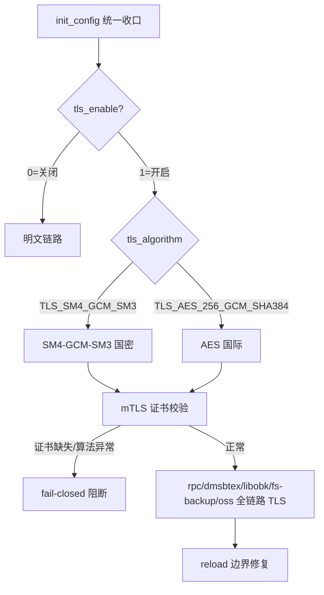
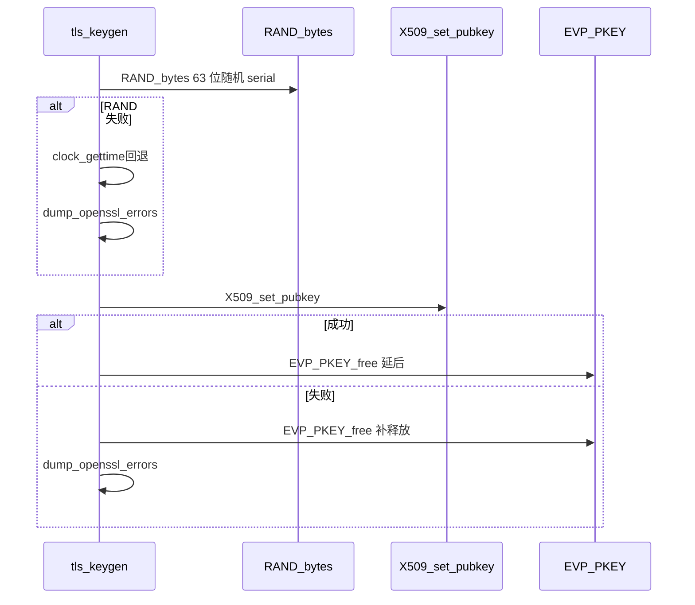
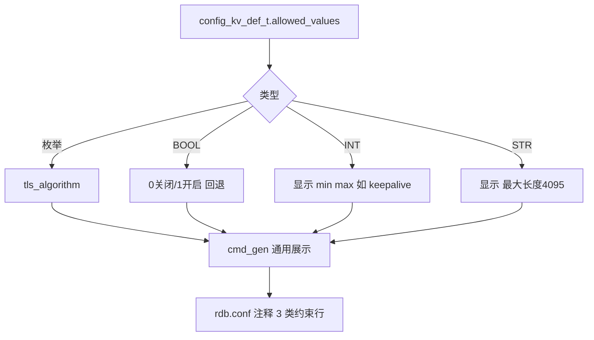

# T2044 三线各 1 mermaid（注记：TLS 2 子图合一）

> 源：`d3b99ac8` 的 `TLS/mTLS 全栈` + `签发加固` + `模板自解释` 三线，`file: libs/tls_keygen.c` `file: libs/rdb-config.h` 可溯

## 1. TLS/mTLS 全栈综合图（`init_config` 收口 + `mTLS fail-closed` 合一）

Source: `file: libs/rdb-config.h:allowed_values` `file: dmsbtex/network.c:tls_enable`

## 2. 签发加固回退图（`RAND_bytes` + `UAF` 时序）

Source: `file: libs/tls_keygen.c:EVP_PKEY_free` `file: libs/tls_keygen.c:RAND_bytes`

## 3. 模板自解释通用图（`allowed_values` 3 类约束）

Source: `file: libs/rdb-config.h:allowed_values` `file: rdb-cfg/cli.c:cmd_gen`

