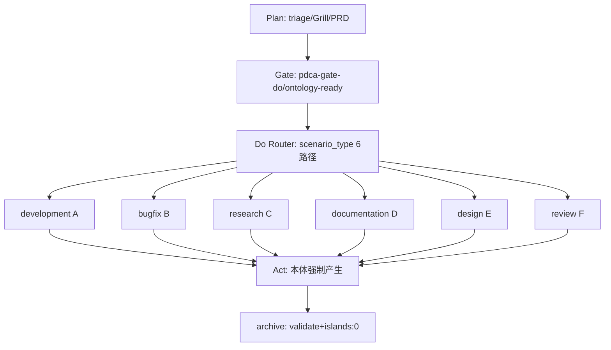
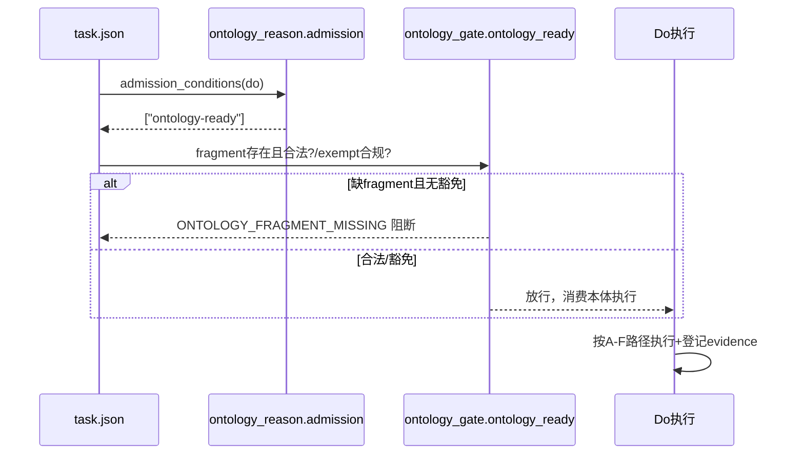
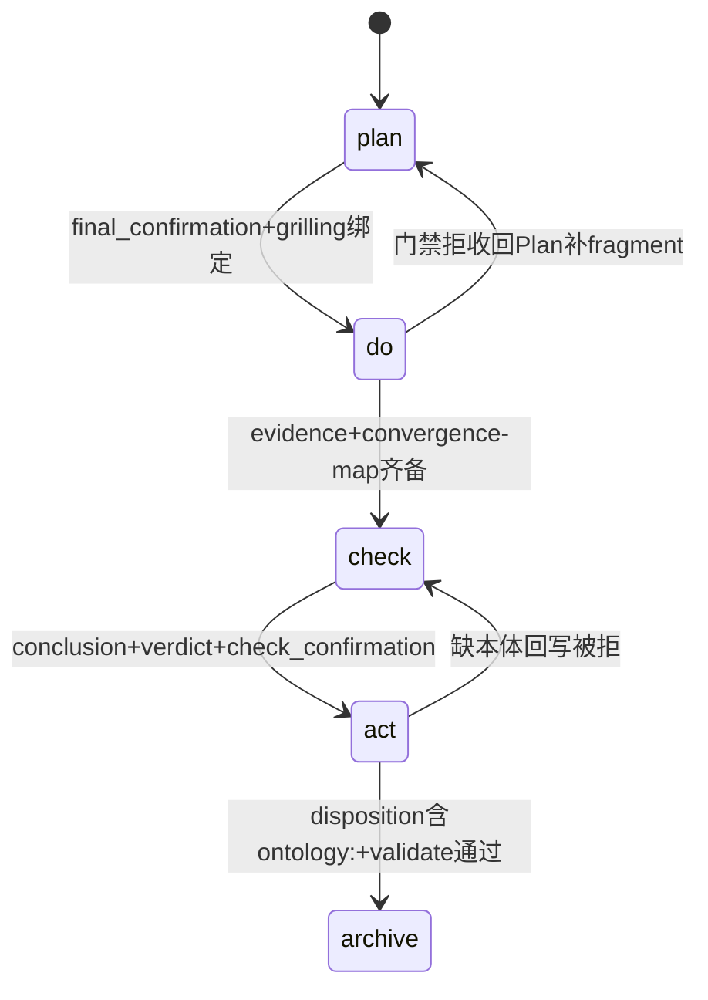

# Research Report — 六场景是否严格先调研后操作

## 调研目标
判定 development/bugfix/research/documentation/design/review 六场景在 Do 前是否强制先有本体调研锚点。口径 A：Do 准入有合法 ontology_fragment 即算先调研，复用即可，不必每次新建 research 票。

## 方法
- Primary sources 全量追溯：flow-do、pdca-gate-do、pdca-ontology-ready、ontology_gate.py、ontology_reason.py、pdca_core.py、scenario-boundary-rule、skill-research/triage-work
- 对每场景核验：Do 准入条件、执行是否消费本体、Act 是否回写本体、豁免路径
- 每结论附可复核验证途径（命令/file:line）

## 发现

### 总表：六场景全部走严格先本体后操作
| 场景 | Do准入ontology-ready | 执行消费本体 | Act强制产本体 | 是否严格先调研后操作 |
|---|---|---|---|---|
| development | 是 | 是 fragment+Seam | 是 | 是（复用式） |
| bugfix | 是 | 是 fragment+回归Seam | 是 | 是（复用式） |
| research | 是 | 是 本身产本体 | 是（沉淀决策） | 是（生产式） |
| documentation | 是 | 是 Diataxis+Source门禁 | 是 | 是（复用+生产） |
| design | 是 | 是 design-it-twice+grilling | 是 | 是（复用式） |
| review | 是 | 是 双轴+grilling | 是 | 是（复用式） |

唯一豁免：meta.ontology_exempt=true 自举任务，需 reason≥20字符含 ontology。

### 架构图 C4 L2（mermaid）

Source: ontology/process/flow-do.md:35-40 与 ontology/concept/pdca-gate-do.md:24

### 逻辑图 时序/流程（mermaid）

Source: scripts/ontology_gate.py:23-43 与 scripts/ontology_reason.py:128-146

### 生命周期图 状态机（mermaid）

Source: ontology/process/flow-act.md:34-36 与 scripts/pdca_core.py:447-451

### 数据流/部署（mermaid）

Source: ontology/domain/pdca/ontology-hybrid-methodology.md:56-57 与 scripts/transition-phase.py:103-108

## 结论与建议
1. 六场景均严格先本体后操作，但 research 是生产式，其余五是复用式消费+Act回写。验证：运行 python3 scripts/ontology_reason.py admission --phase do 得 ['ontology-ready']。
2. development/bugfix 不另起 research 票，靠 fragment 复用+pre-agreed Seam+Act回写满足严格性。验证：查 flow-do.md:50-67 与 ontology_gate.py:37-43。
3. documentation/design/review 虽非 research 名，但内置 research 级门禁（≥3图/≥3Source、双方案、双轴）。验证：查 flow-do.md:76-92。
4. 误读纠偏：含代码产出标 research 属错配，应走 development。验证：运行 python3 scripts/scenario-boundary-check.py --judge --desc。
5. 建议：保持现有门禁；新增场景须先在 pdca-gate-do relates_to 声明准入，否则默认无门禁。

## 术语表
- ontology-ready：Do准入要求 fragment 存在且合法，或合规豁免
- fragment复用：直接引用已有本体节点执行，不必新建
- 生产式：research 本身产出新本体节点
- records-only：已取消，T0513起不再接受

## 参考资料
- Source: ontology/process/flow-do.md
- Source: ontology/concept/pdca-gate-do.md
- Source: ontology/concept/pdca-ontology-ready.md
- Source: scripts/ontology_gate.py
- Source: scripts/ontology_reason.py
- Source: scripts/pdca_core.py
- Source: ontology/concept/pdca-scenario-boundary-rule.md
- Source: ontology/domain/pdca/skill-research.md
- Source: ontology/domain/pdca/skill-triage-work.md
- Source: ontology/process/flow-act.md
