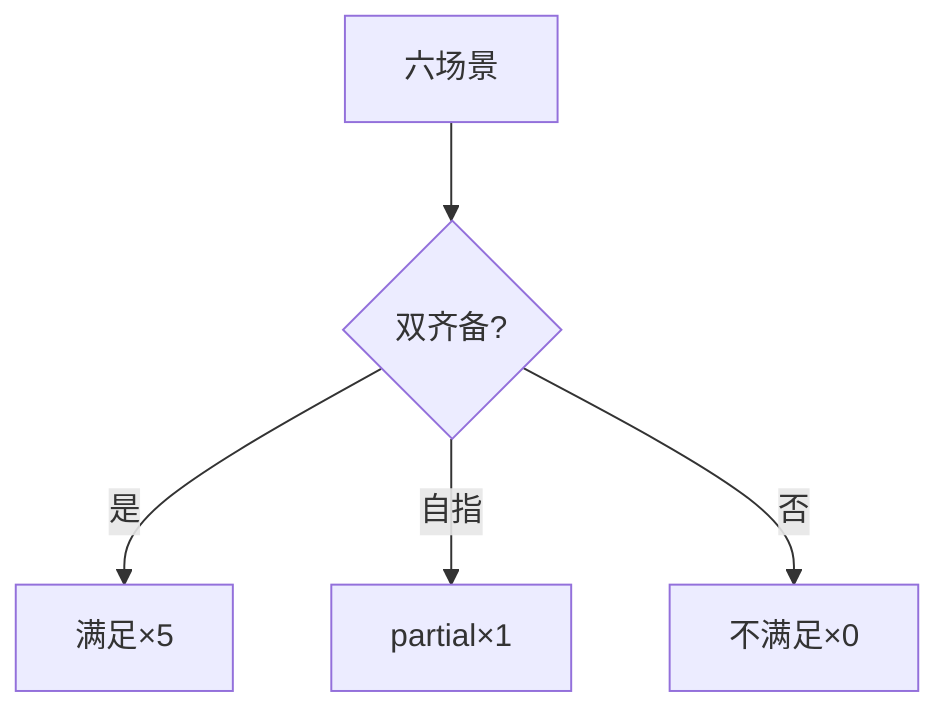
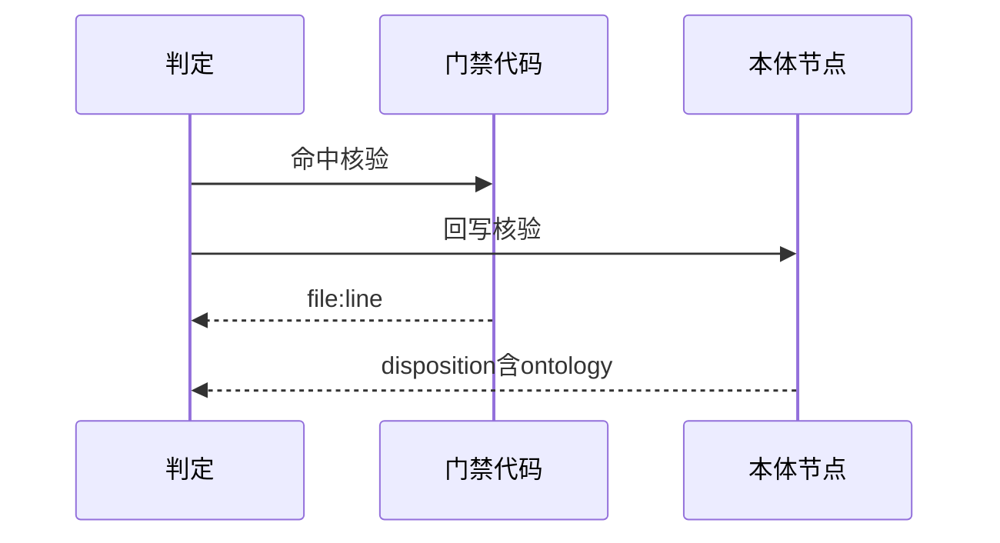
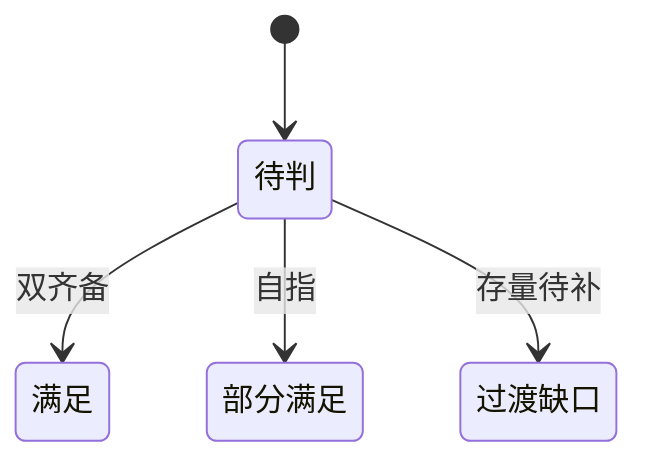

# Research Report — 逐场景双条件判定迷你调研（T2098）

## 调研目标
逐场景复核双条件判定：五满足一partial的依据是否可回链。

## 方法
对照门禁命中表与回写门禁配置逐项打勾。

## 发现
五场景双齐备；research自指有测试锁定；过渡30任务为执行缺口。

### 判定矩阵流程（mermaid）

Source: records/T2096-0910-research-first-compliance-audit/evidence/review.md

### 回链时序（mermaid）

Source: ontology:concept/research-first-gate

### 判定状态机（mermaid）

Source: https://lean.org/lexicon-terms/pdca

## 结论与建议
判定可回链，无粉饰。

## 术语表
- 回链：结论到证据的verifiable path

## 参考资料
- Source: https://lean.org/lexicon-terms/pdca
- Source: https://www.researchgate.net/publication/349440276_PDCA_Cycle_Method_implementation_in_Industries_A_Systematic_Literature_Review
