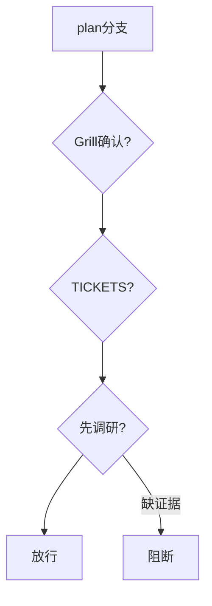
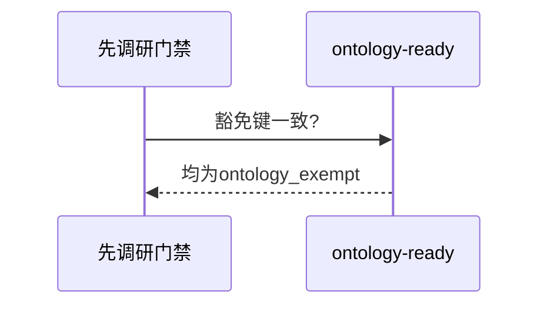
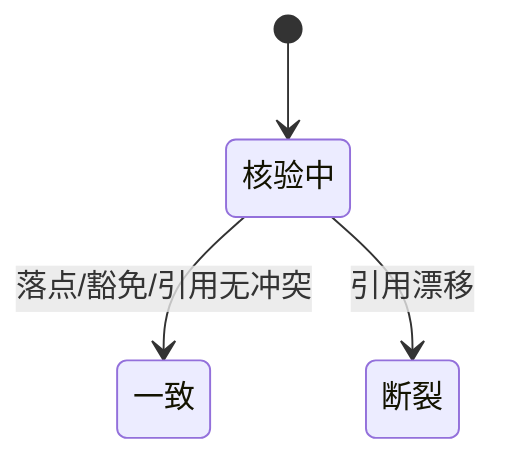

# Research Report — 门禁代码契约一致性迷你调研（T2097）

## 调研目标
核验先调研门禁与既有门禁的契约一致性：落点、豁免口径、文档引用不断裂。

## 方法
走读门禁段与豁免分支，比对ontology-ready同口径。

## 发现
落点plan分支与TICKETS/Grill段共存无冲突；豁免键复用ontology_exempt；文档内联不断号。

### 门禁共存流程（mermaid）

Source: scripts/pdca_core.py 先调研门禁段

### 豁免比对时序（mermaid）

Source: ontology:concept/pdca-ontology-ready

### 一致性状态机（mermaid）

Source: https://lean.org/lexicon-terms/pdca

## 结论与建议
一致，无断裂。

## 术语表
- 内联：不断号追加

## 参考资料
- Source: https://lean.org/lexicon-terms/pdca
- Source: https://www.researchgate.net/publication/349440276_PDCA_Cycle_Method_implementation_in_Industries_A_Systematic_Literature_Review
