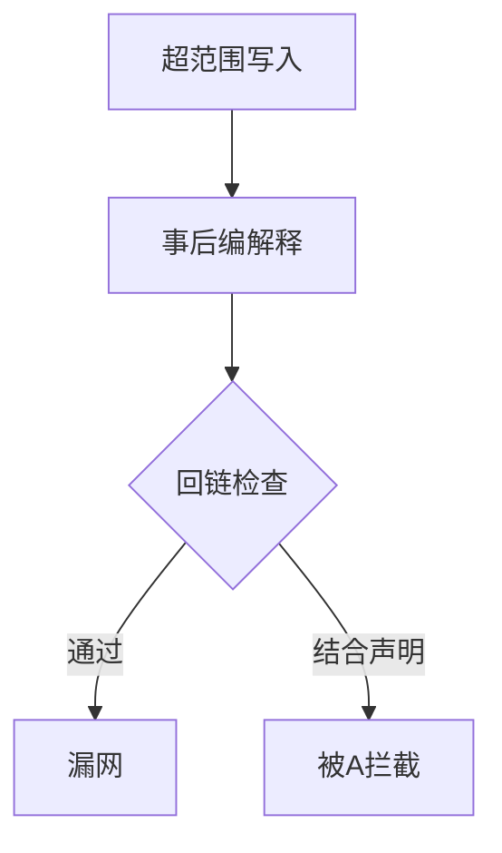
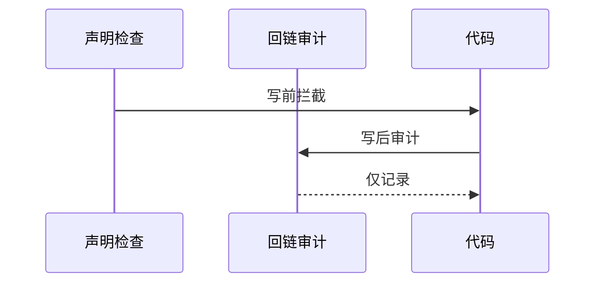
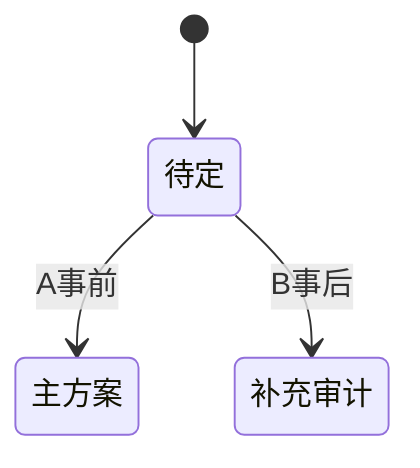

# Research Report — 语义回链备选对比验证（T2114）

## 调研目标
验证候选B为何只能降级补充：事后回链能否证明事先具备。

## 方法
反例推演：超范围代码写入后仍可编造回链解释的情形。

## 发现
回链只能证明可解释性不能证明具备性；无声明锚点时解释可事后拼凑；B适合做A的补充审计。

### 回链缺口流程（mermaid）

Source: records/T2112-0910-line-ontology-design/evidence/design.md

### 时序对比（mermaid）

Source: ontology:concept/scope-coverage-gate

### 定位状态机（mermaid）

Source: https://lean.org/lexicon-terms/pdca

## 结论与建议
B降级为A的补充审计，不单独实施。

## 术语表
- 补充审计：事后记录不阻断

## 参考资料
- Source: https://lean.org/lexicon-terms/pdca
- Source: https://www.researchgate.net/publication/349440276_PDCA_Cycle_Method_implementation_in_Industries_A_Systematic_Literature_Review
