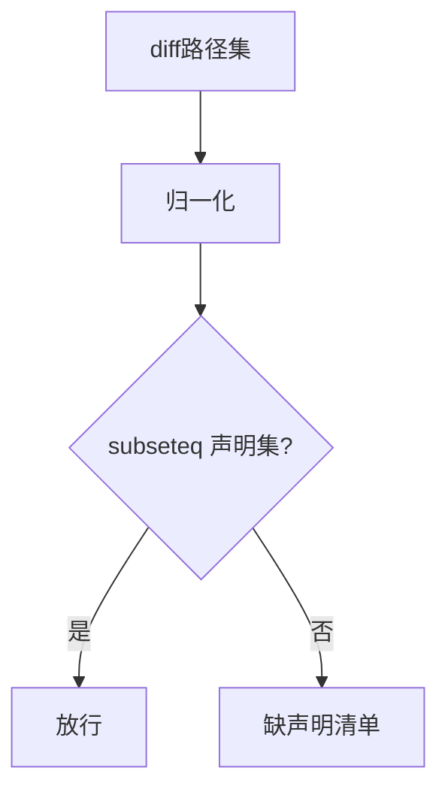
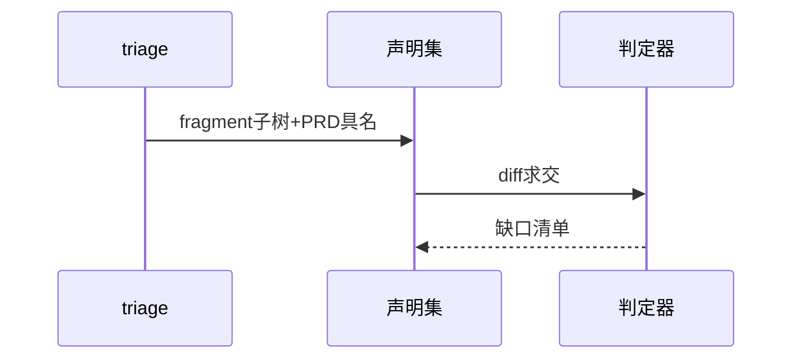
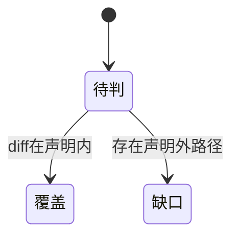

# Research Report — 声明覆盖检查深挖（T2113）

## 调研目标
深挖候选A：scope-declare.json声明集与diff子集判定的可实现性。

## 方法
推演triage产声明、归一化路径、判定包含关系的最小动作。

## 发现
声明在任务创建时可得（fragment子树+PRD具名）；归一化隔离别名；判定为纯集合包含，可单测。

### 判定流程（mermaid）

Source: scripts/pdca_core.py 先调研门禁段

### 声明产出时序（mermaid）

Source: ontology:concept/scope-coverage-gate

### 覆盖状态机（mermaid）

Source: https://lean.org/lexicon-terms/pdca

## 结论与建议
A可行且为唯一满足事先具备的方案。

## 术语表
- 声明集：模块与路径的具名集合

## 参考资料
- Source: https://lean.org/lexicon-terms/pdca
- Source: https://www.researchgate.net/publication/349440276_PDCA_Cycle_Method_implementation_in_Industries_A_Systematic_Literature_Review
